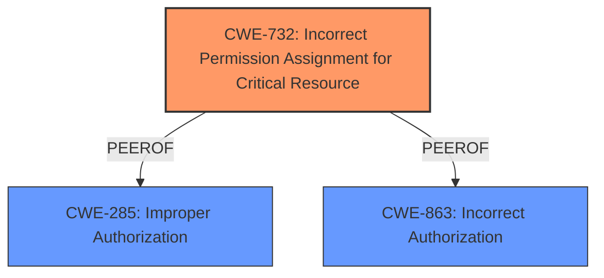

# Raw Analyzer Response for CVE-2024-41600

# Summary
| CWE ID  | CWE Name                                                   | Confidence | CWE Abstraction Level | CWE Vulnerability Mapping Label | CWE-Vulnerability Mapping Notes |
| :-------- | :--------------------------------------------------------- | :--------- | :-------------------- | :------------------------------ | :-------------------------------- |
| CWE-732 | Incorrect Permission Assignment for Critical Resource      | 0.9        | Class                 | Allowed-with-Review             | Primary CWE                       |
| CWE-285 | Improper Authorization                                       | 0.6        | Class                 | Discouraged                     | Secondary Candidate               |
| CWE-863 | Incorrect Authorization                                       | 0.6        | Class                 | Allowed-with-Review             | Secondary Candidate               |

## Evidence and Confidence

*   **Confidence Score:** 0.9
*   **Evidence Strength:** HIGH

## Relationship Analysis
The primary relationship influencing the CWE selection is the hierarchical structure related to authorization and permission issues. CWE-732, as a Class-level CWE, is related to more specific Base-level CWEs, but given the information provided, it remains the most suitable high-level categorization. The guidance on differentiating privileges and permissions was also considered.

## Vulnerability Chain
The vulnerability chain starts with **Insecure Permissions** in the `login` method, leading to the ability of a remote attacker to obtain sensitive information. The root cause is the **insecure permissions**, and the impact is information disclosure.

## Summary of Analysis
The initial assessment strongly suggests CWE-732 as the primary weakness, aligning well with the **Insecure Permissions** vulnerability in the `login` method, as the **rootcause** listed in the description. The vulnerability allows a remote attacker to obtain sensitive information. The selection is based on the description of the vulnerability and the summary of the CVE Reference Links, which explicitly mention **insecure permissions**.

The graph relationships influenced the decision by highlighting the connections between different types of authorization and permission issues, helping to refine the selection to the most appropriate Class-level CWE. The selected CWE is at an appropriate level of specificity, given that the provided information focuses on the high-level issue of **incorrect permission assignment** rather than specific low-level implementation details.

Relevant CWE Information:

# Enhanced Context (25 CWEs)
The following CWEs were identified as potentially relevant to this vulnerability:

## CWE-266: Incorrect Privilege Assignment
**Abstraction Level**: Base
**Similarity Score**: 0.79

## CWE-267: Privilege Defined With Unsafe Actions
**Abstraction Level**: Base
**Similarity Score**: 0.79

## CWE-280: Improper Handling of Insufficient Permissions or Privileges 
**Abstraction Level**: Base
**Similarity Score**: 0.79

## CWE-274: Improper Handling of Insufficient Privileges
**Abstraction Level**: Base
**Similarity Score**: 0.78

## CWE-276: Incorrect Default Permissions
**Abstraction Level**: Base
**Similarity Score**: 0.78

## CWE-472: External Control of Assumed-Immutable Web Parameter
**Abstraction Level**: Base
**Similarity Score**: 0.77

## CWE-425: Direct Request ('Forced Browsing')
**Abstraction Level**: Base
**Similarity Score**: 0.77

## CWE-41: Improper Resolution of Path Equivalence
**Abstraction Level**: Base
**Similarity Score**: 0.77

## CWE-639: Authorization Bypass Through User-Controlled Key
**Abstraction Level**: Base
**Similarity Score**: 0.77

## CWE-668: Exposure of Resource to Wrong Sphere
**Abstraction Level**: Class
**Similarity Score**: 0.76

## CWE-863: Incorrect Authorization
**Abstraction Level**: Class
**Similarity Score**: 1626.45

## CWE-285: Improper Authorization
**Abstraction Level**: Class
**Similarity Score**: 1574.75

## CWE-732: Incorrect Permission Assignment for Critical Resource
**Abstraction Level**: Class
**Similarity Score**: 1558.74

## CWE-269: Improper Privilege Management
**Abstraction Level**: Class
**Similarity Score**: 1547.29

## CWE-639: Authorization Bypass Through User-Controlled Key
**Abstraction Level**: Base
**Similarity Score**: 1509.31

## CWE-471: Modification of Assumed-Immutable Data (MAID)
**Abstraction Level**: base
**Similarity Score**: 4.33

## CWE-613: Insufficient Session Expiration
**Abstraction Level**: base
**Similarity Score**: 4.21

## CWE-425: Direct Request ('Forced Browsing')
**Abstraction Level**: Base
**Similarity Score**: 2.91

## CWE-352: Cross-Site Request Forgery (CSRF)
**Abstraction Level**: compound
**Similarity Score**: 2.61

## CWE-1275: Sensitive Cookie with Improper SameSite Attribute
**Abstraction Level**: variant
**Similarity Score**: 2.55

## CWE-280: Improper Handling of Insufficient Permissions or Privileges 
**Abstraction Level**: Base
**Similarity Score**: 2.50

## CWE-274: Improper Handling of Insufficient Privileges
**Abstraction Level**: Base
**Similarity Score**: 2.49

## CWE-379: Creation of Temporary File in Directory with Insecure Permissions
**Abstraction Level**: base
**Similarity Score**: 2.47

## CWE-378: Creation of Temporary File With Insecure Permissions
**Abstraction Level**: base
**Similarity Score**: 2.47

## CWE-250: Execution with Unnecessary Privileges
**Abstraction Level**: base
**Similarity Score**: 2.47

### CWE-732: Incorrect Permission Assignment for Critical Resource
The product specifies permissions for a security-critical resource in a way that allows that resource to be read or modified by unintended actors. This aligns with the **Insecure Permissions** vulnerability that allows a remote attacker to obtain sensitive information via the login method. The implication is unauthorized access to sensitive data.

### CWE-285: Improper Authorization
The product does not perform or incorrectly performs an authorization check when an actor attempts to access a resource or perform an action. While **insecure permissions** are mentioned, it could also be the case that the authorization check is flawed. The security implication is that an attacker can bypass intended access restrictions.

### CWE-863: Incorrect Authorization
The product performs an authorization check when an actor attempts to access a resource or perform an action, but it does not correctly perform the check. This is similar to CWE-285 but highlights that an authorization mechanism is present but flawed. This could be a secondary issue.

**CWEs Considered But Not Used:**

*   **CWE-266, CWE-250, CWE-284:** The guidance suggests these might be more appropriate for privilege-related issues, but the description focuses on permissions and access control related to the login method, making CWE-732 more fitting.

*   **CWE-425, CWE-639, CWE-471:** These CWEs are related to specific bypass techniques, but the description does not provide sufficient detail to confirm their relevance.

*   **CWE-379, CWE-378:** These are related to insecure temporary files, which is not relevant to the described vulnerability.