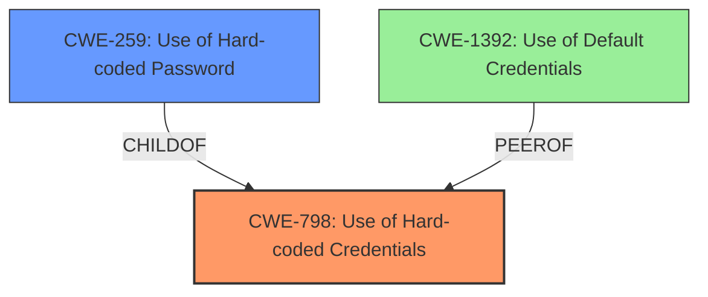

# Analysis Report for CVE-2024-41611

# Vulnerability Analysis Report: CVE-2024-41611

## Description

In D-Link DIR-860L REVA FIRMWARE PATCH 1.10..B04, the Telnet service contains **hardcoded credentials**, enabling attackers to log in remotely to the Telnet service and perform arbitrary commands.

## Vulnerability Description Key Phrases

- **Rootcause:** hardcoded credentials
- **Impact:** log in remotely to the Telnet service and perform arbitrary commands
- **Attacker:** attackers
- **Product:** D-Link DIR-860L
- **Version:** REVA FIRMWARE PATCH 1.10..B04
- **Component:** Telnet service

## Analysis (with Relationship Data)

# Summary
| CWE ID | CWE Name | Confidence | CWE Abstraction Level | CWE Vulnerability Mapping Label | CWE-Vulnerability Mapping Notes |
|---|---|---|---|---|---|
| CWE-798 | Use of Hard-coded Credentials | 1 | Base | Primary | Allowed |
| CWE-259 | Use of Hard-coded Password | 0.9 | Variant | Secondary Candidate | Allowed |
| CWE-1392 | Use of Default Credentials | 0.7 | Base | Secondary Candidate | Allowed |

## Evidence and Confidence

*   **Confidence Score:** 0.9
*   **Evidence Strength:** HIGH

## Relationship Analysis
The primary CWE is CWE-798, which is a Base level CWE. CWE-259 is a more specific Variant of CWE-798, representing the specific case of hardcoded passwords. CWE-1392 represents the use of default credentials, and while hardcoded, the description doesn't indicate they are default.



## Vulnerability Chain
The vulnerability chain starts with the **hardcoded credentials** (CWE-798), which allows an attacker to log in remotely to the Telnet service and perform arbitrary commands.

## Summary of Analysis
The vulnerability description clearly states that the Telnet service contains **hardcoded credentials**, which allows attackers to log in remotely and execute arbitrary commands. This directly aligns with CWE-798 (Use of Hard-coded Credentials). The evidence is strong, as the description explicitly mentions the **hardcoded credentials** and the associated impact.

CWE-798 is chosen as the primary CWE because it accurately represents the root cause of the vulnerability. The "Retriever Results" also list CWE-798 as a highly relevant CWE. The evidence includes the Vulnerability Description mentioning **hardcoded credentials** and the CVE Reference Links Content Summary confirming the same.

CWE-259 (Use of Hard-coded Password) is considered a secondary candidate because it is a more specific variant of CWE-798. However, since the description doesn't explicitly state whether the **hardcoded credentials** are passwords or cryptographic keys, CWE-798 is a more appropriate primary choice. If it was only a password, then CWE-259 would be the Primary CWE.

CWE-1392 (Use of Default Credentials) was considered because **hardcoded credentials** are often default credentials. However, the description does not indicate that the **hardcoded credentials** are default, so it's not the best fit.

CWE-78 (Improper Neutralization of Special Elements used in an OS Command ('OS Command Injection')) was considered due to the ability to perform arbitrary commands. However, the root cause is the **hardcoded credentials**, not a command injection vulnerability. Therefore, CWE-78 is not an appropriate mapping.

Relevant CWE Information:

# Enhanced Context (25 CWEs)
The following CWEs were identified as potentially relevant to this vulnerability:

## CWE-259: Use of Hard-coded Password
**Abstraction Level**: Variant
**Similarity Score**: 0.75
**Source**: dense

**Description**:
The product contains a hard-coded password, which it uses for its own inbound authentication or for outbound communication to external components.

**Mapping Guidance**:
- Usage: Allowed
- Rationale: This CWE entry is at the Variant level of abstraction, which is a preferred level of abstraction for mapping to the root causes of vulnerabilities.


## CWE-798: Use of Hard-coded Credentials
**Abstraction Level**: Base
**Similarity Score**: 0.73
**Source**: dense

**Description**:
The product contains hard-coded credentials, such as a password or cryptographic key.

**Mapping Guidance**:
- Usage: Allowed
- Rationale: This CWE entry is at the Base level of abstraction, which is a preferred level of abstraction for mapping to the root causes of vulnerabilities.


## CWE-321: Use of Hard-coded Cryptographic Key
**Abstraction Level**: Variant
**Similarity Score**: 0.72
**Source**: dense

**Description**:
The use of a hard-coded cryptographic key significantly increases the possibility that encrypted data may be recovered.

**Mapping Guidance**:
- Usage: Allowed
- Rationale: This CWE entry is at the Variant level of abstraction, which is a preferred level of abstraction for mapping to the root causes of vulnerabilities.


## CWE-912: Hidden Functionality
**Abstraction Level**: Class
**Similarity Score**: 0.71
**Source**: dense

**Description**:
The product contains functionality that is not documented, not part of the specification, and not accessible through an interface or command sequence that is obvious to the product's users or administrators.

**Mapping Guidance**:
- Usage: Allowed-with-Review
- Rationale: This CWE entry is a Class and might have Base-level children that would be more appropriate


## CWE-78: Improper Neutralization of Special Elements used in an OS Command ('OS Command Injection')
**Abstraction Level**: Base
**Similarity Score**: 0.71
**Source**: dense

**Description**:
The product constructs all or part of an OS command using externally-influenced input from an upstream component, but it does not neutralize or incorrectly neutralizes special elements that could modify the intended OS command when it is sent to a downstream component.

**Mapping Guidance**:
- Usage: Allowed
- Rationale: This CWE entry is at the Base level of abstraction, which is a preferred level of abstraction for mapping to the root causes of vulnerabilities.


## CWE-288: Authentication Bypass Using an Alternate Path or Channel
**Abstraction Level**: Base
**Similarity Score**: 0.71
**Source**: dense

**Description**:
The product requires authentication, but the product has an alternate path or channel that does not require authentication.

**Mapping Guidance**:
- Usage: Allowed
- Rationale: This CWE entry is at the Base level of abstraction, which is a preferred level of abstraction for mapping to the root causes of vulnerabilities.


## CWE-1392: Use of Default Credentials
**Abstraction Level**: Base
**Similarity Score**: 0.71
**Source**: dense

**Description**:
The product uses default credentials (such as passwords or cryptographic keys) for potentially critical functionality.

**Mapping Guidance**:
- Usage: Allowed
- Rationale: This CWE entry is at the Base level of abstraction, which is a preferred level of abstraction for mapping to the root causes of vulnerabilities.


## CWE-1391: Use of Weak Credentials
**Abstraction Level**: Class
**Similarity Score**: 0.70
**Source**: dense

**Description**:
The product uses weak credentials (such as a default key or hard-coded password) that can be calculated, derived, reused, or guessed by an attacker.

**Mapping Guidance**:
- Usage: Allowed-with-Review
- Rationale: This CWE entry is a Class and might have Base-level children that would be more appropriate


## CWE-1188: Initialization of a Resource with an Insecure Default
**Abstraction Level**: Base
**Similarity Score**: 0.70
**Source**: dense

**Description**:
The product initializes or sets a resource with a default that is intended to be changed by the administrator, but the default is not secure.

**Mapping Guidance**:
- Usage: Allowed
- Rationale: This CWE entry is at the Base level of abstraction, which is a preferred level of abstraction for mapping to the root causes of vulnerabilities.


## CWE-77: Improper Neutralization of Special Elements used in a Command ('Command Injection')
**Abstraction Level**: Class
**Similarity Score**: 0.70
**Source**: dense

**Description**:
The product constructs all or part of a command using externally-influenced input from an upstream component, but it does not neutralize or incorrectly neutralizes special elements that could modify the intended command when it is sent to a downstream component.

**Mapping Guidance**:
- Usage: Allowed-with-Review
- Rationale: CWE-77 is often misused when OS command injection (CWE-78) was intended instead [REF-1287].


## CWE-259: Use of Hard-coded Password
**Abstraction Level**: Variant
**Similarity Score**: 1016.30
**Source**: sparse

**Description**:
The product contains a hard-coded password, which it uses for its own inbound authentication or for outbound communication to external components.

**Mapping Guidance**:
- Usage: Allowed
- Rationale: This CWE entry is at the Variant level of abstraction, which is a


## CWE Relationship Analysis

Current CWEs represent these abstraction levels: .


### Vulnerability Chain Analysis

**Chain starting from CWE-288:**
- 288 (Authentication Bypass Using an Alternate Path or Channel) - ROOT


**Chain starting from CWE-321:**
- 321 (Use of Hard-coded Cryptographic Key) - ROOT


### CWE Relationship Diagram

```mermaid
graph TD
    classDef primary fill:#f96,stroke:#333,stroke-width:2px
    classDef secondary fill:#69f,stroke:#333
    classDef tertiary fill:#9e9,stroke:#333
```


*Report generated on 2025-07-13 13:16:24*
