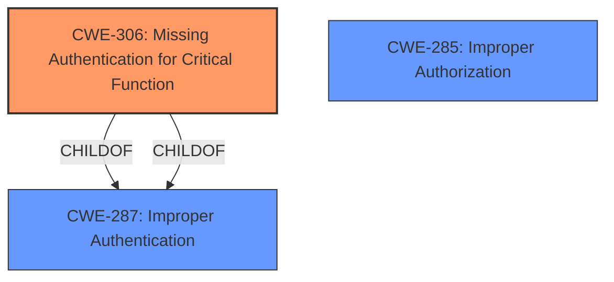

# Raw Analyzer Response for CVE-2024-41670

# Summary
| CWE ID | CWE Name | Confidence | CWE Abstraction Level | CWE Vulnerability Mapping Label | CWE-Vulnerability Mapping Notes |
|---|---|---|---|---|---|
| CWE-306 | Missing Authentication for Critical Function | 0.8 | Base | Allowed | Primary CWE. The core issue is the **missing authentication** or validation step that allows an order to be confirmed even if payment fails.|
| CWE-285 | Improper Authorization | 0.6 | Class | Discouraged | Secondary candidate. The **logical weakness** leads to **improper authorization** to confirm the order without proper payment validation.|

## Evidence and Confidence

*   **Confidence Score:** 0.7
*   **Evidence Strength:** MEDIUM

## Relationship Analysis
The primary CWE, CWE-306 [Missing Authentication for Critical Function], is a Base level CWE that directly addresses the **missing authentication** or validation step. CWE-287 [Improper Authentication] is a parent Class of CWE-306, and could be considered, but is less specific. CWE-285 [Improper Authorization] is a Class level CWE that could be related because the vulnerability leads to **improper authorization** to confirm the order. However, CWE-306 focuses on the **missing authentication** aspect, which is the root cause.

## Vulnerability Chain
The vulnerability chain starts with a **logical weakness** where the payment capture process **lacks authentication** or validation. This **missing authentication** leads to a state where a malicious customer can confirm an order even if the PayPal payment is declined. The impact is that an order is processed without actual payment.

## Summary of Analysis
The primary focus is on the **logical weakness** during payment capture where the system doesn't properly validate the payment status, allowing a malicious customer to confirm an order without actual payment. The evidence for this is explicitly stated in the vulnerability description and the CVE reference summary.

The description notes a **"logical weakness"** during payment capture, specifically when webhooks are disabled. This **weakness** allows a malicious customer to confirm an order even if the payment is declined. The CVE reference summary further clarifies that the root cause is "A logical weakness during the capture of a payment in case of disabled webhooks allows a malicious customer to confirm an order as 'payment accepted' even if the payment is ultimately declined by PayPal." and the **weakness** is an "Improperly implemented security check for payment status."

CWE-306 [Missing Authentication for Critical Function] aligns well with this description because the vulnerability stems from a **missing** or inadequate authentication check to verify that the payment has been successfully processed before confirming the order. It's a base-level CWE, which is preferred.

CWE-287 [Improper Authentication] was considered but is a more general Class-level CWE. While applicable, it doesn't capture the specific nuance of a **missing authentication** check for a critical function.

CWE-285 [Improper Authorization] was also considered but, like CWE-287, it's a Class-level CWE. The **logical weakness** that leads to **improper authorization** to confirm the order without proper payment validation.

Based on the evidence, relationship analysis, and mapping guidance, CWE-306 is the most appropriate primary CWE because it accurately reflects the **missing authentication** in a critical function that leads to the vulnerability.