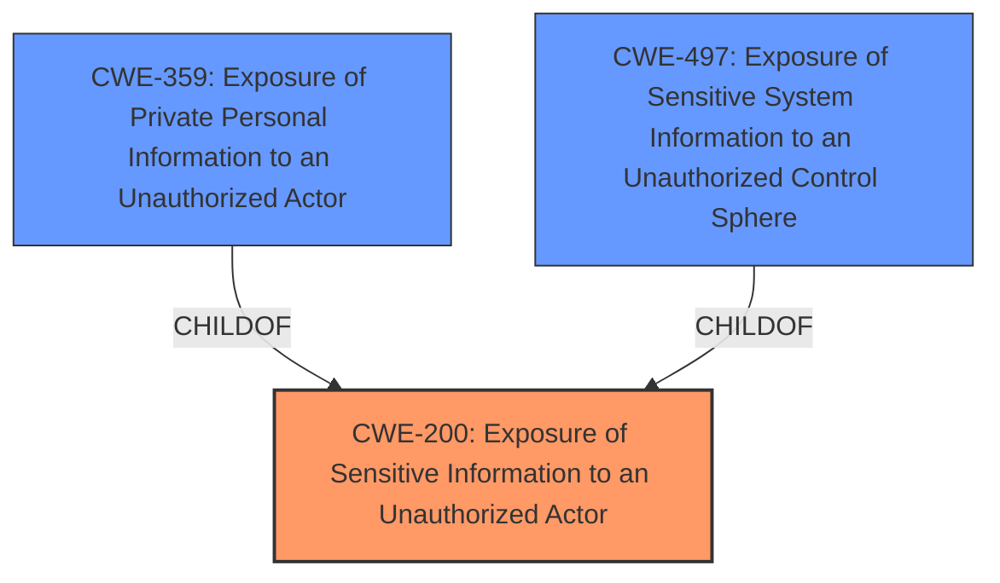

# Raw Analyzer Response for CVE-2024-41694

# Summary

| CWE ID | CWE Name | Confidence | CWE Abstraction Level | CWE Vulnerability Mapping Label | CWE-Vulnerability Mapping Notes |
|---|---|---|---|---|---|
| CWE-200 | Exposure of Sensitive Information to an Unauthorized Actor | 0.9 | Class | Primary | Discouraged, but selected due to explicit mention in the vulnerability description and key phrases. |
| CWE-359 | Exposure of Private Personal Information to an Unauthorized Actor | 0.7 | Base | Secondary Candidate | Allowed, more specific than CWE-200 but requires further evidence to confirm it's specifically private personal information. |
| CWE-497 | Exposure of Sensitive System Information to an Unauthorized Control Sphere | 0.6 | Base | Secondary Candidate | Allowed, more specific than CWE-200 but requires further evidence to confirm it's system information. |

## Evidence and Confidence

*   **Confidence Score:** 0.8
*   **Evidence Strength:** MEDIUM

## Relationship Analysis

The primary relationship influencing the decision is the hierarchical relationship where CWE-359 and CWE-497 are children of CWE-200. This suggests that while CWE-200 is a general classification, the vulnerability could potentially be narrowed down to either CWE-359 (Exposure of Private Personal Information) or CWE-497 (Exposure of Sensitive System Information) if more specific information were available.

## Vulnerability Chain

The vulnerability chain starts with the **rootcause**, where the application or system **does not adequately protect sensitive information from unauthorized access**. This leads directly to the **impact** of confidential data, financial records, proprietary data, and personal information being accessed and potentially disclosed to unauthorized parties.

## Summary of Analysis

The initial analysis strongly points to CWE-200 (Exposure of Sensitive Information to an Unauthorized Actor) as the primary CWE, primarily because it is explicitly mentioned in the vulnerability description and the key phrases section. The **weakness** identified is "CWE-200 Exposure of Sensitive Information to an Unauthorized Actor". The analysis also considered the Retriever results, which listed CWE-200 as the top combined result.

The Retriever results also suggested considering CWE-359 (Exposure of Private Personal Information to an Unauthorized Actor) and CWE-497 (Exposure of Sensitive System Information to an Unauthorized Control Sphere). These are more specific instances of information exposure and are children of CWE-200. However, without more specific details confirming the type of sensitive information exposed (personal vs. system), it's difficult to definitively classify the vulnerability under these more specific CWEs.

While CWE-200 is generally discouraged due to its high-level nature, its explicit mention in the vulnerability description, combined with the lack of more granular information, justifies its selection as the primary CWE. The presence of keywords like "personal information", "financial records" and "proprietary data" suggest the potential for CWE-359 and CWE-497, but additional evidence is needed before these can be confirmed.

Relevant CWE Information:
*   **CWE-200: Exposure of Sensitive Information to an Unauthorized Actor** - The product exposes sensitive information to an actor that is not explicitly authorized to have access to that information.
*   **CWE-359: Exposure of Private Personal Information to an Unauthorized Actor** - The product does not properly prevent a person's private, personal information from being accessed by actors who either (1) are not explicitly authorized to access the information or (2) do not have the implicit consent of the person about whom the information is collected.
*   **CWE-497: Exposure of Sensitive System Information to an Unauthorized Control Sphere** - The product does not properly prevent sensitive system-level information from being accessed by unauthorized actors who do not have the same level of access to the underlying system as the product does.