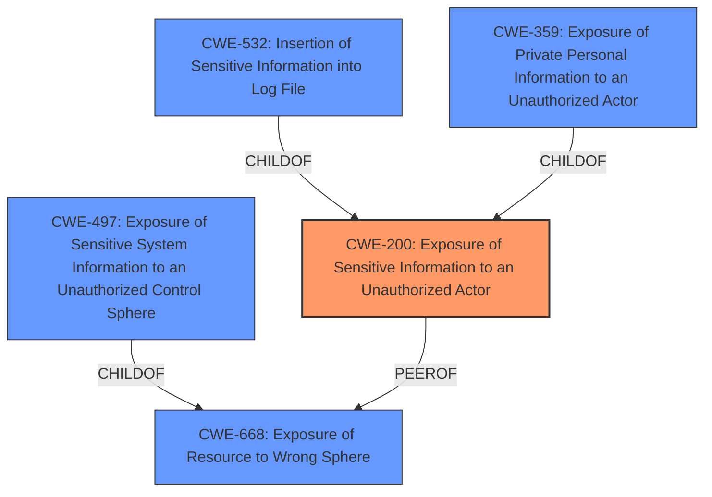

# Raw Analyzer Response for CVE-2024-41696

# Summary
| CWE ID | CWE Name | Confidence | CWE Abstraction Level | CWE Vulnerability Mapping Label | CWE-Vulnerability Mapping Notes |
|---|---|---|---|---|---|
| CWE-200 | Exposure of Sensitive Information to an Unauthorized Actor | 0.9 | Class | Allowed-with-Review | Primary CWE |

## Evidence and Confidence

*   **Confidence Score:** 0.9
*   **Evidence Strength:** MEDIUM

## Relationship Analysis
The analysis centered on identifying the most accurate representation of the vulnerability, considering the relationships between various CWEs. While several CWEs related to information exposure were considered, CWE-200 emerged as the primary candidate due to its direct alignment with the vulnerability description. The relationships analyzed included:

*   **Parent-Child Hierarchical Relationships:** Several more specific CWEs (children of CWE-200 or CWE-668) were evaluated, but the provided information did not contain sufficient detail to justify mapping to these more specific entries.
*   **Chain Relationships:** While information exposure can lead to further vulnerabilities, the description focuses solely on the initial exposure, making chain relationships less relevant.
*   **Peer Relationships:** Peer relationships helped to explore alternative classifications, ensuring the selected CWE was the most fitting.
*   **Abstraction Levels:** The abstraction level was a key factor, aiming for the most specific level possible while still accurately representing the vulnerability.

## Vulnerability Chain
The vulnerability chain is relatively simple:

1.  **Root Cause:** The root cause is the **Exposure of Sensitive Information** to an Unauthorized Actor.
2.  **Impact:** The impact is that the Unauthorized Actor can access the Sensitive Information.

## Summary of Analysis
The initial analysis focused on the provided vulnerability description and key phrases. The description explicitly states "**Exposure of Sensitive Information** to an Unauthorized Actor." This directly aligns with CWE-200.

The retriever results also suggest CWE-200 as the top candidate. However, CWE-200 is a Class-level CWE, and the guidance discourages its use when more specific options are available. I considered the other CWEs listed, particularly CWE-359 (Exposure of Private Personal Information to an Unauthorized Actor), CWE-497 (Exposure of Sensitive System Information to an Unauthorized Control Sphere), and CWE-532 (Insertion of Sensitive Information into Log File). However, the provided information does not give enough detail to support any of these more specific CWEs. Without knowing the specific type of sensitive information exposed, or the method of exposure (e.g., log files), it is not possible to choose a more specific CWE.

Therefore, I am selecting CWE-200 as the primary CWE with a confidence score of 0.9. While normally discouraged, its usage is appropriate in this case due to lack of more specific rootcause information.

Relevant CWE Information:
*   **CWE-200: Exposure of Sensitive Information to an Unauthorized Actor**: The product exposes sensitive information to an actor that is not explicitly authorized to have access to that information. This aligns directly with the vulnerability description.