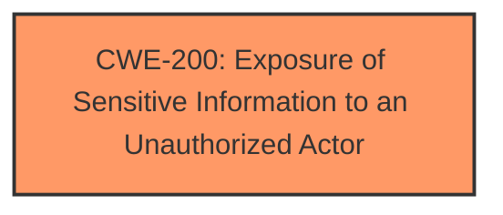

# Enhanced Analysis for CVE-2024-41723

# Summary
| CWE ID | CWE Name | Confidence | CWE Abstraction Level | CWE Vulnerability Mapping Label | CWE-Vulnerability Mapping Notes |
|---|---|---|---|---|---|
| CWE-200 | Exposure of Sensitive Information to an Unauthorized Actor | 0.8 | Class | Discouraged | The vulnerability results in information exposure, making this a relevant, though discouraged, choice. |

## Evidence and Confidence

*   **Confidence Score:** 0.8
*   **Evidence Strength:** LOW

## Relationship Analysis
The primary relationship that influenced the decision was the need to identify a CWE that accurately represents the **impact** of the vulnerability, which is information exposure. While CWE-200 is a high-level class, the limited information available makes it difficult to pinpoint a more specific root cause.



## Vulnerability Chain
The vulnerability chain starts with an undisclosed request to BIG-IP iControl REST, leading to the **impact** of information leak of user account names. The **root cause** is not explicitly stated in the vulnerability description.
  - Undisclosed request to BIG-IP iControl REST -> **Information leak** (CWE-200)
  - The description lacks explicit details on the **root cause**.

## Summary of Analysis
The analysis is heavily based on the provided evidence, which is limited. The **impact** of the vulnerability is clearly stated as "information leak of user account names." The selected CWE, CWE-200 (Exposure of Sensitive Information to an Unauthorized Actor), directly addresses this **impact**.

CWE-200 is a Class-level CWE and is generally discouraged as a primary mapping due to its high level of abstraction. However, given the lack of information about the **root cause** of the vulnerability, it serves as the most appropriate choice to represent the **impact**. The "CVE Reference Links Content Summary" section is "UNRELATED", which means no further details about the technical details of the vulnerability are available.

Other CWEs were considered but deemed less suitable:

*   CWE-400 (Uncontrolled Resource Consumption): While resource consumption might be a secondary effect, the primary **impact** is information disclosure.
*   CWE-918 (Server-Side Request Forgery): SSRF could potentially lead to information disclosure, but there is no explicit evidence to support this.
*   CWE-74 (Improper Neutralization of Special Elements in Output Used by a Downstream Component ('Injection')) : Since there is not evidence of special elements and injection, this is not suitable.

The selection of CWE-200 is based on the direct **impact** of the vulnerability, as stated in the description. Although it's a high-level class, the limited information prevents a more specific mapping.


## CWE Relationship Analysis

Current CWEs represent these abstraction levels: .


### Vulnerability Chain Analysis

**Chain starting from CWE-918:**
- 918 (Server-Side Request Forgery (SSRF)) - ROOT


**Chain starting from CWE-200:**
- 200 (Exposure of Sensitive Information to an Unauthorized Actor) - ROOT


### CWE Relationship Diagram

```mermaid
graph TD
    classDef primary fill:#f96,stroke:#333,stroke-width:2px
    classDef secondary fill:#69f,stroke:#333
    classDef tertiary fill:#9e9,stroke:#333
```