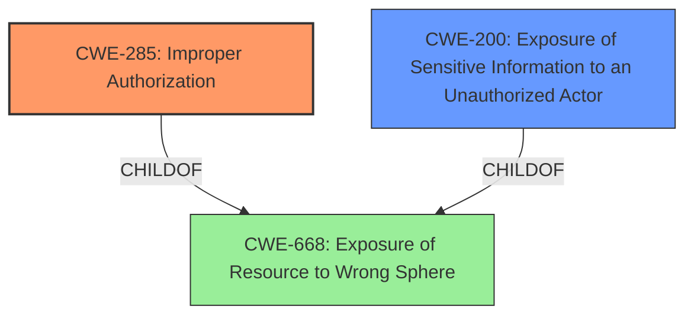

# Raw Analyzer Response for CVE-2024-41736

# Summary
| CWE ID | CWE Name | Confidence | CWE Abstraction Level | CWE Vulnerability Mapping Label | CWE-Vulnerability Mapping Notes |
|---|---|---|---|---|---|
| CWE-285 | Improper Authorization | 0.75 | Class | Primary | Discouraged |
| CWE-200 | Exposure of Sensitive Information to an Unauthorized Actor | 0.65 | Class | Secondary Candidate | Discouraged |

## Evidence and Confidence

*   **Confidence Score:** 0.70
*   **Evidence Strength:** LOW

## Relationship Analysis
The primary relationship considered was the hierarchical structure. CWE-285, while a Class-level CWE, is more fitting than its parents because it directly addresses the **improper authorization**, which is the core issue. CWE-200 is a potential impact of **improper authorization**, representing the resulting exposure of sensitive information. These two Class-level CWEs are children of the Pillar CWE-668.

## Vulnerability Chain
The vulnerability chain starts with **improper authorization** (CWE-285), which allows an authenticated attacker to bypass restrictions, leading to the exposure of restricted information (CWE-200). The root cause is the **failure to properly authorize** access, and the impact is the resulting exposure of sensitive data.

## Summary of Analysis
The analysis relies heavily on the vulnerability description because the CVE reference links do not provide specific details. The description indicates that an authenticated attacker can "access information which would otherwise be restricted." This strongly suggests an authorization issue. CWE-285 (Improper Authorization) aligns well with this **root cause**. While CWE-200 (Exposure of Sensitive Information to an Unauthorized Actor) is also relevant as a consequence, it is a technical impact rather than the **root cause weakness**. Both CWE-285 and CWE-200 are Class-level CWEs, which are typically discouraged. However, without more specific information, a more granular mapping is not possible. I am overriding the discouragement of class-level CWEs because the evidence is too weak to support more specific variants.

Relevant CWE Information:
- Vulnerability Description: "Under certain conditions SAP Permit to Work allows an authenticated attacker to access information which would otherwise be restricted causing low impact on the confidentiality of the application."

*   **CWE-285: Improper Authorization**
    *   **Explanation:** The vulnerability description states that an authenticated attacker can "access information which would otherwise be restricted." This directly points to a problem with authorization checks. The system is not properly verifying whether the attacker should have access to the information.
    *   **Security Implications:** An attacker can gain unauthorized access to sensitive information, potentially leading to data breaches or other security incidents.
    *   **Relationship:** CWE-285 is a Class-level CWE. More specific Base or Variant level CWEs would be preferred if more details about the **authorization** mechanism and its failure were available.
    *   **Mapping Guidance:** The usage is discouraged, but it is the most appropriate given the available information.
*   **CWE-200: Exposure of Sensitive Information to an Unauthorized Actor**
    *   **Explanation:** The vulnerability results in the exposure of restricted information, which aligns with CWE-200. However, CWE-200 represents the impact of the vulnerability rather than the root cause.
    *   **Security Implications:** Sensitive information is exposed to unauthorized actors, potentially leading to data breaches and other security incidents.
    *   **Relationship:** CWE-200 is a Class-level CWE and a child of CWE-668.
    *   **Mapping Guidance:** The usage is discouraged, as it is an impact rather than a **root cause**.

CWEs Considered but Not Used:

*   CWE-668: Exposure of Resource to Wrong Sphere - While this is a parent of both CWE-285 and CWE-200, it is too high-level and doesn't accurately represent the specific vulnerability.
*   CWE-425: Direct Request ('Forced Browsing') - This CWE is relevant to web applications that do not adequately enforce authorization on restricted URLs. However, the description doesn't explicitly mention URLs, so it is less suitable.
*   CWE-470: Use of Externally-Controlled Input to Select Classes or Code ('Unsafe Reflection') - This CWE does not align to the vulnerability description.