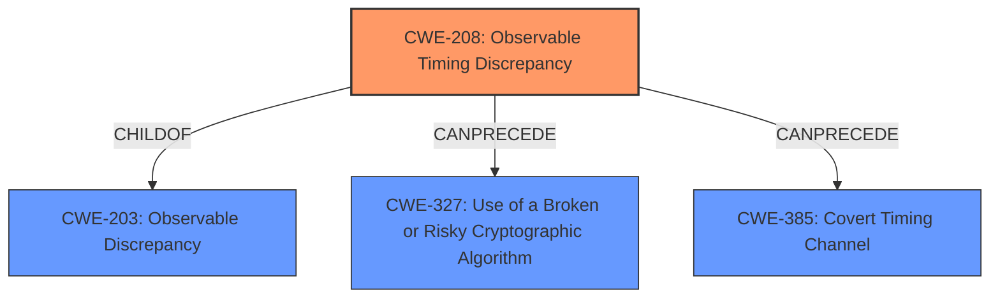

# Analysis Report for CVE-2024-41760

# Vulnerability Analysis Report: CVE-2024-41760

## Description

IBM Common Cryptographic Architecture 7.0.0 through 7.5.51 could allow an attacker to obtain sensitive information due to a **timing attack** during certain RSA operations.

## Vulnerability Description Key Phrases

- **Weakness:** timing attack
- **Impact:** obtain sensitive information
- **Product:** IBM Common Cryptographic Architecture
- **Version:** 7.0.0 through 7.5.51
- **Component:** certain RSA operations

## Analysis (with Relationship Data)

# Summary
| CWE ID  | CWE Name                                      | Confidence | CWE Abstraction Level | CWE Vulnerability Mapping Label | CWE-Vulnerability Mapping Notes |
| :-------- | :--------------------------------------------- | :---------- | :--------------------- | :------------------------------ | :------------------------------ |
| CWE-208 | Observable Timing Discrepancy                 | 0.9         | Base                   | Allowed                       | Primary CWE                  |

## Evidence and Confidence

*   **Confidence Score:** 0.9
*   **Evidence Strength:** HIGH

## Relationship Analysis
The primary CWE identified is CWE-208 (Observable Timing Discrepancy). It's a base-level CWE, which is the preferred level. The relationship analysis shows that CWE-208 is a child of CWE-203 (Observable Discrepancy) and can precede CWE-327 (Use of a Broken or Risky Cryptographic Algorithm) and CWE-385 (Covert Timing Channel).



## Vulnerability Chain
The vulnerability chain starts with the **timing attack** (CWE-208) during RSA operations, leading to the **impact** of obtaining sensitive information.

CWE-208 (Root Cause) -> Information Disclosure (Impact)

## Summary of Analysis
The analysis is based on the provided evidence, which clearly states a **timing attack** is the vulnerability.

The primary CWE selected is CWE-208 (Observable Timing Discrepancy). This is at the base level of abstraction and accurately represents the vulnerability where the time it takes to perform certain RSA operations reveals sensitive information.

Relevant CWE Information:

# Enhanced Context (25 CWEs)
The following CWEs were identified as potentially relevant to this vulnerability:

## CWE-208: Observable Timing Discrepancy
**Abstraction Level**: Base
**Similarity Score**: 0.77
**Source**: dense

**Description**:
Two separate operations in a product require different amounts of time to complete, in a way that is observable to an actor and reveals security-relevant information about the state of the product, such as whether a particular operation was successful or not.

**Mapping Guidance**:
- Usage: Allowed
- Rationale: This CWE entry is at the Base level of abstraction, which is a preferred level of abstraction for mapping to the root causes of vulnerabilities.

## CWE-208: Observable Timing Discrepancy
**Abstraction Level**: Base
**Similarity Score**: 2.91
**Source**: graph

**Description**:
Two separate operations in a product require different amounts of time to complete, in a way that is observable to an actor and reveals security-relevant information about the state of the product, such as whether a particular operation was successful or not.

**Mapping Guidance**:
- Usage: Allowed
- Rationale: This CWE entry is at the Base level of abstraction, which is a preferred level of abstraction for mapping to the root causes of vulnerabilities.

**Relationships**:
- PARENTOF -> CWE-1254
- CANPRECEDE -> CWE-327
- CANPRECEDE -> CWE-385
- CHILDOF -> CWE-203
- CANFOLLOW -> CWE-208

CWE-208 (Observable Timing Discrepancy) is the most relevant because the vulnerability description explicitly mentions a **timing attack** during RSA operations. This aligns directly with the CWE's description of different operations requiring different amounts of time, revealing sensitive information. The "Vulnerability Description Key Phrases" also highlight **"timing attack"** as the **weakness**.

CWE-203 (Observable Discrepancy) was considered, but it is a more general case of observable differences in behavior, while CWE-208 is specific to timing discrepancies.

CWE-327 (Use of a Broken or Risky Cryptographic Algorithm) was considered because the vulnerability involves RSA operations. However, the root cause is the **timing attack** itself, not necessarily the use of a broken algorithm.

CWE-385 (Covert Timing Channel) was considered, but CWE-208 is a more direct match for the described vulnerability.

The Retriever results also support CWE-208 as the top candidate.


## CWE Relationship Analysis

Current CWEs represent these abstraction levels: .


### Vulnerability Chain Analysis

**Chain starting from CWE-203:**
- 203 (Observable Discrepancy) - ROOT


**Chain starting from CWE-327:**
- 327 (Use of a Broken or Risky Cryptographic Algorithm) - ROOT


### CWE Relationship Diagram

```mermaid
graph TD
    classDef primary fill:#f96,stroke:#333,stroke-width:2px
    classDef secondary fill:#69f,stroke:#333
    classDef tertiary fill:#9e9,stroke:#333
```


*Report generated on 2025-07-13 13:23:30*
