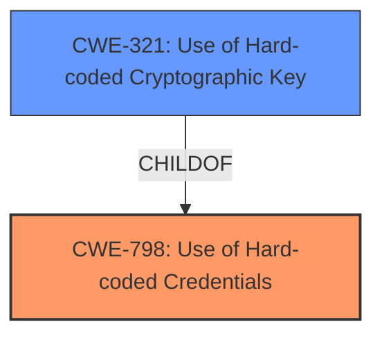

# Analysis for CVE-2024-41885

# Summary

| CWE ID  | CWE Name                                                       | Confidence | CWE Abstraction Level | CWE Vulnerability Mapping Label | CWE-Vulnerability Mapping Notes |
| :-------- | :------------------------------------------------------------- | :--------- | :-------------------- | :------------------------------ | :------------------------------ |
| CWE-798 | Use of **Hard-coded Credentials**                             | 0.9        | Base                  | Allowed                         | Primary CWE                   |
| CWE-321 | Use of **Hard-coded Cryptographic Key**                       | 0.7        | Variant               | Allowed                         | Secondary Candidate            |

## Evidence and Confidence

*   **Confidence Score:** 0.8
*   **Evidence Strength:** HIGH

## Relationship Analysis

The primary CWE is CWE-798 (Use of **Hard-coded Credentials**), a Base level CWE. CWE-321 (Use of **Hard-coded Cryptographic Key**) is a Variant of CWE-798, representing a more specific case. The vulnerability description clearly indicates that the seed string for the encryption key is **hardcoded**, making CWE-798 the most appropriate root cause. CWE-321 is a good secondary candidate since the **hardcoded** value is related to cryptography.

## Vulnerability Chain

The vulnerability chain starts with the **hardcoding** of the seed string (CWE-798). This allows an attacker to potentially reproduce the NVR firmware decryption key, leading to possible firmware decryption and analysis.

## Summary of Analysis

The analysis is based on the vulnerability description, which explicitly states that the seed string for the encrypt key was **hardcoded**. This directly aligns with CWE-798 (Use of **Hard-coded Credentials**). The retriever results also indicate CWE-798 and CWE-321 as relevant candidates, further supporting this classification. The relationship analysis shows that CWE-321 is a variant of CWE-798, providing a more specific classification.

The decision to select CWE-798 is based on the direct evidence of **hardcoding** in the vulnerability description and the alignment with the CWE's definition. The retriever results and relationship analysis provide additional support for this classification. CWE-798 is selected because it is the root cause, while CWE-321 could be a consequence of that root cause. The selected CWEs are at the optimal level of specificity, accurately representing the **weakness** described in the vulnerability.

Relevant CWE Information:

# Enhanced Context (25 CWEs)
The following CWEs were identified as potentially relevant to this vulnerability:

## CWE-1391: Use of Weak Credentials
**Abstraction Level**: Class
**Similarity Score**: 0.76
**Source**: dense

**Description**:
The product uses weak credentials (such as a default key or hard-coded password) that can be calculated, derived, reused, or guessed by an attacker.

**Mapping Guidance**:
- Usage: Allowed-with-Review
- Rationale: This CWE entry is a Class and might have Base-level children that would be more appropriate

This was not chosen since the seed is **hardcoded** and not just weak, but a static value.

## CWE-798: Use of **Hard-coded Credentials**
**Abstraction Level**: Base
**Similarity Score**: 0.74
**Source**: dense

**Description**:
The product contains **hard-coded credentials**, such as a password or cryptographic key.

**Mapping Guidance**:
- Usage: Allowed
- Rationale: This CWE entry is at the Base level of abstraction, which is a preferred level of abstraction for mapping to the root causes of vulnerabilities.

This was chosen as the primary because the **seed string** was **hardcoded**.

## CWE-321: Use of **Hard-coded Cryptographic Key**
**Abstraction Level**: Variant
**Similarity Score**: 0.73
**Source**: dense

**Description**:
The use of a **hard-coded cryptographic key** significantly increases the possibility that encrypted data may be recovered.

**Mapping Guidance**:
- Usage: Allowed
- Rationale: This CWE entry is at the Variant level of abstraction, which is a preferred level of abstraction for mapping to the root causes of vulnerabilities.

This was chosen as a secondary candidate since the **hardcoded** value is related to cryptography.

## CWE-345: Insufficient Verification of Data Authenticity
**Abstraction Level**: Class
**Similarity Score**: 0.72
**Source**: dense

**Description**:
The product does not sufficiently verify the origin or authenticity of data, in a way that causes it to accept invalid data.

**Mapping Guidance**:
- Usage: Discouraged
- Rationale: This CWE entry is a level-1 Class (i.e., a child of a Pillar). It might have lower-level children that would be more appropriate

This was not chosen as the **weakness** is related to the **hardcoded** seed.

## CWE-330: Use of Insufficiently Random Values
**Abstraction Level**: Class
**Similarity Score**: 0.72
**Source**: dense

**Description**:
The product uses insufficiently random numbers or values in a security context that depends on unpredictable numbers.

**Mapping Guidance**:
- Usage: Discouraged
- Rationale: This CWE entry is a level-1 Class (i.e., a child of a Pillar). It might have lower-level children that would be more appropriate

This was not chosen as the **weakness** is related to the **hardcoded** seed, and not randomness.

## CWE-294: Authentication Bypass by Capture-replay
**Abstraction Level**: Base
**Similarity Score**: 0.71
**Source**: dense

**Description**:
A capture-replay flaw exists when the design of the product makes it possible for a malicious user to sniff network traffic and bypass authentication by replaying it to the server in question to the same effect as the original message (or with minor changes).

**Mapping Guidance**:
- Usage: Allowed
- Rationale: This CWE entry is at the Base level of abstraction, which is a preferred level of abstraction for mapping to the root causes of vulnerabilities.

This was not chosen as the **weakness** is related to the **hardcoded** seed.

## CWE-497: Exposure of Sensitive System Information to an Unauthorized Control Sphere
**Abstraction Level**: Base
**Similarity Score**: 0.71
**Source**: dense

**Description**:
The product does not properly prevent sensitive system-level information from being accessed by unauthorized actors who do not have the same level of access to the underlying system as the product does.

**Mapping Guidance**:
- Usage: Allowed
- Rationale: This CWE entry is at the Base level of abstraction, which is a preferred level of abstraction for mapping to the root causes of vulnerabilities.

This was not chosen as the **weakness** is related to the **hardcoded** seed.

## CWE-311: Missing Encryption of Sensitive Data
**Abstraction Level**: Class
**Similarity Score**: 0.71
**Source**: dense

**Description**:
The product does not encrypt sensitive or critical information before storage or transmission.

**Mapping Guidance**:
- Usage: Discouraged
- Rationale: CWE-311 is high-level with more precise children available. It is a level-1 Class (i.e., a child of a Pillar).

This was not chosen as the **weakness** is related to the **hardcoded** seed.

## CWE-335: Incorrect Usage of Seeds in Pseudo-Random Number Generator (PRNG)
**Abstraction Level**: Base
**Similarity Score**: 0.70
**Source**: dense

**Description**:
The product uses a Pseudo-Random Number Generator (PRNG) but does not correctly manage seeds.

**Mapping Guidance**:
- Usage: Allowed
- Rationale: This CWE entry is at the Base level of abstraction, which is a preferred level of abstraction for mapping to the root causes of vulnerabilities.

This was not chosen because the seed is simply **hardcoded**, rather than managed incorrectly.

## CWE-303: Incorrect Implementation of Authentication Algorithm
**Abstraction Level**: Base
**Similarity Score**: 0.70
**Source**: dense

**Description**:
The requirements for the product dictate the use of an established authentication algorithm, but the implementation of the algorithm is incorrect.

**Mapping Guidance**:
- Usage: Allowed
- Rationale: This CWE entry is at the Base level of abstraction, which is a preferred level of abstraction for mapping to the root causes of vulnerabilities.

This was not chosen as the **weakness** is related to the **hardcoded** seed.