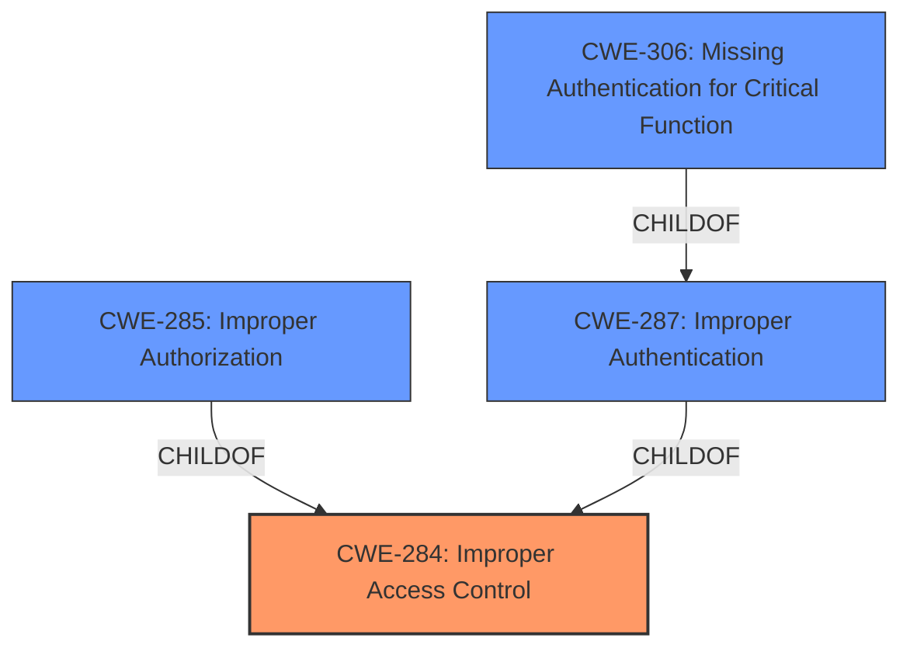

# Analysis Report for CVE-2024-41912

# Vulnerability Analysis Report: CVE-2024-41912

## Description

A vulnerability was discovered in the firmware builds up to 10.10.2.2 in Poly Clariti Manager devices. The firmware flaw does not properly implement access controls.

## Vulnerability Description Key Phrases

- **Product:** Poly Clariti Manager
- **Version:** up to 10.10.2.2

## Analysis (with Relationship Data)

# Summary
| CWE ID | CWE Name | Confidence | CWE Abstraction Level | CWE Vulnerability Mapping Label | CWE-Vulnerability Mapping Notes |
|---|---|---|---|---|---|
| CWE-284 | Improper Access Control | 0.8 | Pillar | Allowed | Primary CWE |
| CWE-306 | Missing Authentication for Critical Function | 0.6 | Base | Allowed | Secondary Candidate |
| CWE-285 | Improper Authorization | 0.6 | Class | Discouraged | Secondary Candidate |

## Evidence and Confidence

*   **Confidence Score:** 0.7
*   **Evidence Strength:** LOW

## Relationship Analysis
The primary CWE selected is CWE-284 which is a Pillar level of abstraction. CWE-284 has child relationships to more specific CWEs like CWE-285 (Improper Authorization) and CWE-287 (Improper Authentication). The retriever results also include CWE-306 (Missing Authentication for Critical Function), which could also be related to access control issues. Since the vulnerability description is very high level, I will start with the higher level CWE-284. Further investigation may require a more specific child CWE.



## Vulnerability Chain
The vulnerability chain starts with **improper access control** (CWE-284), potentially leading to unauthorized access and modification of system resources. A lack of authentication (CWE-306) or authorization (CWE-285) could be contributing factors.

## Summary of Analysis
The vulnerability description indicates that the Poly Clariti Manager devices have a firmware flaw related to **improper implementation of access controls**. Due to the high-level nature of the description and lack of supporting evidence, I have mapped this to CWE-284 (Improper Access Control), which is a Pillar. The retriever results also suggest CWE-306 (Missing Authentication for Critical Function) and CWE-285 (Improper Authorization). These could be contributing factors, but without more information, I am sticking with the broader CWE-284. My assessment is primarily based on the **Vulnerability Description** which states the **firmware flaw does not properly implement access controls**. I have a lower confidence score because the **CVE Reference Links Content Summary** section is empty and there isn't a rootcause or weakness entry in the **Vulnerability Description Key Phrases**.

Relevant CWE Information:

*   **CWE-284 Improper Access Control:** This CWE is selected as the primary weakness because the vulnerability description specifically mentions a flaw related to **improper implementation of access controls**. Access control is a high-level concept, so a Pillar level CWE is appropriate.
*   **CWE-306 Missing Authentication for Critical Function:** This CWE is considered as a potential contributing factor because **missing authentication** can lead to **improper access control**. However, without more information, it's difficult to determine if this is the specific cause.
*   **CWE-285 Improper Authorization:** This CWE is considered because authorization is a key component of access control. **Improper authorization** can lead to unauthorized access to resources. However, without more specific information, it is hard to determine if authorization is the specific issue.

Other CWEs considered but not used:

*   CWE-259 (Use of Hard-coded Password) and CWE-321 (Use of Hard-coded Cryptographic Key): These are related to credential management, but there is no mention of credentials in the vulnerability description.
*   CWE-78 (Improper Neutralization of Special Elements used in an OS Command ('OS Command Injection')): This is related to command injection, but there is no indication of command injection in the vulnerability description.
*   CWE-425 (Direct Request ('Forced Browsing')): This is related to authorization on URLs, but there is no mention of URLs in the vulnerability description.
*   CWE-345 (Insufficient Verification of Data Authenticity): This is related to data authenticity, but there is no mention of data authenticity in the vulnerability description.
*   CWE-912 (Hidden Functionality): This is related to undocumented functionality, but there is no mention of undocumented functionality in the vulnerability description.
*   CWE-287 (Improper Authentication): This is related to authentication, but there is no explicit mention of an authentication failure in the vulnerability description, only that access controls were not properly implemented.
*   CWE-798 (Use of Hard-coded Credentials): Similar to CWE-259 and CWE-321, there is no mention of credentials in the vulnerability description.
*   CWE-347 (Improper Verification of Cryptographic Signature): This is related to cryptographic signatures, but there is no mention of cryptographic signatures in the vulnerability description.
*   CWE-613 (Insufficient Session Expiration): This relates to session management, which doesn't directly align with the description of access control issues.
*   CWE-471 (Modification of Assumed-Immutable Data (MAID)): This relates to data integrity, but there is no indication of this in the vulnerability description.
*   CWE-184 (Incomplete List of Disallowed Inputs): This relates to input validation which is not explicitly mentioned.
*   CWE-1304 (Improperly Preserved Integrity of Hardware Configuration State During a Power Save/Restore Operation): This CWE is very specific to hardware state during power save operations and does not fit the context of the given vulnerability.
*   CWE-912 (Hidden Functionality): The vulnerability description focuses on access control, not hidden functionality.
*   CWE-303: Incorrect Implementation of Authentication Algorithm - While authentication might be involved, the core issue seems to be broader access control, not specifically the authentication algorithm's implementation.
*   CWE-345: Insufficient Verification of Data Authenticity - This relates to data integrity, which isn't explicitly mentioned in the description.
*   CWE-497: Exposure of Sensitive System Information to an Unauthorized Control Sphere - The description doesn't directly imply sensitive information exposure.
*   CWE-755: Improper Handling of Exceptional Conditions - There's no mention of exceptional conditions or error handling in the description.
*   CWE-319: Cleartext Transmission of Sensitive Information - This relates to data transmission security, which isn't directly mentioned.
*   CWE-346: Origin Validation Error - This is related to data origin validation, not directly access control.
*   CWE-288: Authentication Bypass Using an Alternate Path or Channel - While this could be related, the description is too general to confirm this specific bypass.
*   CWE-312: Cleartext Storage of Sensitive Information - This relates to data storage security, not access control.


## CWE Relationship Analysis

Current CWEs represent these abstraction levels: .


### Vulnerability Chain Analysis

**Chain starting from CWE-471:**
- 471 (Modification of Assumed-Immutable Data (MAID)) - ROOT


**Chain starting from CWE-345:**
- 345 (Insufficient Verification of Data Authenticity) - ROOT


### CWE Relationship Diagram

```mermaid
graph TD
    classDef primary fill:#f96,stroke:#333,stroke-width:2px
    classDef secondary fill:#69f,stroke:#333
    classDef tertiary fill:#9e9,stroke:#333
```


*Report generated on 2025-07-13 13:29:52*
