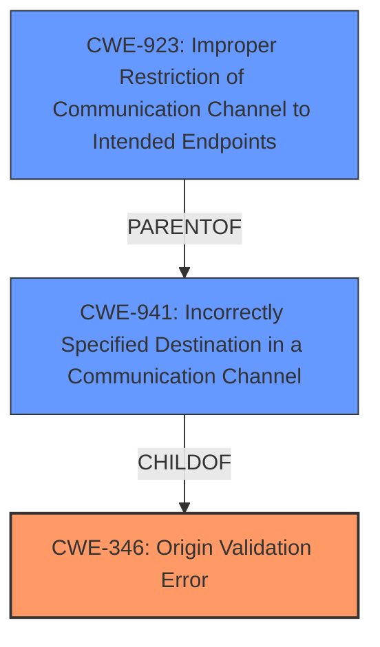

# Enhanced Analysis for CVE-2024-41926

# Summary
| CWE ID | CWE Name | Confidence | CWE Abstraction Level | CWE Vulnerability Mapping Label | CWE-Vulnerability Mapping Notes |
|---|---|---|---|---|---|
| CWE-346 | Origin Validation Error | 0.8 | Class | Primary | Allowed-with-Review |
| CWE-941 | Incorrectly Specified Destination in a Communication Channel | 0.7 | Base | Secondary | Allowed |
| CWE-923 | Improper Restriction of Communication Channel to Intended Endpoints | 0.6 | Class | Secondary | Allowed-with-Review |

## Evidence and Confidence

*   **Confidence Score:** 0.8
*   **Evidence Strength:** MEDIUM

## Relationship Analysis
The primary CWE, CWE-346 [Origin Validation Error], is a class-level weakness. Several base-level CWEs could be considered children of this class. CWE-941 [Incorrectly Specified Destination in a Communication Channel] and CWE-923 [Improper Restriction of Communication Channel to Intended Endpoints] are related to the vulnerability. While CWE-941 is a more direct description of the **failure to validate the source**, CWE-346 is a broader category encompassing this.



## Vulnerability Chain
The vulnerability chain starts with a **failure to validate the source of sync messages** (CWE-346). This leads to the ability for a malicious remote to **set arbitrary RemoteId values for synced users**.

CWE-346 (Root Cause) -> Impact: Setting arbitrary RemoteId values.

## Summary of Analysis
The primary weakness is the **failure to validate the source of sync messages**. The best fit is CWE-346 [Origin Validation Error], as it directly addresses the **lack of proper verification of the data source**. The vulnerability description explicitly states that the system "fail[s] to validate the source of sync messages."

CWE-941 [Incorrectly Specified Destination in a Communication Channel] is also relevant, as it describes the **incorrect specification of the destination**, which is related to origin validation. However, CWE-346 is a more appropriate high-level classification.

CWE-923 [Improper Restriction of Communication Channel to Intended Endpoints] is also relevant, as the communication channel is not properly restricted to the intended endpoints. This could be considered a broader category that includes the specific origin validation failure.

The selection of CWE-346 is based on the evidence from the vulnerability description: "Mattermost versions 9.9.x <= 9.9.0 and 9.5.x <= 9.5.6 **fail to validate the source of sync messages** and only allow the correct remote IDs, which allows a malicious remote to set arbitrary RemoteId values for synced users and therefore claim that a user was synced from another remote."

The chosen CWEs are at the optimal level of specificity, with CWE-346 providing a general classification and CWE-941 and CWE-923 providing more specific details about the vulnerability.

Other CWEs Considered but Not Used:

*   CWE-639 [Authorization Bypass Through User-Controlled Key]: While the vulnerability allows setting arbitrary RemoteId values, it's primarily an origin validation issue rather than a direct authorization bypass through a user-controlled key.
*   CWE-863 [Incorrect Authorization]: Similar to CWE-639, the root cause is not primarily an authorization issue.
*   CWE-347 [Improper Verification of Cryptographic Signature]: This CWE is not relevant as the vulnerability does not involve cryptographic signatures.
*   CWE-287 [Improper Authentication]: While related, the vulnerability is more about validating the origin of messages than a general authentication failure.
*   CWE-1286 [Improper Validation of Syntactic Correctness of Input]: The issue is not about the syntactic correctness of the input, but the validity of the source.
*   CWE-789 [Memory Allocation with Excessive Size Value]: This CWE is not relevant to the vulnerability.
*   CWE-116 [Improper Encoding or Escaping of Output]: This CWE is not relevant to the vulnerability.
*   CWE-322 [Key Exchange without Entity Authentication]: This CWE is not relevant as the vulnerability does not involve key exchange.


## CWE Relationship Analysis

Current CWEs represent these abstraction levels: .


### Vulnerability Chain Analysis

**Chain starting from CWE-863:**
- 863 (Incorrect Authorization) - ROOT


**Chain starting from CWE-116:**
- 116 (Improper Encoding or Escaping of Output) - ROOT


### CWE Relationship Diagram

```mermaid
graph TD
    classDef primary fill:#f96,stroke:#333,stroke-width:2px
    classDef secondary fill:#69f,stroke:#333
    classDef tertiary fill:#9e9,stroke:#333
```