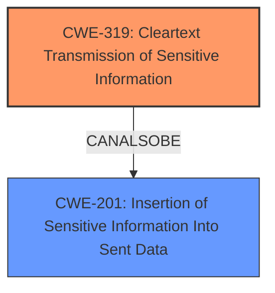

# Enhanced Analysis for CVE-2024-41931

# Summary
| CWE ID | CWE Name | Confidence | CWE Abstraction Level | CWE Vulnerability Mapping Label | CWE-Vulnerability Mapping Notes |
|---|---|---|---|---|---|
| CWE-319 | Cleartext Transmission of Sensitive Information | 0.9 | Base | Allowed | Primary CWE. The encryption key name is transmitted without encryption. |
| CWE-201 | Insertion of Sensitive Information Into Sent Data | 0.7 | Base | Allowed | Secondary CWE. Sending the key name can be considered insertion of sensitive information into sent data. |

## Evidence and Confidence

*   **Confidence Score:** 0.8
*   **Evidence Strength:** HIGH

## Relationship Analysis
The primary CWE is CWE-319, which directly addresses the **cleartext transmission of sensitive information**. CWE-201, *Insertion of Sensitive Information Into Sent Data*, is a related CWE that describes the broader issue of including sensitive information in transmitted data. While CWE-319 is more specific, CWE-201 provides a broader context.



## Vulnerability Chain
The vulnerability chain starts with the **weakness** of sending the encryption key name unencrypted. This leads directly to the impact of an attacker being able to capture the key name and potentially gain information about the encryption in use.

## Summary of Analysis
The analysis is based on the provided evidence, specifically the **root cause** that the "encryption key name is sent unencrypted when the key is broadcasted over RF." This directly aligns with CWE-319, *Cleartext Transmission of Sensitive Information*. The CVE reference summary also indicates "Weakness: Insertion of Sensitive Information Into Sent Data (CWE-201)". Therefore, both CWE-319 and CWE-201 are relevant. CWE-319 is selected as the primary because it more accurately describes the **root cause**, while CWE-201 is a valid secondary consideration. Both CWEs are at the base level of abstraction, which is preferred.

Relevant CWE Information:

# Enhanced Context (25 CWEs)
The following CWEs were identified as potentially relevant to this vulnerability:

## CWE-319: Cleartext Transmission of Sensitive Information
**Abstraction Level**: Base
**Similarity Score**: 0.71
**Source**: dense

**Description**:
The product transmits sensitive or security-critical data in cleartext in a communication channel that can be sniffed by unauthorized actors.

**Mapping Guidance**:
- Usage: Allowed
- Rationale: This CWE entry is at the Base level of abstraction, which is a preferred level of abstraction for mapping to the root causes of vulnerabilities.

## CWE-201: Insertion of Sensitive Information Into Sent Data
**Abstraction Level**: base
**Similarity Score**: 3.64
**Source**: graph

**Description**:
CWE-201: Insertion of Sensitive Information Into Sent Data

**Mapping Guidance**:
- Usage: Allowed
- Rationale: This CWE entry is at the Base level of abstraction, which is a preferred level of abstraction for mapping to the root causes of vulnerabilities.

## CWE-311: Missing Encryption of Sensitive Data
**Abstraction Level**: Class
**Similarity Score**: 0.68
**Source**: dense

**Description**:
The product does not encrypt sensitive or critical information before storage or transmission.

**Mapping Guidance**:
- Usage: Discouraged
- Rationale: CWE-311 is high-level with more precise children available. It is a level-1 Class (i.e., a child of a Pillar).

**CWEs Considered But Not Used:**

*   **CWE-311: Missing Encryption of Sensitive Data:** While related, this is a class-level CWE and less specific than CWE-319. The data *is* encrypted, but the key *name* is not, so it's not a complete lack of encryption.
*   **CWE-523: Unprotected Transport of Credentials:** This is similar to CWE-319, but more focused on credentials specifically. The key *name* is not strictly a credential.
*   **CWE-312: Cleartext Storage of Sensitive Information:** This CWE doesn't apply because the information is being transmitted, not stored.
*   **CWE-330: Use of Insufficiently Random Values:** Not applicable as there is no randomness described in the vulnerability.
*   **CWE-345: Insufficient Verification of Data Authenticity:** The issue isn't authenticity, but the transmission of sensitive data in cleartext.
*   **CWE-321: Use of Hard-coded Cryptographic Key:** This is not about hard-coded keys, but about transmitting the key name unencrypted.
*   **CWE-294: Authentication Bypass by Capture-replay:** Not applicable, as this is not about authentication bypass.
*   **CWE-327: Use of a Broken or Risky Cryptographic Algorithm:** Not applicable, as there's no indication of broken cryptography.
*   **CWE-347: Improper Verification of Cryptographic Signature:** The vulnerability doesn't relate to signature verification.
*   **CWE-1240: Use of a Cryptographic Primitive with a Risky Implementation:** Not applicable, as no risky implementation is mentioned.
*   **CWE-201: Insertion of Sensitive Information Into Sent Data:** As explained previously, this is a secondary consideration as it relates to inserting sensitive information into the sent data.


## CWE Relationship Analysis

Current CWEs represent these abstraction levels: .


### Vulnerability Chain Analysis

**Chain starting from CWE-321:**
- 321 (Use of Hard-coded Cryptographic Key) - ROOT


**Chain starting from CWE-345:**
- 345 (Insufficient Verification of Data Authenticity) - ROOT


### CWE Relationship Diagram

```mermaid
graph TD
    classDef primary fill:#f96,stroke:#333,stroke-width:2px
    classDef secondary fill:#69f,stroke:#333
    classDef tertiary fill:#9e9,stroke:#333
```