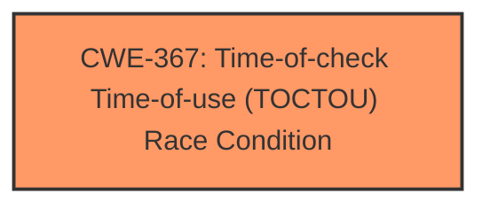

# Analysis Report for CVE-2024-41945

# Vulnerability Analysis Report: CVE-2024-41945

## Description

fuels-ts is a library for interacting with Fuel v2. The typescript SDK has no awareness of to-be-spent transactions causing some transactions to fail or silently get pruned as they are funded with already used UTXOs. The problem occurs, because the `fund` function in `fuels-ts/packages/account/src/account.ts` gets the needed ressources statelessly with the function `getResourcesToSpend` without taking into consideration already used UTXOs. This issue will lead to unexpected SDK behaviour, such as a transaction not getting included in the `txpool` / in a block or a previous transaction silently getting removed from the `txpool` and replaced with a new one.

## Vulnerability Description Key Phrases

- **Rootcause:** statelessness of fund function in fuels-ts
- **Weakness:** does not consider already used UTXOs
- **Impact:** transaction failure or pruning
- **Product:** Fuel v2 typescript SDK
- **Component:** fund function in fuels-ts/packages/account/src/account.ts

## Analysis (with Relationship Data)

# Summary
| CWE ID | CWE Name | Confidence | CWE Abstraction Level | CWE Vulnerability Mapping Label | CWE-Vulnerability Mapping Notes |
|---|---|---|---|---|---|
| CWE-367 | Time-of-check Time-of-use (TOCTOU) Race Condition | 0.8 | Base | Allowed | Primary CWE. The vulnerability arises because the state of UTXOs can change between the time they are checked for availability and the time they are used in a transaction, leading to the same UTXO being used multiple times. |

## Evidence and Confidence

*   **Confidence Score:** 0.8
*   **Evidence Strength:** HIGH

## Relationship Analysis
The primary CWE selected is CWE-367, a **Base** level weakness. This is the most specific CWE that accurately captures the essence of the vulnerability, which involves a race condition due to the time gap between checking the availability of UTXOs and their actual use in a transaction. No direct parent or child relationships strongly influenced the selection, but the peer relationships helped to confirm that this was the most appropriate classification, especially when considering alternatives like resource management or input validation issues.



## Vulnerability Chain
The vulnerability chain is relatively simple:
1.  **Root Cause:** The `fund` function in the `fuels-ts` library retrieves UTXOs statelessly (**CWE-367**).
2.  **Weakness:** The function **does not consider already used UTXOs** in pending transactions, leading to a race condition.
3.  **Impact:** Transactions may fail, be pruned from the transaction pool, or replace other transactions.

## Summary of Analysis
The initial analysis focused on identifying the root cause of the vulnerability. The key phrases "**statelessness of fund function**" and "**does not consider already used UTXOs**" strongly suggest a timing issue where the state of UTXOs changes between the time they are checked and used. This aligns with the description of CWE-367.

The **CVE Reference Links Content Summary** confirms this by stating that the `getResourcesToSpend` function does not exclude UTXOs that have already been used in other transactions, leading to the possibility of the same UTXO being used in multiple transactions within the same block.

The retriever results listed CWE-367 as a relevant candidate, further supporting this assessment. While other CWEs like CWE-754 (Improper Check for Unusual or Exceptional Conditions), CWE-347 (Improper Verification of Cryptographic Signature), and CWE-770 (Allocation of Resources Without Limits or Throttling) were considered, they did not accurately capture the timing-related race condition at the heart of this vulnerability.

CWE-367 is at the Base level of abstraction, which is ideal for mapping root causes. The mapping guidance for CWE-367 allows its usage, reinforcing its suitability.

Based on the evidence, relationship analysis, and mapping guidance, CWE-367 is the most appropriate classification for this vulnerability.

Relevant CWE Information:
- **Vulnerability Description Key Phrases**: **statelessness of fund function in fuels-ts** and **does not consider already used UTXOs** within the same block
- **CVE Reference Links Content Summary**:  The `getResourcesToSpend` function does not exclude UTXOs that have already been used in other transactions.


## CWE Relationship Analysis

Current CWEs represent these abstraction levels: .


### Vulnerability Chain Analysis

**Chain starting from CWE-367:**
- 367 (Time-of-check Time-of-use (TOCTOU) Race Condition) - ROOT


**Chain starting from CWE-347:**
- 347 (Improper Verification of Cryptographic Signature) - ROOT


### CWE Relationship Diagram

```mermaid
graph TD
    classDef primary fill:#f96,stroke:#333,stroke-width:2px
    classDef secondary fill:#69f,stroke:#333
    classDef tertiary fill:#9e9,stroke:#333
```


*Report generated on 2025-07-13 13:32:03*
