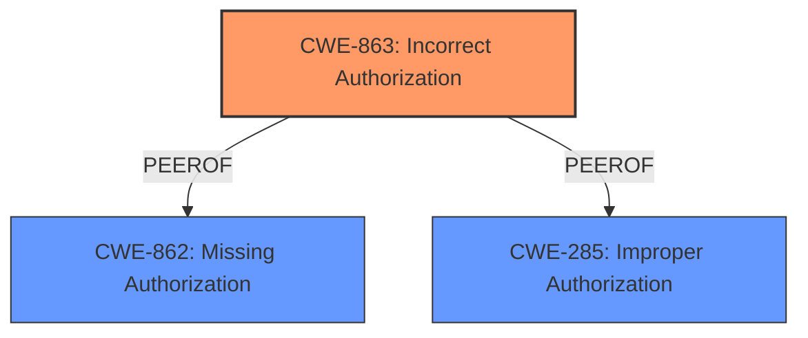

# Enhanced Analysis for CVE-2024-41964

# Summary
| CWE ID  | CWE Name                                                                 | Confidence | CWE Abstraction Level | CWE Vulnerability Mapping Label | CWE-Vulnerability Mapping Notes |
| :-------- | :----------------------------------------------------------------------- | :--------- | :-------------------- | :------------------------------ | :-------------------------------- |
| CWE-863   | Incorrect Authorization                                                 | 1.0        | Class                 | Primary                         | Allowed-with-Review               |
| CWE-862   | Missing Authorization                                                   | 0.7        | Class                 | Secondary                       | Allowed-with-Review               |

## Evidence and Confidence

*   **Confidence Score:** 0.9
*   **Evidence Strength:** HIGH

## Relationship Analysis
The primary CWE is CWE-863, "Incorrect Authorization". This is due to the presence of authorization checks, but they are **incorrectly** performed or **missing**. CWE-862, "Missing Authorization", is a closely related CWE and a parent of CWE-863 which indicates a complete absence of authorization checks.



## Vulnerability Chain
The vulnerability chain starts with the **missing permission checks** which allow attackers with Panel access to manipulate the language definitions.
The chain is as follows:
1.  **Missing Permission Checks** (**ROOT CAUSE**: **CWE-863**/**CWE-862**)
2.  Manipulation of Language Definitions (**IMPACT**)

## Summary of Analysis
The initial analysis identified **missing permission checks** as the root cause of the vulnerability. The primary CWE selected is CWE-863 "Incorrect Authorization", because the **missing permission checks** allow attackers with Panel access to manipulate the language definitions. The CVE Reference Links Content Summary states: "*The primary weakness is the absence of proper authorization checks when modifying language definitions.*" and "*The issue is identified as CWE-863 (Incorrect Authorization)*".

CWE-862 "Missing Authorization" was considered as a possible alternative because the vulnerability description contains the phrase "**missing permission checks**". However, the vulnerability description indicates that permissions for creating and deleting languages already existed, but they were not enforced. This implies that authorization checks were present, but were not correctly implemented. So, CWE-863 "Incorrect Authorization" is a better fit.

The selected CWEs are at the appropriate level of specificity, as they accurately reflect the nature of the authorization issues in the Kirby CMS.

Relevant CWE Information:

*   CWE-863: Incorrect Authorization: The product performs an authorization check when an actor attempts to access a resource or perform an action, but it does not correctly perform the check.
*   CWE-862: Missing Authorization: The product does not perform an authorization check when an actor attempts to access a resource or perform an action.


## CWE Relationship Analysis

Current CWEs represent these abstraction levels: .


### Vulnerability Chain Analysis

**Chain starting from CWE-863:**
- 863 (Incorrect Authorization) - ROOT


**Chain starting from CWE-285:**
- 285 (Improper Authorization) - ROOT


### CWE Relationship Diagram

```mermaid
graph TD
    classDef primary fill:#f96,stroke:#333,stroke-width:2px
    classDef secondary fill:#69f,stroke:#333
    classDef tertiary fill:#9e9,stroke:#333
```