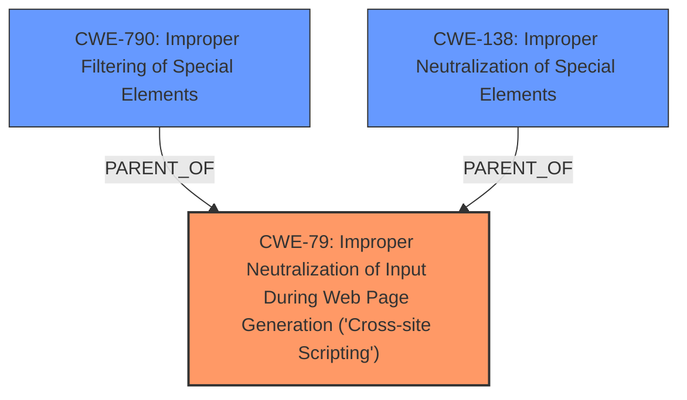

# Analysis for CVE-2024-42010

# Summary
| CWE ID | CWE Name | Confidence | CWE Abstraction Level | CWE Vulnerability Mapping Label | CWE-Vulnerability Mapping Notes |
|---|---|---|---|---|---|
| CWE-79 | Improper Neutralization of Input During Web Page Generation ('Cross-site Scripting') | 0.9 | Base | Allowed | Primary CWE. The vulnerability involves insufficient filtering of CSS, leading to potential Cross-Site Scripting (XSS) by injecting malicious code into web pages. |
| CWE-138 | Improper Neutralization of Special Elements | 0.6 | Class | Discouraged | Secondary CWE. The product receives input from an upstream component, but it does not neutralize or incorrectly neutralizes special elements that could be interpreted as control elements or syntactic markers when they are sent to a downstream component. |
| CWE-790 | Improper Filtering of Special Elements | 0.6 | Class | Allowed-with-Review | Secondary CWE. The product receives data from an upstream component, but does not filter or incorrectly filters special elements before sending it to a downstream component. |

## Evidence and Confidence

*   **Confidence Score:** 0.8
*   **Evidence Strength:** HIGH

## Relationship Analysis
The primary relationship influencing the selection is that CWE-79 is a base CWE that directly describes the XSS vulnerability resulting from improper neutralization of input.
CWE-138 and CWE-790 are class level CWEs related to improper neutralization and filtering. CWE-79 is more specific to web page generation.
The relationships between these CWEs help to understand how a general lack of neutralization (CWE-138) and filtering (CWE-790) can lead to XSS (CWE-79).

## Vulnerability Chain
1.  **Root Cause:** **Insufficiently filters Cascading Style Sheets (CSS) token sequences** in rendered e-mail messages (Vulnerability Description Key Phrases). This maps to improper neutralization of input.
2.  **Weakness:** The flawed regex-based blocklist filter in `mod_css_styles()` function is susceptible to bypass, allowing injection of malicious CSS.
3.  **Impact:** A remote attacker can **obtain sensitive information** (Vulnerability Description Key Phrases) or manipulate the user interface through CSS injection techniques, potentially leading to XSS.

The chain starts with a filtering issue, which allows for CSS injection and results in information leakage or UI manipulation.

## Summary of Analysis
The primary decision is based on the **rootcause**, which is the **insufficient filtering of CSS token sequences**. This directly leads to the possibility of injecting malicious CSS into web pages, which aligns with CWE-79.
The vulnerability description and CVE Reference Links Content Summary provide clear evidence of **insufficient filtering** being the root cause. The retriever results also show CWE-79 as the top candidate with a high similarity score.

CWE-79 is at the Base level of abstraction, which is preferred. The other CWEs considered either describe more general classes of weaknesses (CWE-138, CWE-790) or are not directly related to the core issue of CSS injection.
I considered CWE-138 and CWE-790 because they are related to the **improper neutralization** and **filtering** of special elements. However, these are more general and less specific than CWE-79, which focuses on the specific context of web page generation.
The selection of CWE-79 is based on direct evidence from the vulnerability description and the provided context, making it the most appropriate classification.