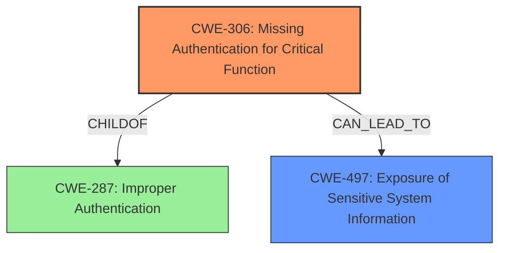

# Enhanced Analysis for CVE-2024-42019

# Summary

| CWE ID  | CWE Name                                               | Confidence | CWE Abstraction Level | CWE Vulnerability Mapping Label | CWE-Vulnerability Mapping Notes |
| ------- | ------------------------------------------------------ | ---------- | --------------------- | ------------------------------- | ----------------------------- |
| CWE-306 | Missing Authentication for Critical Function          | 0.8        | Base                  | Primary                         | Allowed                       |
| CWE-497 | Exposure of Sensitive System Information to an Unauthorized Control Sphere | 0.6        | Base                  | Secondary                         | Allowed                       |

## Evidence and Confidence

*   **Confidence Score:** 0.7
*   **Evidence Strength:** MEDIUM

## Relationship Analysis

The primary CWE is CWE-306, which represents a failure to authenticate a critical function. This can lead to exposure of sensitive information, as represented by CWE-497. CWE-306 is a child of CWE-287 (Improper Authentication), but CWE-306 is more specific, therefore preferred.



## Vulnerability Chain

The chain of events is as follows:
1.  **Missing Authentication (CWE-306):** A critical function lacks proper authentication.
2.  **Information Exposure (CWE-497):** Due to the missing authentication, sensitive system information (NTLM hash) is exposed.

The **Primary CWE** is CWE-306 as it identifies the issue that led to the vulnerability and is the first in the "Vulnerability Chain".

## Summary of Analysis

The primary vulnerability is the **lack of authentication** on a critical function, allowing access to sensitive information. This aligns well with CWE-306 (Missing Authentication for Critical Function). The exposed information (NTLM hash) is a consequence of this missing authentication, hence CWE-497 (Exposure of Sensitive System Information to an Unauthorized Control Sphere) is a secondary weakness.

The selection of CWE-306 is based on the description stating that the **attacker can access the NTLM hash** of the Veeam Reporter Service service account. The CVE reference specifies that the **root cause of the vulnerability** is that the vulnerability allows an attacker to access the NTLM hash of the Veeam Reporter Service service account. This access indicates a **missing authentication** on a critical function that provides that hash.

CWE-287 (Improper Authentication) was considered but deemed too general. CWE-306, being a child of CWE-287, is a more specific and accurate representation of the **missing authentication**.

Relevant CWE Information:

*   **CWE-306: Missing Authentication for Critical Function:** The product does not perform any authentication for functionality that requires a provable user identity or consumes a significant amount of resources.
*   **CWE-497: Exposure of Sensitive System Information to an Unauthorized Control Sphere:** The product does not properly prevent sensitive system-level information from being accessed by unauthorized actors who do not have the same level of access to the underlying system as the product does.

I have a moderate confidence in this assessment because the description doesn't explicitly state that the function *should* have authentication, but the exposure of the NTLM hash strongly implies it.


## CWE Relationship Analysis

Current CWEs represent these abstraction levels: .


### Vulnerability Chain Analysis

**Chain starting from CWE-306:**
- 306 (Missing Authentication for Critical Function) - ROOT


**Chain starting from CWE-287:**
- 287 (Improper Authentication) - ROOT


### CWE Relationship Diagram

```mermaid
graph TD
    classDef primary fill:#f96,stroke:#333,stroke-width:2px
    classDef secondary fill:#69f,stroke:#333
    classDef tertiary fill:#9e9,stroke:#333
```