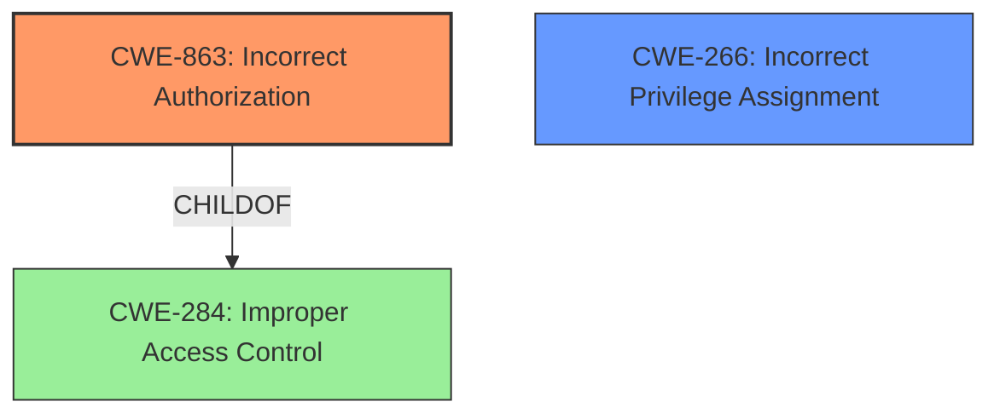

# Analysis for CVE-2024-42023

# Summary
| CWE ID    | CWE Name                                                  | Confidence | CWE Abstraction Level | CWE Vulnerability Mapping Label | CWE-Vulnerability Mapping Notes |
| --------- | --------------------------------------------------------- | ---------- | --------------------- | ------------------------------- | ------------------------------- |
| CWE-863   | Incorrect Authorization | 0.9        | Class                 | Allowed-with-Review               | Primary CWE                    |
| CWE-266 | Incorrect Privilege Assignment | 0.7        | Base                 | Allowed               | Secondary Candidate                  |

## Evidence and Confidence

*   **Confidence Score:** 0.8
*   **Evidence Strength:** MEDIUM

## Relationship Analysis
The primary relationship impacting the decision is the parent-child relationship between CWE-863 (Incorrect Authorization) and its potential base-level children, as well as its relationship to CWE-284 (Improper Access Control). Although CWE-863 is a Class-level CWE, it is more specific and applicable than the Pillar-level CWE-284. The guidance encourages to review if the base-level children are more appropriate. CWE-266 (Incorrect Privilege Assignment) is considered as it relates to the assignment of privileges, which is a key aspect of the vulnerability.

## Vulnerability Chain
The vulnerability chain starts with the **improper access control**, leading to low-privileged users being able to execute code with Administrator privileges.

1.  **Root Cause:** **Improper access control** leading to **incorrect authorization** (CWE-863) and potentially **incorrect privilege assignment** (CWE-266).
2.  **Impact:** Low-privileged users can execute code with Administrator privileges.

## Summary of Analysis
The initial assessment focused on identifying the root cause of the vulnerability. The description highlights **improper access control** that allows low-privileged users to execute code with administrator privileges. The primary CWE selected is CWE-863 (Incorrect Authorization) because the vulnerability involves an authorization check that is performed incorrectly. CWE-266 (Incorrect Privilege Assignment) is considered as a secondary candidate due to the privilege escalation aspect, but the primary issue is with the incorrect authorization mechanism.

The "Authentication vs Authorization vs Access Control Guidance" and "Privileges vs Permissions Guidance" sections were instrumental in narrowing down the CWE selection. The guidance emphasized that if the issue involves improper or missing role checks, then CWE-863 (Incorrect Authorization) is a more appropriate choice than the general CWE-284 (Improper Access Control).

The evidence supporting this decision is derived from the "Vulnerability Description Key Phrases," which identifies **improper access control** as the root cause and highlights that low-privileged users can execute code with Administrator privileges. The "CVE Reference Links Content Summary" also confirms that the vulnerability allows low-privileged users to execute code with Administrator privileges remotely.

The selection of CWE-863 is at the optimal level of specificity because it directly addresses the incorrect authorization aspect of the vulnerability, whereas CWE-284 is too general. CWE-266 is also considered because it addresses the incorrect assignment of privileges, contributing to the overall vulnerability.

Relevant CWE Information:

# Enhanced Context (25 CWEs)
The following CWEs were identified as potentially relevant to this vulnerability:

## CWE-266: Incorrect Privilege Assignment
**Abstraction Level**: Base
**Similarity Score**: 0.74
**Source**: dense

**Description**:
A product incorrectly assigns a privilege to a particular actor, creating an unintended sphere of control for that actor.

**Mapping Guidance**:
- Usage: Allowed
- Rationale: This CWE entry is at the Base level of abstraction, which is a preferred level of abstraction for mapping to the root causes of vulnerabilities.

## CWE-863: Incorrect Authorization
**Abstraction Level**: Class
**Similarity Score**: 2293.90
**Source**: sparse

**Description**:
The product performs an authorization check when an actor attempts to access a resource or perform an action, but it does not correctly perform the check.

**Mapping Guidance**:
- Usage: Allowed-with-Review
- Rationale: This CWE entry is a Class and might have Base-level children that would be more appropriate