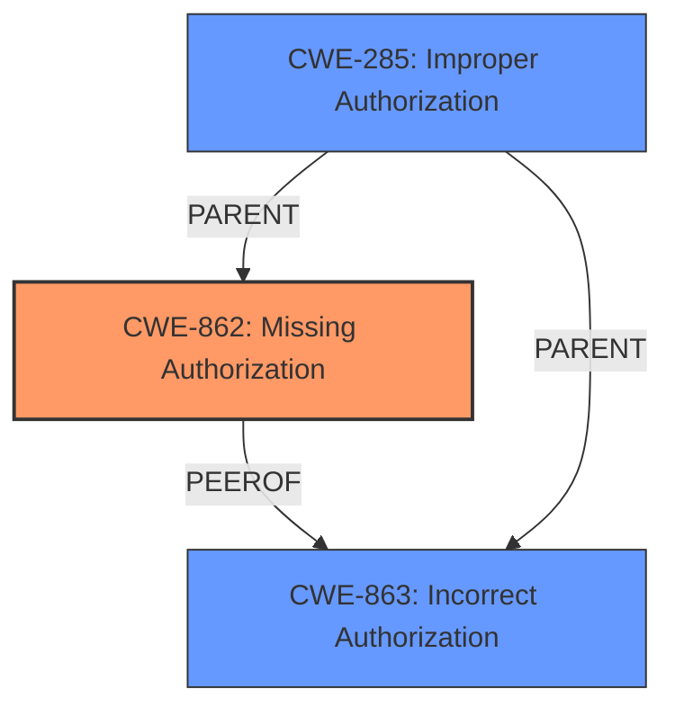

# Enhanced Analysis for CVE-2024-42032

# Summary
| CWE ID | CWE Name | Confidence | CWE Abstraction Level | CWE Vulnerability Mapping Label | CWE-Vulnerability Mapping Notes |
|---|---|---|---|---|---|
| CWE-862 | Missing Authorization | 0.9 | Class | Primary CWE | Allowed-with-Review |
| CWE-285 | Improper Authorization | 0.7 | Class | Secondary Candidate CWE | Discouraged |

## Evidence and Confidence

*   **Confidence Score:** 0.8
*   **Evidence Strength:** MEDIUM

## Relationship Analysis
The primary relationship influencing the selection is the parent-child relationship between CWE-285 (Improper Authorization) and CWE-862 (Missing Authorization). Given the description indicates a lack of permission verification, the more specific CWE-862 is favored. CWE-863 (Incorrect Authorization) was also considered as a peer, but the absence of any authorization mechanism points more directly to a missing authorization check rather than an incorrect one.



## Vulnerability Chain
The vulnerability chain starts with the **missing authorization** check in the Contacts module, leading to the potential exposure of service confidentiality. The root cause is the **lack of access permission verification**, and the impact is the compromise of confidentiality.

## Summary of Analysis
The initial assessment focused on identifying the root cause of the vulnerability, which is described as an "**Access permission verification vulnerability**". The key phrase here is "**Access permission verification vulnerability**" indicating an issue with authorization.

The retriever results suggested CWE-862 (Missing Authorization), CWE-285 (Improper Authorization), and CWE-863 (Incorrect Authorization) as potential candidates. Given the description, the most accurate mapping is CWE-862, as it directly addresses the **missing** authorization check.

CWE-285 (Improper Authorization) was considered but deemed less appropriate because it implies that an authorization check exists but is flawed, which is not explicitly stated. Similarly, CWE-863 (Incorrect Authorization) was considered but also deemed less appropriate because it implies the existence of an authorization check that is incorrectly implemented.

The evidence from the "CVE Reference Links Content Summary" supports this decision: "The vulnerability is due to an access permission verification issue within the Contacts module" and "Insufficient or improper access permission checks within the Contacts module" This confirms that the vulnerability stems from a **missing** or insufficient access permission check.

The final decision to map the vulnerability to CWE-862 is based on the specific evidence of a **missing access permission verification** mechanism, making it the most accurate and specific representation of the vulnerability. This is further supported by the MITRE guidance, which states that if authorization logic is completely missing, then CWE-862 is the best fit.

Other CWEs Considered and Rejected:

*   CWE-285: Improper Authorization - Rejected because it implies that an authorization check exists but is flawed, which is not explicitly stated in the vulnerability description.
*   CWE-863: Incorrect Authorization - Rejected because it suggests an authorization check is present but incorrectly implemented, contrasting the description's indication of a missing check.
*   CWE-732: Incorrect Permission Assignment for Critical Resource - Rejected because the issue is not about assigning incorrect permissions but about the absence of authorization checks.
*   CWE-287: Improper Authentication - Rejected because the issue is related to permissions and access control and not directly related to authentication.
*   CWE-359: Exposure of Private Personal Information to an Unauthorized Actor - Rejected because while the impact might be exposure of personal information, the root cause is the missing authorization.
*   CWE-119: Improper Restriction of Operations within the Bounds of a Memory Buffer, CWE-125: Out-of-bounds Read, CWE-1257: Improper Access Control Applied to Mirrored or Aliased Memory Regions - These are memory-related issues and not relevant to this vulnerability which is about authorization.


## CWE Relationship Analysis

Current CWEs represent these abstraction levels: .


### Vulnerability Chain Analysis

**Chain starting from CWE-863:**
- 863 (Incorrect Authorization) - ROOT


**Chain starting from CWE-359:**
- 359 (Exposure of Private Personal Information to an Unauthorized Actor) - ROOT


### CWE Relationship Diagram

```mermaid
graph TD
    classDef primary fill:#f96,stroke:#333,stroke-width:2px
    classDef secondary fill:#69f,stroke:#333
    classDef tertiary fill:#9e9,stroke:#333
```