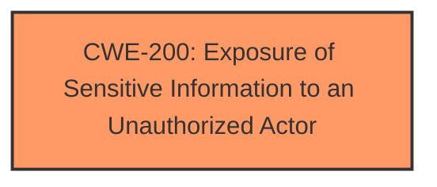

# Analysis for CVE-2024-42034

# Summary
| CWE ID | CWE Name | Confidence | CWE Abstraction Level | CWE Vulnerability Mapping Label | CWE-Vulnerability Mapping Notes |
|---|---|---|---|---|---|
| CWE-200 | Exposure of Sensitive Information to an Unauthorized Actor | 0.6 | Class |  Primary CWE | Discouraged |

## Evidence and Confidence

*   **Confidence Score:** 0.6
*   **Evidence Strength:** LOW

## Relationship Analysis
The primary relationship impacting the decision is the parent-child relationship between CWE-200 and more specific CWEs. While CWE-200 is a class-level CWE and generally discouraged, the lack of specific root cause information in the vulnerability description makes it difficult to select a more precise base or variant CWE.

## Vulnerability Chain
The vulnerability chain appears to be very short. The vulnerability in the account module leads to the impact of affecting service confidentiality. The root cause is unknown based on the evidence provided.

## Summary of Analysis
The initial analysis and the retrieved CWEs suggest possible causes, but the evidence is too limited to pinpoint a specific root cause. The primary indicator from the vulnerability description is "affect service confidentiality," which aligns with the impact described in CWE-200.

The selection of CWE-200 is largely based on the impact of the vulnerability ("affect service confidentiality") rather than a clearly identified root cause. While CWE-200 is a class-level CWE and discouraged for direct mapping, the limited evidence prevents a more specific classification.

The evidence supporting this classification is weak because the provided description lacks details about the root cause of the vulnerability. The description only mentions "LaunchAnywhere vulnerability in the account module" and the impact on "service confidentiality."

Relevant CWE Information:

*   **CWE-200: Exposure of Sensitive Information to an Unauthorized Actor** - The product exposes sensitive information to an actor that is not explicitly authorized to have access to that information. This aligns with the "affect service confidentiality" impact. However, it is a class-level CWE, and a more specific CWE would be preferable if more information were available.

The retriever results suggested other CWEs, but the lack of specific details in the vulnerability description makes it challenging to justify them. For example:

*   **CWE-90: Improper Neutralization of Special Elements used in an LDAP Query ('LDAP Injection')** - Requires evidence of LDAP queries and injection, which is not present.
*   **CWE-285: Improper Authorization** and **CWE-287: Improper Authentication** - Require evidence of authorization or authentication issues, which is not explicitly mentioned.

I considered CWE-NVD-noinfo since that was the Primary CWE Match, but that is not a valid CWE.

Given the limited evidence, I am selecting CWE-200 as the primary CWE, but with a low confidence score of 0.6. This selection is based on the reported impact, but it acknowledges the lack of information about the underlying root cause.