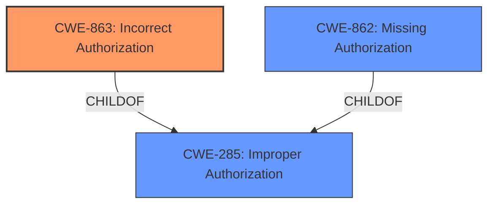

# Analysis Report for CVE-2024-42035

# Vulnerability Analysis Report: CVE-2024-42035

## Description

Permission control vulnerability in the App Multiplier module ImpactSuccessful exploitation of this vulnerability may affect functionality and confidentiality.

## Vulnerability Description Key Phrases

- **Rootcause:** permission control vulnerability
- **Impact:** affect functionality and confidentiality
- **Component:** App Multiplier module

## Analysis (with Relationship Data)

# Summary

| CWE ID  | CWE Name                                                                 | Confidence | CWE Abstraction Level | CWE Vulnerability Mapping Label | CWE-Vulnerability Mapping Notes |
| ------- | ------------------------------------------------------------------------ | ---------- | --------------------- | ------------------------------- | ------------------------------- |
| CWE-863 | Incorrect Authorization                                                    | 0.9        | Class                 | Allowed-with-Review             | Primary CWE                     |
| CWE-285 | Improper Authorization                                                     | 0.7        | Class                 | Discouraged                     | Secondary Candidate             |
| CWE-862 | Missing Authorization                                                      | 0.6        | Class                 | Allowed-with-Review             | Secondary Candidate             |

## Evidence and Confidence

*   **Confidence Score:** 0.8
*   **Evidence Strength:** HIGH

## Relationship Analysis

The primary relationship that influenced the decision was the hierarchical structure of authorization-related CWEs. CWE-863 (Incorrect Authorization) and CWE-862 (Missing Authorization) are both children of the more general CWE-285 (Improper Authorization). Since the vulnerability description specifies a "**permission control vulnerability**" and the CVE summary mentions "**insufficient access control mechanisms**", it suggests that authorization is the area of concern.



## Vulnerability Chain

The vulnerability chain starts with the **permission control vulnerability** due to **insufficient access control mechanisms**. This leads to a potential impact on functionality and confidentiality.

1.  **Root Cause:** **Permission Control Vulnerability** (Likely Incorrect or Missing Authorization)
2.  **Weakness:** Insufficient access control mechanisms.
3.  **Impact:** Affects functionality and confidentiality.

## Summary of Analysis

The initial analysis considered the high-scoring CWEs from the Retriever Results, specifically those related to authorization. The key evidence supporting this mapping is the "rootcause: **permission control vulnerability**" and "weaknesses: Insufficient access control mechanisms" found in the vulnerability description and CVE reference links content summary.

The choice of CWE-863 (Incorrect Authorization) as the primary CWE is based on the understanding that the vulnerability involves some form of authorization check that is not correctly implemented. However, CWE-862 (Missing Authorization) could also be a possible match if no authorization is in place, but CWE-863 better represents a flaw in existing logic.

CWE-285 (Improper Authorization) was considered but deemed less specific than CWE-863. While CWE-285 is a parent of both CWE-862 and CWE-863, choosing it would be less informative. The guidance for CWE-285 states that it is discouraged and lower-level CWEs should be used instead.

CWE-732 (Incorrect Permission Assignment for Critical Resource) was also considered but deemed less relevant because the description focuses on authorization logic rather than simple permission assignments.

The final decision to prioritize CWE-863 is driven by the need to identify the most precise and informative CWE based on the available evidence. The confidence level is high (0.9) because the available information consistently points towards an authorization-related issue.

Relevant CWE Information:

**CWE-863: Incorrect Authorization**

*   **Technical Explanation:** The vulnerability description indicates a "**permission control vulnerability**," suggesting that the authorization process is flawed, leading to incorrect access decisions.
*   **Security Implications and Potential Impact:** If authorization checks are not correctly implemented, unauthorized users may gain access to sensitive resources or functionalities, leading to confidentiality breaches or disruption of services.
*   **Parent-Child Relationships:** CWE-863 is a child of CWE-285 (Improper Authorization), providing a more specific classification.
*   **MITRE Mapping Guidance:** The guidance suggests this could be the appropriate CWE if the authorization logic is present but flawed.

**CWE-285: Improper Authorization**

*   **Technical Explanation:** The product does not perform or incorrectly performs an authorization check when an actor attempts to access a resource or perform an action.
*   **Security Implications and Potential Impact:** An attacker can gain unauthorized access to resources or functionalities.
*   **Parent-Child Relationships:** This is a parent to CWE-863, which makes it less specific.
*   **MITRE Mapping Guidance:** The guidance recommends using lower-level CWEs when possible.

**CWE-862: Missing Authorization**

*   **Technical Explanation:** The product completely lacks an authorization check before granting access to a resource or allowing an action.
*   **Security Implications and Potential Impact:** An attacker can bypass security controls and access sensitive information or perform privileged operations without proper authentication.
*   **Parent-Child Relationships:** This is a child of CWE-285.
*   **MITRE Mapping Guidance:** This is appropriate when there is no authorization check present.


## CWE Relationship Analysis

Current CWEs represent these abstraction levels: .


### Vulnerability Chain Analysis

**Chain starting from CWE-863:**
- 863 (Incorrect Authorization) - ROOT


**Chain starting from CWE-285:**
- 285 (Improper Authorization) - ROOT


### CWE Relationship Diagram

```mermaid
graph TD
    classDef primary fill:#f96,stroke:#333,stroke-width:2px
    classDef secondary fill:#69f,stroke:#333
    classDef tertiary fill:#9e9,stroke:#333
```


*Report generated on 2025-07-13 13:40:27*
