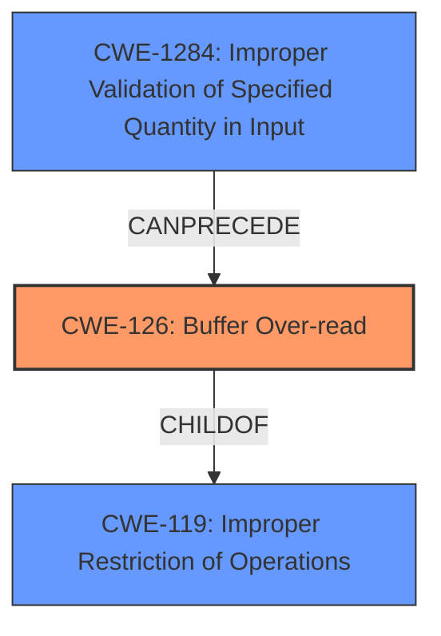

# Analysis for CVE-2024-42040

# Summary
| CWE ID | CWE Name | Confidence | CWE Abstraction Level | CWE Vulnerability Mapping Label | CWE-Vulnerability Mapping Notes |
|---|---|---|---|---|---|
| CWE-126 | Buffer Over-read | 1.0 | Variant | Primary CWE | Allowed |
| CWE-1284 | Improper Validation of Specified Quantity in Input | 0.7 | Base | Secondary | Allowed |

## Evidence and Confidence

*   **Confidence Score:** 0.9
*   **Evidence Strength:** HIGH

## Relationship Analysis
The primary weakness is CWE-126 Buffer Over-read, which is a variant of the more general CWE-119 Improper Restriction of Operations within the Bounds of a Memory Buffer. CWE-126 is the best fit because it specifically describes reading beyond the intended buffer, which aligns with the vulnerability description. CWE-1284 is related as it describes the **improper validation** of the quantity, which leads to the over-read.

## Vulnerability Chain
The vulnerability chain starts with **improper validation** of input quantity (CWE-1284) which leads to **buffer over-read** (CWE-126), resulting in memory leak (Impact).

## Summary of Analysis
The vulnerability description clearly indicates a **buffer overflow** leading to a memory leak due to crafted DHCP responses. The root cause involves an incorrect calculation and missing bounds check in the `bootp_process_vendor` function, resulting in reading beyond the buffer.

The primary CWE is CWE-126 Buffer Over-read, as the core issue is reading beyond the allocated buffer. This is supported by the "CVE Reference Links Content Summary" which states: "The core issue is reading data beyond the allocated buffer, leading to a memory leak."

CWE-1284 (Improper Validation of Specified Quantity in Input) is a secondary CWE as it relates to the **incorrect length calculation**. The "CVE Reference Links Content Summary" also mentions: "Incorrect Length Calculation: `bootp_process_vendor` uses the full packet length instead of the remaining size of the vendor-specific data, which creates the out-of-bounds read."

CWE-119 (Improper Restriction of Operations within the Bounds of a Memory Buffer) was considered but deemed too general. While the vulnerability does involve improper restriction of operations, the more specific CWE-126 is a better fit. The Usage for CWE-119 is Discouraged when lower-level CWEs could be used.

CWE-120 (Buffer Copy without Checking Size of Input ('Classic Buffer Overflow')) was also considered but not selected because the issue is not a buffer copy without checking size, but an out-of-bounds read due to **incorrect calculation**.

CWE-190 (Integer Overflow or Wraparound) was considered, but the root cause isn't directly related to integer overflow, but more so due to **improper validation** of the input quantity that leads to the over-read.

The selected CWEs are at the optimal level of specificity, as CWE-126 directly describes the buffer over-read, and CWE-1284 explains the **improper validation** that leads to the over-read.