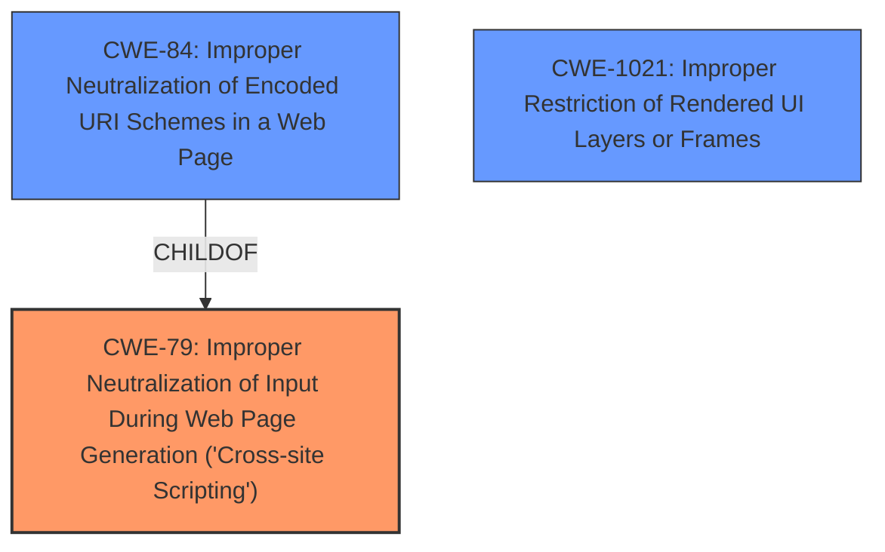

# Raw Analyzer Response for CVE-2024-42041

# Summary
| CWE ID | CWE Name | Confidence | CWE Abstraction Level | CWE Vulnerability Mapping Label | CWE-Vulnerability Mapping Notes |
|---|---|---|---|---|---|
| CWE-79 | Improper Neutralization of Input During Web Page Generation ('Cross-site Scripting') | 0.7 | Base | Primary | Allowed |
| CWE-84 | Improper Neutralization of Encoded URI Schemes in a Web Page | 0.4 | Variant | Secondary | Allowed |
| CWE-1021 | Improper Restriction of Rendered UI Layers or Frames | 0.3 | Base | Secondary | Allowed |

## Evidence and Confidence

*   **Confidence Score:** 0.7
*   **Evidence Strength:** LOW

## Relationship Analysis
The primary CWE is CWE-79, which represents a general case of improper neutralization of input. CWE-84 is a variant that focuses on encoded URI schemes, which could be a more specific case, but evidence is lacking. CWE-1021 is also considered as a potential weakness where the application does not restrict or incorrectly restricts frame objects or UI layers, leading to user confusion or potential security issues. However, since the vulnerability description focuses on the execution of arbitrary JavaScript code, CWE-79 is the most relevant.

## Vulnerability Chain
The vulnerability chain starts with the **improper neutralization** of input, leading to the execution of arbitrary JavaScript code.
  - Root Cause: **Improper neutralization** of input (CWE-79).
  - Impact: Execution of arbitrary JavaScript code.

## Summary of Analysis
The analysis is heavily based on the vulnerability description, focusing on the ability to execute arbitrary JavaScript code. The key phrase "execute arbitrary JavaScript code" suggests a cross-site scripting (XSS) vulnerability, making CWE-79 the most appropriate primary classification. The retriever results also support this, although the sparse scores are low due to lack of information.

CWE-84 was considered because the description mentions JavaScript code execution, and URI encoding could be a method to deliver the payload. However, without further evidence, it is a less direct match. CWE-1021 was considered because the vulnerability is in a browser component, but the arbitrary JavaScript execution makes CWE-79 more relevant.

The selection of CWE-79 is at the Base level, providing a good balance between specificity and generality given the available information.

Relevant CWE Information:

# Enhanced Context (25 CWEs)
The following CWEs were identified as potentially relevant to this vulnerability:

## CWE-451: User Interface (UI) Misrepresentation of Critical Information
**Abstraction Level**: Class
**Similarity Score**: 0.73
**Source**: dense

**Description**:
The user interface (UI) does not properly represent critical information to the user, allowing the information - or its source - to be obscured or spoofed. This is often a component in phishing attacks.

**Mapping Guidance**:
- Usage: Allowed-with-Review
- Rationale: This CWE entry is a Class and might have Base-level children that would be more appropriate

*Not Selected:* This is more related to phishing attacks which is not the case for this vulnerability.

## CWE-1021: Improper Restriction of Rendered UI Layers or Frames
**Abstraction Level**: Base
**Similarity Score**: 0.72
**Source**: dense

**Description**:
The web application does not restrict or incorrectly restricts frame objects or UI layers that belong to another application or domain, which can lead to user confusion about which interface the user is interacting with.

**Mapping Guidance**:
- Usage: Allowed
- Rationale: This CWE entry is at the Base level of abstraction, which is a preferred level of abstraction for mapping to the root causes of vulnerabilities.

*Selected as Secondary:* While JavaScript execution is the main impact, **improper restriction of UI layers** could be a contributing factor.

## CWE-116: Improper Encoding or Escaping of Output
**Abstraction Level**: Class
**Similarity Score**: 0.70
**Source**: dense

**Description**:
The product prepares a structured message for communication with another component, but encoding or escaping of the data is either missing or done incorrectly. As a result, the intended structure of the message is not preserved.

**Mapping Guidance**:
- Usage: Allowed-with-Review
- Rationale: This CWE entry is a Class and might have Base-level children that would be more appropriate

*Not Selected:* This is a more general case of **improper encoding or escaping** and not as relevant as CWE-79.

## CWE-203: Observable Discrepancy
**Abstraction Level**: Base
**Similarity Score**: 0.70
**Source**: dense

**Description**:
The product behaves differently or sends different responses under different circumstances in a way that is observable to an unauthorized actor, which exposes security-relevant information about the state of the product, such as whether a particular operation was successful or not.

**Mapping Guidance**:
- Usage: Allowed
- Rationale: This CWE entry is at the Base level of abstraction, which is a preferred level of abstraction for mapping to the root causes of vulnerabilities.

*Not Selected:* This is more related to information leakage which is not the case for this vulnerability.

## CWE-494: Download of Code Without Integrity Check
**Abstraction Level**: Base
**Similarity Score**: 0.69
**Source**: dense

**Description**:
The product downloads source code or an executable from a remote location and executes the code without sufficiently verifying the origin and integrity of the code.

**Mapping Guidance**:
- Usage: Allowed
- Rationale: This CWE entry is at the Base level of abstraction, which is a preferred level of abstraction for mapping to the root causes of vulnerabilities.

*Not Selected:* This is more related to downloading code from remote location which is not the case for this vulnerability.

## CWE-356: Product UI does not Warn User of Unsafe Actions
**Abstraction Level**: Base
**Similarity Score**: 0.69
**Source**: dense

**Description**:
The product's user interface does not warn the user before undertaking an unsafe action on behalf of that user. This makes it easier for attackers to trick users into inflicting damage to their system.

**Mapping Guidance**:
- Usage: Allowed
- Rationale: This CWE entry is at the Base level of abstraction, which is a preferred level of abstraction for mapping to the root causes of vulnerabilities.

*Not Selected:* The provided description does not have information about **unsafe actions** of the user.

## CWE-425: Direct Request ('Forced Browsing')
**Abstraction Level**: Base
**Similarity Score**: 0.69
**Source**: dense

**Description**:
The web application does not adequately enforce appropriate authorization on all restricted URLs, scripts, or files.

**Mapping Guidance**:
- Usage: Allowed
- Rationale: This CWE entry is at the Base level of abstraction, which is a preferred level of abstraction for mapping to the root causes of vulnerabilities.

*Not Selected:* The description does not have information about **enforcement of appropriate authorization** on restricted resources.

## CWE-248: Uncaught Exception
**Abstraction Level**: Base
**Similarity Score**: 0.68
**Source**: dense

**Description**:
An exception is thrown from a function, but it is not caught.

**Mapping Guidance**:
- Usage: Allowed
- Rationale: This CWE entry is at the Base level of abstraction, which is a preferred level of abstraction for mapping to the root causes of vulnerabilities.

*Not Selected:* The description does not have information about **exception handling**.

## CWE-941: Incorrectly Specified Destination in a Communication Channel
**Abstraction Level**: Base
**Similarity Score**: 0.68
**Source**: dense

**Description**:
The product creates a communication channel to initiate an outgoing request to an actor, but it does not correctly specify the intended destination for that actor.

**Mapping Guidance**:
- Usage: Allowed
- Rationale: This CWE entry is at the Base level of abstraction, which is a preferred level of abstraction for mapping to the root causes of vulnerabilities.

*Not Selected:* The description does not have information about **communication channels**.

## CWE-790: Improper Filtering of Special Elements
**Abstraction Level**: Class
**Similarity Score**: 0.68
**Source**: dense

**Description**:
The product receives data from an upstream component, but does not filter or incorrectly filters special elements before sending it to a downstream component.

**Mapping Guidance**:
- Usage: Allowed-with-Review
- Rationale: This CWE entry is a Class and might have Base-