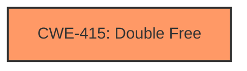

# Raw Analyzer Response for CVE-2024-42069

# Summary
| CWE ID | CWE Name | Confidence | CWE Abstraction Level | CWE Vulnerability Mapping Label | CWE-Vulnerability Mapping Notes |
|---|---|---|---|---|---|
| CWE-415 | Double Free | 1.0 | Variant | Allowed | Primary CWE |

## Evidence and Confidence

*   **Confidence Score:** 1.0
*   **Evidence Strength:** HIGH

## Relationship Analysis
The primary relationship that influenced my decision was the direct match of the vulnerability description to CWE-415 (Double Free). The retriever results also strongly suggested this CWE. There were no complex chain relationships apparent in the description. The Variant level abstraction is appropriate given the specific nature of the double free.

## Vulnerability Chain
The vulnerability chain is straightforward: a coding error leads to a double free. The root cause is **incorrect resource management** in the error handling path, which leads to the impact of a **double free**.

## Summary of Analysis
The vulnerability description clearly indicates a **double free** condition in the Linux kernel due to incorrect resource management in the error handling path of the `add_adev` function. The `auxiliary_device_uninit()` function calls `adev_release` which frees `madev`. The error handling path then calls `kfree(madev)` again resulting in a double free.

The evidence directly supports CWE-415 (Double Free) as the primary CWE.

"The vulnerability is caused by a **double free** of the `madev` variable. This occurs in the error handling path of the `add_adev` function within the `mana_en.c` driver. Specifically, when `auxiliary_device_add()` returns an error, `auxiliary_device_uninit()` is called, which in turn calls the `adev_release` callback. This callback frees `madev`. However, in the original code, the error handling path would then *again* call `kfree(madev)`, resulting in a double free."

The selection of CWE-415 is at the optimal level of specificity because it directly describes the **double free** condition.

Other CWEs Considered:
*   CWE-362 (Concurrent Execution using Shared Resource with Improper Synchronization ('Race Condition')): This was considered because memory corruption issues can sometimes relate to race conditions. However, the description did not specify a race condition, but rather a double free due to a logical error in the error handling path. Therefore, it was not chosen.
*   CWE-763 (Release of Invalid Pointer or Reference): This was considered, but CWE-415 is more specific to the actual error, which is freeing the same memory twice, rather than a more general release of an invalid pointer.
*   CWE-123 (Write-what-where Condition): This was considered, but it describes the *impact* of memory corruption, not the root cause which is a **double free**.