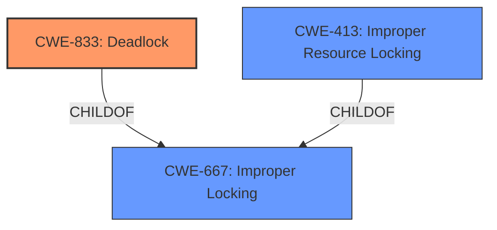

# Analysis Report for CVE-2024-42085

# Vulnerability Analysis Report: CVE-2024-42085

## Description

In the Linux kernel, the following vulnerability has been resolved usb dwc3 core remove lock of otg mode during gadget suspend/resume to avoid **deadlock** When config CONFIG_USB_DWC3_DUAL_ROLE is selected, and trigger system to enter suspend status with below command echo mem > /sys/power/state There will be a **deadlock** issue occurring. Detailed invoking path as below dwc3_suspend_common() spin_lock_irqsave(&dwc->lock, flags) lock, flags) gadget_driver is NULL or not. It causes the following code is executed and **deadlock** occurs when trying to get the spinlock. In fact, the root cause is the commit 5265397f9442(usb dwc3 **Remove DWC3 locking during gadget suspend/resume**) that forgot to remove the lock of otg mode. So, remove the redundant lock of otg mode during gadget suspend/resume.

## Vulnerability Description Key Phrases

- **Rootcause:** Remove DWC3 locking during gadget suspend/resume
- **Weakness:** deadlock
- **Vector:** echo mem > /sys/power/state
- **Product:** Linux kernel
- **Component:** usb dwc3 core

## Analysis (with Relationship Data)

# Summary
| CWE ID | CWE Name | Confidence | CWE Abstraction Level | CWE Vulnerability Mapping Label | CWE-Vulnerability Mapping Notes |
|---|---|---|---|---|---|
| CWE-833 | Deadlock | 1.0 | Base | Primary | Allowed |
| CWE-413 | Improper Resource Locking | 0.7 | Base | Secondary | Allowed |
| CWE-667 | Improper Locking | 0.6 | Class | Secondary | Allowed-with-Review |

## Evidence and Confidence

*   **Confidence Score:** 0.9
*   **Evidence Strength:** HIGH

## Relationship Analysis
The primary relationship that impacted my decision was the hierarchical relationship between CWE-667 (Improper Locking) and its potential children, specifically CWE-413 (Improper Resource Locking) and CWE-833 (**Deadlock**). Since the vulnerability description explicitly mentions a **deadlock** caused by improper locking during suspend/resume operations, CWE-833 becomes the most specific and appropriate choice as the primary CWE. CWE-413 is related to the root cause of the **deadlock**, i.e. improper locking, and CWE-667 is a more general classification of the same issue.



## Vulnerability Chain
The vulnerability chain starts with a **missing lock removal** (implicit in the description), leading to **improper locking** and ultimately resulting in a **deadlock**.

1.  **Missing Lock Removal:** The initial commit failed to remove all necessary locks during suspend/resume.
2.  **Improper Locking (CWE-413):** The incomplete lock removal leads to a double locking situation.
3.  **Deadlock (CWE-833):** The double locking causes the system to enter a **deadlock** state when suspending.

## Summary of Analysis
The analysis is primarily based on the provided vulnerability description and the CVE reference links content summary. The description clearly states that the vulnerability is a **deadlock** caused by a missing lock removal during suspend/resume operations.

The retriever results also suggest CWE-667 (**Improper Locking**) and CWE-833 (**Deadlock**) as potential candidates. Given the explicit mention of a **deadlock** and the root cause being a locking issue, CWE-833 is the most specific and appropriate primary CWE. CWE-413 (Improper Resource Locking) serves as a good secondary CWE since it describes the root cause of the deadlock.

The relationship analysis further supports this decision, as CWE-833 is a child of CWE-667 and closely related to CWE-413, indicating a more specific instance of **improper locking**. The evidence from the vulnerability description includes phrases like "remove lock of otg mode during gadget suspend/resume to avoid **deadlock**", "There will be a **deadlock** issue occurring" and "causes the following code is executed and **deadlock** occurs when trying to get the spinlock" which strongly support the selection of CWE-833.

The selected CWEs are at the optimal level of specificity because CWE-833 directly addresses the vulnerability, while CWE-413 and CWE-667 provide context about the underlying locking issue.

Relevant CWE Information:

# Enhanced Context (25 CWEs)
The following CWEs were identified as potentially relevant to this vulnerability:

## CWE-833: Deadlock
**Abstraction Level**: Base
**Similarity Score**: 0.78
**Source**: dense

**Description**:
The product contains multiple threads or executable segments that are waiting for each other to release a necessary lock, resulting in **deadlock**.

**Mapping Guidance**:
- Usage: Allowed
- Rationale: This CWE entry is at the Base level of abstraction, which is a preferred level of abstraction for mapping to the root causes of vulnerabilities.

## CWE-667: Improper Locking
**Abstraction Level**: Class
**Similarity Score**: 0.78
**Source**: dense

**Description**:
The product does not properly acquire or release a lock on a resource, leading to unexpected resource state changes and behaviors.

**Mapping Guidance**:
- Usage: Allowed-with-Review
- Rationale: This CWE entry is a Class and might have Base-level children that would be more appropriate

## CWE-755: Improper Handling of Exceptional Conditions
**Abstraction Level**: Class
**Similarity Score**: 0.73
**Source**: dense

**Description**:
The product does not handle or incorrectly handles an exceptional condition.

**Mapping Guidance**:
- Usage: Discouraged
- Rationale: This CWE entry is a level-1 Class (i.e., a child of a Pillar). It might have lower-level children that would be more appropriate

## CWE-754: Improper Check for Unusual or Exceptional Conditions
**Abstraction Level**: Class
**Similarity Score**: 0.73
**Source**: dense

**Description**:
The product does not check or incorrectly checks for unusual or exceptional conditions that are not expected to occur frequently during day to day operation of the product.

**Mapping Guidance**:
- Usage: Allowed-with-Review
- Rationale: This CWE entry is a Class and might have Base-level children that would be more appropriate

## CWE-191: Integer Underflow (Wrap or Wraparound)
**Abstraction Level**: Base
**Similarity Score**: 0.72
**Source**: dense

**Description**:
The product subtracts one value from another, such that the result is less than the minimum allowable integer value, which produces a value that is not equal to the correct result.

**Mapping Guidance**:
- Usage: Allowed
- Rationale: This CWE entry is at the Base level of abstraction, which is a preferred level of abstraction for mapping to the root causes of vulnerabilities.

## CWE-362: Concurrent Execution using Shared Resource with Improper Synchronization ('Race Condition')
**Abstraction Level**: Class
**Similarity Score**: 0.72
**Source**: dense

**Description**:
The product contains a concurrent code sequence that requires temporary, exclusive access to a shared resource, but a timing window exists in which the shared resource can be modified by another code sequence operating concurrently.

**Mapping Guidance**:
- Usage: Allowed-with-Review
- Rationale: This CWE entry is a Class and might have Base-level children that would be more appropriate

## CWE-345: Insufficient Verification of Data Authenticity
**Abstraction Level**: Class
**Similarity Score**: 0.72
**Source**: dense

**Description**:
The product does not sufficiently verify the origin or authenticity of data, in a way that causes it to accept invalid data.

**Mapping Guidance**:
- Usage: Discouraged
- Rationale: This CWE entry is a level-1 Class (i.e., a child of a Pillar). It might have lower-level children that would be more appropriate

## CWE-1285: Improper Validation of Specified Index, Position, or Offset in Input
**Abstraction Level**: Base
**Similarity Score**: 0.72
**Source**: dense

**Description**:
The product receives input that is expected to specify an index, position, or offset into an indexable resource such as a buffer or file, but it does not validate or incorrectly validates that the specified index/position/offset has the required properties.

**Mapping Guidance**:
- Usage: Allowed
- Rationale: This CWE entry is at the Base level of abstraction, which is a preferred level of abstraction for mapping to the root causes of vulnerabilities.

## CWE-703: Improper Check or Handling of Exceptional Conditions
**Abstraction Level**: Pillar
**Similarity Score**: 0.72
**Source**: dense

**Description**:
The product does not properly anticipate or handle exceptional conditions that rarely occur during normal operation of the product.

**Mapping Guidance**:
- Usage: Discouraged
- Rationale: This CWE entry is extremely high-level, a Pillar.

## CWE-413: Improper Resource Locking
**Abstraction Level**: Base
**Similarity Score**: 0.72
**Source**: dense

**Description**:
The product does not lock or does not correctly lock a resource when the product must have exclusive access to the resource.

**Mapping Guidance**:
- Usage: Allowed
- Rationale: This CWE entry is at the Base level of abstraction, which is a preferred level of abstraction for mapping to the root causes of vulnerabilities.

## CWE-667: Improper Locking
**Abstraction Level**: Class
**Similarity Score**: 1059.26
**Source**: sparse

**Description**:
The product does not properly acquire or release a lock on a resource, leading to unexpected resource


## CWE Relationship Analysis

Current CWEs represent these abstraction levels: .


### Vulnerability Chain Analysis

**Chain starting from CWE-345:**
- 345 (Insufficient Verification of Data Authenticity) - ROOT


**Chain starting from CWE-667:**
- 667 (Improper Locking) - ROOT


### CWE Relationship Diagram

```mermaid
graph TD
    classDef primary fill:#f96,stroke:#333,stroke-width:2px
    classDef secondary fill:#69f,stroke:#333
    classDef tertiary fill:#9e9,stroke:#333
```


*Report generated on 2025-07-13 13:43:57*
