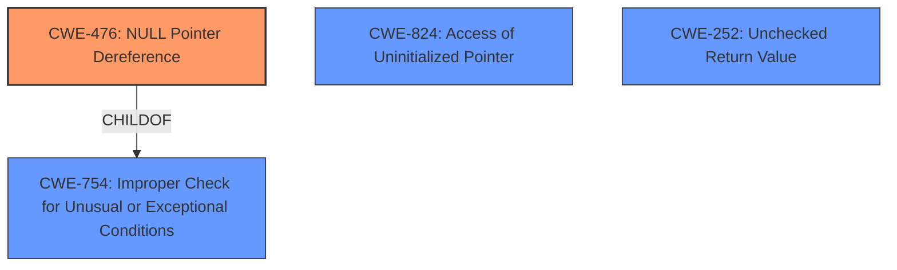

# Analysis Report for CVE-2024-42091

# Vulnerability Analysis Report: CVE-2024-42091

## Description

In the Linux kernel, the following vulnerability has been resolved drm/xe Check pat.ops before dumping PAT settings We may leave pat.ops unset when running on brand new platform or when running as a VF. While the former is unlikely, the latter is valid (future) use case and will cause NPD when someone will try to dump PAT settings by debugfs. Its better to check pointer to pat.ops instead of specific .dump hook, as we have this hook always defined for every .ops variant.

## Vulnerability Description Key Phrases

- **Rootcause:** improper pointer checking
- **Impact:** null pointer dereference
- **Product:** Linux kernel
- **Component:** drm/xe Check pat.ops before dumping PAT settings

## Analysis (with Relationship Data)

# Summary
| CWE ID | CWE Name | Confidence | CWE Abstraction Level | CWE Vulnerability Mapping Label | CWE-Vulnerability Mapping Notes |
|---|---|---|---|---|---|
| CWE-476 | NULL Pointer Dereference | 1.0 | Base | Allowed | Primary CWE |
| CWE-824 | Access of Uninitialized Pointer | 0.7 | Base | Allowed | Secondary Candidate |
| CWE-252 | Unchecked Return Value | 0.6 | Base | Allowed | Secondary Candidate |

## Evidence and Confidence

*   **Confidence Score:** 0.9
*   **Evidence Strength:** HIGH

## Relationship Analysis
The primary relationship that impacted my decision was the parent-child relationship between CWE-754 (Improper Check for Unusual or Exceptional Conditions) and CWE-476 (NULL Pointer Dereference). CWE-476 is a child of CWE-754. The vulnerability description highlights a **missing check** for a NULL pointer, directly leading to a potential dereference. This direct relationship strengthens the choice of CWE-476 as the primary weakness.

The Retriever Results suggest that CWE-824 (Access of Uninitialized Pointer) and CWE-252 (Unchecked Return Value) are also relevant. While plausible, the evidence more strongly supports a direct NULL pointer dereference due to the **improper pointer checking**, making CWE-476 the most fitting primary classification.



## Vulnerability Chain
The vulnerability chain is relatively straightforward:
1.  **Root Cause:** **Improper pointer checking** (Implicit in CWE-476 because the check should have happened)
2.  **Weakness:** NULL Pointer Dereference (CWE-476)
3.  **Impact:** Kernel crash (Denial of Service)

## Summary of Analysis
My assessment is heavily based on the clear evidence provided in the vulnerability description and CVE reference summary. The description states: "Its better to check pointer to pat.ops instead of specific .dump hook, as we have this hook always defined for every .ops variant." This directly indicates a **failure to properly check** if `pat.ops` is NULL before dereferencing it.

The CVE reference summary reinforces this by stating: "The `xe_pat_dump` function in `drivers/gpu/drm/xe/xe_pat.c` attempts to access the `dump` function pointer within the `xe->pat.ops` structure without first verifying if `xe->pat.ops` itself is a valid pointer (i.e. not NULL)." This confirms the **improper pointer checking** leading to a potential NULL pointer dereference.

The graph relationships influenced my decision to choose CWE-476 as the primary weakness. While other CWEs like CWE-824 (Access of Uninitialized Pointer) and CWE-252 (Unchecked Return Value) were considered, the direct evidence of a NULL pointer dereference due to a **missing check** makes CWE-476 the most accurate and specific classification.

CWE-476 is at the optimal level of specificity (Base) because it precisely captures the vulnerability: a NULL pointer is dereferenced due to a **lack of proper validation**.

Relevant CWE Information:

# Enhanced Context (25 CWEs)
The following CWEs were identified as potentially relevant to this vulnerability:

## CWE-667: Improper Locking
**Abstraction Level**: Class
**Similarity Score**: 0.74
**Source**: dense

**Description**:
The product does not properly acquire or release a lock on a resource, leading to unexpected resource state changes and behaviors.

**Mapping Guidance**:
- Usage: Allowed-with-Review
- Rationale: This CWE entry is a Class and might have Base-level children that would be more appropriate

*Not Selected:* This CWE is not relevant because the vulnerability is not related to locking mechanisms.

## CWE-824: Access of Uninitialized Pointer
**Abstraction Level**: Base
**Similarity Score**: 0.74
**Source**: dense

**Description**:
The product accesses or uses a pointer that has not been initialized.

**Mapping Guidance**:
- Usage: Allowed
- Rationale: This CWE entry is at the Base level of abstraction, which is a preferred level of abstraction for mapping to the root causes of vulnerabilities.

*Potentially Relevant:* This could be a secondary issue if the pointer is uninitialized and then dereferenced, but the primary issue is the **lack of checking for NULL** before dereferencing, so this is a weaker match.

## CWE-476: NULL Pointer Dereference
**Abstraction Level**: Base
**Similarity Score**: 0.74
**Source**: dense

**Description**:
The product dereferences a pointer that it expects to be valid but is NULL.

**Mapping Guidance**:
- Usage: Allowed
- Rationale: This CWE entry is at the Base level of abstraction, which is a preferred level of abstraction for mapping to the root causes of vulnerabilities.

*Selected as Primary:* This perfectly matches the vulnerability description, where the code attempts to dereference a pointer (`xe->pat.ops`) without ensuring it's not NULL.

## CWE-1285: Improper Validation of Specified Index, Position, or Offset in Input
**Abstraction Level**: Base
**Similarity Score**: 0.74
**Source**: dense

**Description**:
The product receives input that is expected to specify an index, position, or offset into an indexable resource such as a buffer or file, but it does not validate or incorrectly validates that the specified index/position/offset has the required properties.

**Mapping Guidance**:
- Usage: Allowed
- Rationale: This CWE entry is at the Base level of abstraction, which is a preferred level of abstraction for mapping to the root causes of vulnerabilities.

*Not Selected:* This is not relevant because the vulnerability does not involve validating an index, position, or offset in input.

## CWE-755: Improper Handling of Exceptional Conditions
**Abstraction Level**: Class
**Similarity Score**: 0.73
**Source**: dense

**Description**:
The product does not handle or incorrectly handles an exceptional condition.

**Mapping Guidance**:
- Usage: Discouraged
- Rationale: This CWE entry is a level-1 Class (i.e., a child of a Pillar). It might have lower-level children that would be more appropriate

*Not Selected:* Too generic. CWE-476 is a more specific child of this CWE.

## CWE-252: Unchecked Return Value
**Abstraction Level**: Base
**Similarity Score**: 0.73
**Source**: dense

**Description**:
The product does not check the return value from a method or function, which can prevent it from detecting unexpected states and conditions.

**Mapping Guidance**:
- Usage: Allowed
- Rationale: This CWE entry is at the Base level of abstraction, which is a preferred level of abstraction for mapping to the root causes of vulnerabilities.

*Potentially Relevant:* While the code doesn't explicitly skip checking a return value, the **missing NULL check** serves a similar purpose - failing to validate the state of a pointer. This is a weaker match than CWE-476.

## CWE-754: Improper Check for Unusual or Exceptional Conditions
**Abstraction Level**: Class
**Similarity Score**: 0.73
**Source**: dense

**Description**:
The product does not check or incorrectly checks for unusual or exceptional conditions that are not expected to occur frequently during day to day operation of the product.

**Mapping Guidance**:
- Usage: Allowed-with-Review
- Rationale: This CWE entry is a Class and might have Base-level children that would be more appropriate

*Not Selected:* Too generic. CWE-476 is a more specific child of this CWE.

## CWE-822: Untrusted Pointer Dereference
**Abstraction Level**: Base
**Similarity Score**: 0.73
**Source**: dense

**Description**:
The product obtains a value from an untrusted source, converts this value to a pointer, and dereferences the resulting pointer.

**Mapping Guidance**:
- Usage: Allowed
- Rationale: This CWE entry is at the Base level of abstraction, which is a preferred level of abstraction for mapping to the root causes of vulnerabilities.

*Not Selected:* Not directly relevant. The pointer isn't necessarily obtained from an untrusted source; it's simply not checked for NULL.

## CWE-703: Improper Check or Handling of Exceptional Conditions
**Abstraction Level**: Pillar
**Similarity Score**: 0.73
**Source**: dense


## CWE Relationship Analysis

Current CWEs represent these abstraction levels: .


### Vulnerability Chain Analysis

**Chain starting from CWE-476:**
- 476 (NULL Pointer Dereference) - ROOT


**Chain starting from CWE-667:**
- 667 (Improper Locking) - ROOT


### CWE Relationship Diagram

```mermaid
graph TD
    classDef primary fill:#f96,stroke:#333,stroke-width:2px
    classDef secondary fill:#69f,stroke:#333
    classDef tertiary fill:#9e9,stroke:#333
```


*Report generated on 2025-07-13 13:44:38*
