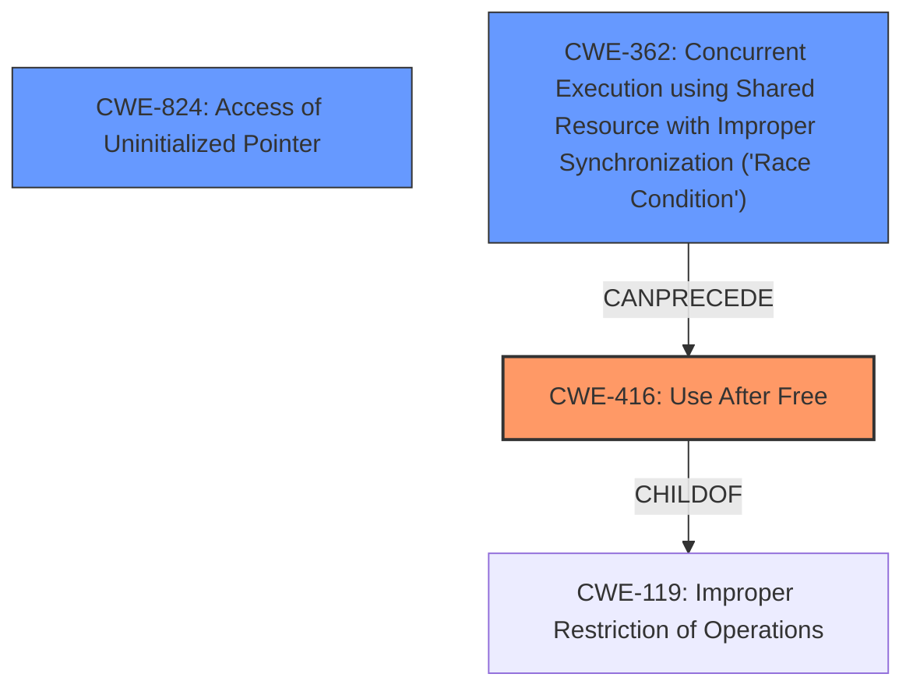

# Analysis Report for CVE-2024-42115

# Vulnerability Analysis Report: CVE-2024-42115

## Description

In the Linux kernel, the following vulnerability has been resolved jffs2 Fix potential **illegal address access** in jffs2_free_inode During the stress testing of the jffs2 file system,the following abnormal printouts were found [ 2430.649000] Unable to handle kernel paging request at virtual address 0069696969696948 [ 2430.649622] Mem abort info [ 2430.649829] ESR = 0x96000004 [ 2430.650115] EC = 0x25 DABT (current EL), IL = 32 bits [ 2430.650564] SET = 0, FnV = 0 [ 2430.650795] EA = 0, S1PTW = 0 [ 2430.651032] FSC = 0x04 level 0 translation fault [ 2430.651446] Data abort info [ 2430.651683] ISV = 0, ISS = 0x00000004 [ 2430.652001] CM = 0, WnR = 0 [ 2430.652558] [0069696969696948] address between user and kernel address ranges [ 2430.653265] Internal error Oops 96000004 [#1] PREEMPT SMP [ 2430.654512] CPU 2 PID 20919 Comm cat Not tainted 5.15.25-g512f31242bf6 #33 [ 2430.655008] Hardware name linux,dummy-virt (DT) [ 2430.655517] pstate 20000005 (nzCv daif -PAN -UAO -TCO -DIT -SSBS BTYPE=--) [ 2430.656142] pc kfree+0x78/0x348 [ 2430.656630] lr jffs2_free_inode+0x24/0x48 [ 2430.657051] sp ffff800009eebd10 [ 2430.657355] x29 ffff800009eebd10 x28 0000000000000001 x27 0000000000000000 [ 2430.658327] x26 ffff000038f09d80 x25 0080000000000000 x24 ffff800009d38000 [ 2430.658919] x23 5a5a5a5a5a5a5a5a x22 ffff000038f09d80 x21 ffff8000084f0d14 [ 2430.659434] x20 ffff0000bf9a6ac0 x19 0169696969696940 x18 0000000000000000 [ 2430.659969] x17 ff

## Vulnerability Description Key Phrases

- **Rootcause:** illegal address access
- **Impact:** ['Oops', 'illegal address access']
- **Vector:** stress testing
- **Product:** Linux kernel
- **Component:** jffs2

## Analysis (with Relationship Data)

# Summary

| CWE ID | CWE Name | Confidence | CWE Abstraction Level | CWE Vulnerability Mapping Label | CWE-Vulnerability Mapping Notes |
|---|---|---|---|---|---|
| CWE-416 | Use After Free | 0.9 | Variant |  Primary CWE | Allowed |
| CWE-824 | Access of Uninitialized Pointer | 0.7 | Base | Secondary Candidate | Allowed |
| CWE-362 | Concurrent Execution using Shared Resource with Improper Synchronization ('Race Condition') | 0.6 | Class | Secondary Candidate | Allowed-with-Review |

## Evidence and Confidence

*   **Confidence Score:** 0.8
*   **Evidence Strength:** HIGH

## Relationship Analysis

The primary weakness is a Use-After-Free (CWE-416), a variant of memory corruption. This can be preceded by concurrent execution issues (CWE-362) and is related to accessing uninitialized pointers (CWE-824). The analysis considered the parent-child relationships, such as CWE-416's relationship to more general memory corruption issues. The presence of concurrency exacerbating the issue was also considered.



## Vulnerability Chain

1.  **Root Cause:** **Improper initialization** of `jffs2_inode_info` structure members, leading to uninitialized data. Concurrency increases the chance of triggering the issue.
2.  **Weakness:** **Use-after-free vulnerability** (CWE-416) due to accessing the `target` field after it has been prematurely released.
3.  **Impact:** Kernel panic/crash, potential arbitrary code execution.

## Summary of Analysis

The analysis is strongly based on the "CVE Reference Links Content Summary," which provides detailed technical information about the vulnerability. The key piece of evidence is the description of the **root cause** as the **improper initialization** of the `jffs2_inode_info` structure, specifically the `target` member. This leads to a use-after-free condition (CWE-416) when `jffs2_free_inode` attempts to free the `target` after it has already been released in the `iget_locked` function.

The relationship graph helps to visualize how CWE-416 is related to other CWEs like CWE-362 (Concurrency) and CWE-119 (Improper Restriction of Operations within the Bounds of a Memory Buffer). Although the retriever results included CWE-367 (Time-of-check Time-of-use (TOCTOU) Race Condition), the description of the vulnerability and the provided fix do not directly indicate a TOCTOU issue. Instead, the concurrency aspect is more related to increasing the probability of the use-after-free occurring.

The selected CWEs are at the optimal level of specificity. CWE-416 is a Variant-level CWE that accurately describes the use-after-free condition. CWE-824 (Access of Uninitialized Pointer) and CWE-362 (Concurrent Execution) provide additional context about the underlying causes and contributing factors.

Relevant CWE Information:

# Enhanced Context (25 CWEs)

## CWE-362: Concurrent Execution using Shared Resource with Improper Synchronization ('Race Condition')
**Abstraction Level**: Class
**Similarity Score**: 0.79
**Source**: dense

**Description**:
The product contains a concurrent code sequence that requires temporary, exclusive access to a shared resource, but a timing window exists in which the shared resource can be modified by another code sequence operating concurrently.

**Mapping Guidance**:
- Usage: Allowed-with-Review
- Rationale: This CWE entry is a Class and might have Base-level children that would be more appropriate

## CWE-667: Improper Locking
**Abstraction Level**: Class
**Similarity Score**: 0.79
**Source**: dense

**Description**:
The product does not properly acquire or release a lock on a resource, leading to unexpected resource state changes and behaviors.

**Mapping Guidance**:
- Usage: Allowed-with-Review
- Rationale: This CWE entry is a Class and might have Base-level children that would be more appropriate

## CWE-367: Time-of-check Time-of-use (TOCTOU) Race Condition
**Abstraction Level**: Base
**Similarity Score**: 0.78
**Source**: dense

**Description**:
The product checks the state of a resource before using that resource, but the resource's state can change between the check and the use in a way that invalidates the results of the check. This can cause the product to perform invalid actions when the resource is in an unexpected state.

**Mapping Guidance**:
- Usage: Allowed
- Rationale: This CWE entry is at the Base level of abstraction, which is a preferred level of abstraction for mapping to the root causes of vulnerabilities.

## CWE-1285: Improper Validation of Specified Index, Position, or Offset in Input
**Abstraction Level**: Base
**Similarity Score**: 0.77
**Source**: dense

**Description**:
The product receives input that is expected to specify an index, position, or offset into an indexable resource such as a buffer or file, but it does not validate or incorrectly validates that the specified index/position/offset has the required properties.

**Mapping Guidance**:
- Usage: Allowed
- Rationale: This CWE entry is at the Base level of abstraction, which is a preferred level of abstraction for mapping to the root causes of vulnerabilities.

## CWE-824: Access of Uninitialized Pointer
**Abstraction Level**: Base
**Similarity Score**: 0.77
**Source**: dense

**Description**:
The product accesses or uses a pointer that has not been initialized.

**Mapping Guidance**:
- Usage: Allowed
- Rationale: This CWE entry is at the Base level of abstraction, which is a preferred level of abstraction for mapping to the root causes of vulnerabilities.

**Explanation:** While the primary issue is a use-after-free, the underlying **improper initialization** (or lack thereof) of the `target` pointer is a contributing factor. If the pointer were properly initialized to NULL, the use-after-free could be prevented. Therefore, CWE-824 is considered a secondary, contributing weakness.

## CWE-129: Improper Validation of Array Index
**Abstraction Level**: Variant
**Similarity Score**: 0.77
**Source**: dense

**Description**:
The product uses untrusted input when calculating or using an array index, but the product does not validate or incorrectly validates the index to ensure the index references a valid position within the array.

**Mapping Guidance**:
- Usage: Allowed
- Rationale: This CWE entry is at the Variant level of abstraction, which is a preferred level of abstraction for mapping to the root causes of vulnerabilities.

## CWE-125: Out-of-bounds Read
**Abstraction Level**: Base
**Similarity Score**: 0.77
**Source**: dense

**Description**:
The product reads data past the end, or before the beginning, of the intended buffer.

**Mapping Guidance**:
- Usage: Allowed
- Rationale: This CWE entry is at the Base level of abstraction, which is a preferred level of abstraction for mapping to the root causes of vulnerabilities.

## CWE-755: Improper Handling of Exceptional Conditions
**Abstraction Level**: Class
**Similarity Score**: 0.76
**Source**: dense

**Description**:
The product does not handle or incorrectly handles an exceptional condition.

**Mapping Guidance**:
- Usage: Discouraged
- Rationale: This CWE entry is a level-1 Class (i.e., a child of a Pillar). It might have lower-level children that would be more appropriate

## CWE-252: Unchecked Return Value
**Abstraction Level**: Base
**Similarity Score**: 0.76
**Source**: dense

**Description**:
The product does not check the return value from a method or function, which can prevent it from detecting unexpected states and conditions.

**Mapping Guidance**:
- Usage: Allowed
- Rationale: This CWE entry is at the Base level of abstraction, which is a preferred level of abstraction for mapping to the root causes of vulnerabilities.

## CWE-754: Improper Check for Unusual or Exceptional Conditions
**Abstraction Level**: Class
**Similarity Score**: 0.76
**Source**: dense

**Description**:
The product does not check or incorrectly checks for unusual or exceptional conditions that are not expected to occur frequently during day


## CWE Relationship Analysis

Current CWEs represent these abstraction levels: .


### Vulnerability Chain Analysis

**Chain starting from CWE-416:**
- 416 (Use After Free) - ROOT


**Chain starting from CWE-125:**
- 125 (Out-of-bounds Read) - ROOT


### CWE Relationship Diagram

```mermaid
graph TD
    classDef primary fill:#f96,stroke:#333,stroke-width:2px
    classDef secondary fill:#69f,stroke:#333
    classDef tertiary fill:#9e9,stroke:#333
```


*Report generated on 2025-07-13 13:46:13*
