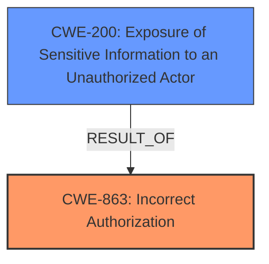

# Analysis Report for CVE-2024-42222

# Vulnerability Analysis Report: CVE-2024-42222

## Description

In Apache CloudStack 4.19.1.0, a **regression in the network listing API** allows unauthorised list access of network details for domain admin and normal user accounts. This vulnerability compromises tenant isolation, potentially leading to unauthorised access to network details, configurations and data. Affected users are advised to upgrade to version 4.19.1.1 to address this issue. Users on older versions of CloudStack considering to upgrade, can skip 4.19.1.0 and upgrade directly to 4.19.1.1.

## Vulnerability Description Key Phrases

- **Rootcause:** regression in the network listing API
- **Impact:** ['unauthorised list access of network details', 'compromise tenant isolation']
- **Attacker:** domain admin and normal user accounts
- **Product:** Apache CloudStack
- **Version:** 4.19.1.0

## Analysis (with Relationship Data)

# Summary
| CWE ID | CWE Name | Confidence | CWE Abstraction Level | CWE Vulnerability Mapping Label | CWE-Vulnerability Mapping Notes |
|---|---|---|---|---|---|
| CWE-863 | Incorrect Authorization | 0.9 | Class | Primary CWE | Allowed-with-Review |
| CWE-200 | Exposure of Sensitive Information to an Unauthorized Actor | 0.7 | Class | Secondary Candidate | Discouraged |

## Evidence and Confidence

*   **Confidence Score:** 0.8
*   **Evidence Strength:** HIGH

## Relationship Analysis
The primary CWE selected is CWE-863 (**Incorrect Authorization**), which is a Class-level CWE. While it would be ideal to have a more specific Base-level CWE, the description directly indicates an authorization problem, making this a reasonable starting point. CWE-200 (**Exposure of Sensitive Information to an Unauthorized Actor**) is considered as a secondary candidate because the impact of the **incorrect authorization** leads to the exposure of sensitive network details. However, CWE-200 is discouraged as it represents the impact rather than the root cause. There's no clear parent-child or chain relationship influencing the primary selection, but the relationship between authorization and information exposure is evident.



## Vulnerability Chain
The vulnerability chain starts with a **regression in the network listing API** which leads to **incorrect authorization**, ultimately resulting in **unauthorised access of network details** and a compromise of **tenant isolation**.

*   **Root Cause:** **Regression in the network listing API** leading to a failure in authorization checks (CWE-863).
*   **Impact:** Exposure of sensitive information (CWE-200) and compromised tenant isolation.

## Summary of Analysis
The initial assessment focused on identifying the root cause of the vulnerability based on the provided evidence. The key phrase "**regression in the network listing API**" coupled with the statement that it "allows unauthorised list access of network details" pointed towards an authorization issue.

The description states: "In Apache CloudStack 4.19.1.0, a **regression in the network listing API** allows unauthorised list access of network details for domain admin and normal user accounts. This vulnerability compromises tenant isolation, potentially leading to unauthorised access to network details, configurations and data."

The CVE Reference Links Content Summary states:
"**Unauthorised Access:** The network listing API allows domain admins and normal users to access network details that do not belong to their domain."

CWE-863 (**Incorrect Authorization**) was chosen as the primary CWE because it directly addresses the **incorrect** performance of an authorization check. The **regression** introduced a flaw where the authorization mechanism failed to properly restrict access to network details based on the user's domain. This aligns with the definition of CWE-863, "The product performs an authorization check when an actor attempts to access a resource or perform an action, but it does not correctly perform the check."

CWE-200 (**Exposure of Sensitive Information to an Unauthorized Actor**) was considered because the impact of the **incorrect authorization** is the exposure of sensitive network details. However, it's a secondary effect, and CWE-200 is discouraged for root cause analysis.

The selection of CWE-863 is at the Class level, and while a more specific Base-level CWE would be preferable, the current evidence sufficiently supports this classification.
The retriever results also pointed to other exposure related CWEs as well, but were discarded since they represent the impact of the root cause.

Relevant CWE Information:

# Enhanced Context (25 CWEs)
The following CWEs were identified as potentially relevant to this vulnerability:

## CWE-863: Incorrect Authorization
**Abstraction Level**: Class
**Similarity Score**: 973.54
**Source**: sparse

**Description**:
The product performs an authorization check when an actor attempts to access a resource or perform an action, but it does not correctly perform the check.

**Mapping Guidance**:
- Usage: Allowed-with-Review
- Rationale: This CWE entry is a Class and might have Base-level children that would be more appropriate

## CWE-200: Exposure of Sensitive Information to an Unauthorized Actor
**Abstraction Level**: Class
**Similarity Score**: 0.71
**Source**: dense

**Description**:
The product exposes sensitive information to an actor that is not explicitly authorized to have access to that information.

**Mapping Guidance**:
- Usage: Discouraged
- Rationale: CWE-200 is commonly misused to represent the loss of confidentiality in a vulnerability, but confidentiality loss is a technical impact - not a root cause error. As of CWE 4.9, over 400 CWE entries can lead to a loss of confidentiality. Other options are often available. [REF-1287].


## CWE Relationship Analysis

Current CWEs represent these abstraction levels: .


### Vulnerability Chain Analysis

**Chain starting from CWE-863:**
- 863 (Incorrect Authorization) - ROOT


**Chain starting from CWE-200:**
- 200 (Exposure of Sensitive Information to an Unauthorized Actor) - ROOT


### CWE Relationship Diagram

```mermaid
graph TD
    classDef primary fill:#f96,stroke:#333,stroke-width:2px
    classDef secondary fill:#69f,stroke:#333
    classDef tertiary fill:#9e9,stroke:#333
```


*Report generated on 2025-07-13 13:50:49*
