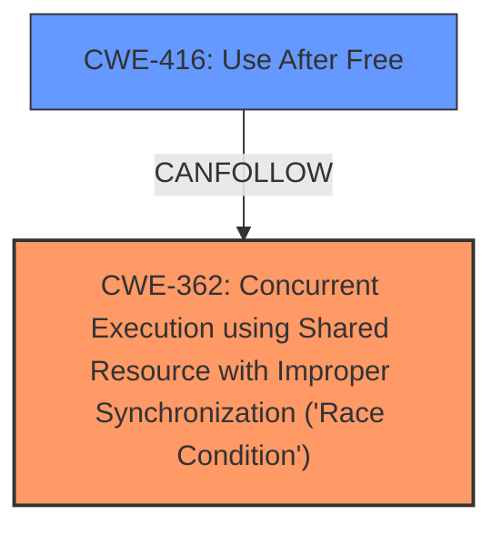

# Analysis for CVE-2024-42233

# Summary
| CWE ID | CWE Name | Confidence | CWE Abstraction Level | CWE Vulnerability Mapping Label | CWE-Vulnerability Mapping Notes |
|---|---|---|---|---|---|
| CWE-362 | Concurrent Execution using Shared Resource with Improper Synchronization ('Race Condition') | 0.9 | Class | Allowed-with-Review | Primary CWE |
| CWE-416 | Use After Free | 0.7 | Base | Allowed | Secondary Candidate |

## Evidence and Confidence

*   **Confidence Score:** 0.8
*   **Evidence Strength:** HIGH

## Relationship Analysis
The primary relationship impacting the decision is the parent-child relationship where CWE-416 (Use After Free) can be a consequence of CWE-362 (Race Condition). The race condition allows for a stale pointer to be accessed, leading to the use-after-free. CWE-362 is a class, and therefore it may have base-level children that would be more appropriate. However, no child CWEs of CWE-362 seem to better represent the vulnerability.



## Vulnerability Chain
The vulnerability chain begins with a **race condition** (CWE-362) when accessing the page table, leading to a **use-after-free** vulnerability (CWE-416) due to the **use of a stale PTL pointer**.

## Summary of Analysis
The initial assessment identified a race condition leading to a use-after-free. The core issue is the improper synchronization when accessing the page table, allowing for concurrent changes. The evidence from the "CVE Reference Links Content Summary" clearly indicates that the **root cause** is the **race condition** and the **impact** is a UAF.

The retriever results listed several potential CWEs, including CWE-362, CWE-415, CWE-125, and CWE-476. While CWE-415 (Double Free) and CWE-476 (NULL Pointer Dereference) are possibilities, they do not accurately represent the **root cause** of the vulnerability. The **race condition** that leads to the stale pointer (and subsequent UAF) is best captured by CWE-362.

CWE-362 is selected because the vulnerability description explicitly states that the page table may be racily changed and vmf->ptl may fail to protect the actual page table due to a missing lock. This matches the description of CWE-362: "The product contains a concurrent code sequence that requires temporary, exclusive access to a shared resource, but a timing window exists in which the shared resource can be modified by another code sequence operating concurrently."

CWE-416 is included as a secondary CWE because the **impact** of the vulnerability is a UAF, which is directly related to the **use of the stale PTL pointer**.

The selected CWEs are at an appropriate level of specificity. CWE-362 is a Class, but no child CWE seems to better represent the specific type of **race condition** in the filemap. CWE-416 is a Base level, representing the specific type of memory corruption.

Relevant CWE Information:

# Enhanced Context (25 CWEs)
The following CWEs were identified as potentially relevant to this vulnerability:

## CWE-362: Concurrent Execution using Shared Resource with Improper Synchronization ('Race Condition')
**Abstraction Level**: Class
**Similarity Score**: 0.77
**Source**: dense

**Description**:
The product contains a concurrent code sequence that requires temporary, exclusive access to a shared resource, but a timing window exists in which the shared resource can be modified by another code sequence operating concurrently.

**Mapping Guidance**:
- Usage: Allowed-with-Review
- Rationale: This CWE entry is a Class and might have Base-level children that would be more appropriate

## CWE-416: Use After Free
**Abstraction Level**: Base
**Similarity Score**: 3.24
**Source**: graph

**Description**:
CWE-415: Double Free

**Mapping Guidance**:
- Usage: Allowed
- Rationale: This CWE entry is at the Variant level of abstraction, which is a preferred level of abstraction for mapping to the root causes of vulnerabilities.

**Relationships**:
- CANFOLLOW -> CWE-364
- PEEROF -> CWE-123
- PEEROF -> CWE-416
- CHILDOF -> CWE-666
- CHILDOF -> CWE-672

```
```
# Summary
| CWE ID | CWE Name | Confidence | CWE Abstraction Level | CWE Vulnerability Mapping Label | CWE-Vulnerability Mapping Notes |
|---|---|---|---|---|---|
| CWE-362 | Concurrent Execution using Shared Resource with Improper Synchronization ('Race Condition') | 0.9 | Class | Allowed-with-Review | Primary CWE |
| CWE-416 | Use After Free | 0.7 | Base | Allowed | Secondary Candidate |

## Evidence and Confidence

*   **Confidence Score:** 0.8
*   **Evidence Strength:** HIGH

## Relationship Analysis
The primary relationship impacting the decision is the parent-child relationship where CWE-416 (Use After Free) can be a consequence of CWE-362 (Race Condition). The race condition allows for a stale pointer to be accessed, leading to the use-after-free. The CANFOLLOW relationship from CWE-416 -> CWE-364 shows how the race condition can lead to the use-after-free. CWE-362 is a class, and therefore it may have base-level children that would be more appropriate. However, no child CWEs of CWE-362 seem to better represent the vulnerability.


## Vulnerability Chain
The vulnerability chain begins with a **race condition** (CWE-362) when accessing the page table, leading to a **use-after-free** vulnerability (CWE-416) due to the **use of a stale PTL pointer**.

## Summary of Analysis
The initial assessment identified a race condition leading to a use-after-free. The core issue is the improper synchronization when accessing the page table, allowing for concurrent changes. The evidence from the "CVE Reference Links Content Summary" clearly indicates that the **root cause** is the **race condition** and the **impact** is a UAF.

The retriever results listed several potential CWEs, including CWE-362, CWE-415, CWE-125, and CWE-476. While CWE-415 (Double Free) and CWE-476 (NULL Pointer Dereference) are possibilities, they do not accurately represent the **root cause** of the vulnerability. The **race condition** that leads to the stale pointer (and subsequent UAF) is best captured by CWE-362.

CWE-362 is selected because the vulnerability description explicitly states that the page table may be racily changed and vmf->ptl may fail to protect the actual page table due to a missing lock. This matches the description of CWE-362: "The product contains a concurrent code sequence that requires temporary, exclusive access to a shared resource, but a timing window exists in which the shared resource can be modified by another code sequence operating concurrently."

CWE-416 is included as a secondary CWE because the **impact** of the vulnerability is a UAF, which is directly related to the **use of the stale PTL pointer**.

The selected CWEs are at an appropriate level of specificity. CWE-362 is a Class, but no child CWE seems to better represent the specific type of **race condition** in the filemap. CWE-416 is a Base level, representing the specific type of memory corruption.

CWE-415 (Double Free) was considered, but the description focuses on a **race condition** leading to a UAF, not necessarily a double free. CWE-125 (Out-of-bounds Read) and CWE-476 (NULL Pointer Dereference) were also considered, but they are not as directly relevant as CWE-362 and CWE-416. The core issue is the **race condition** enabling the UAF, making CWE-362 the primary weakness.