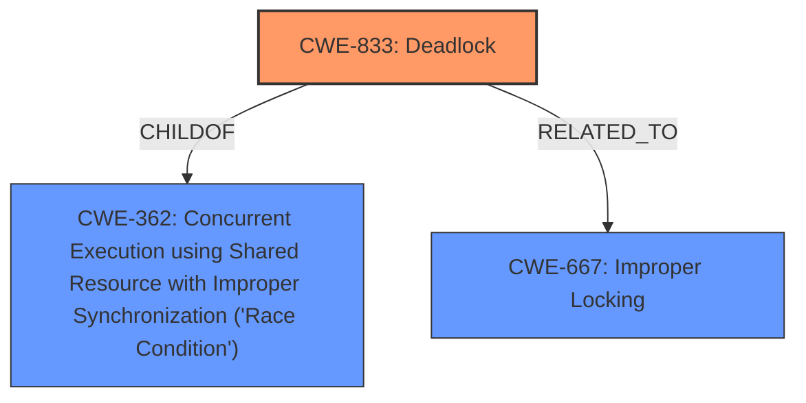

# Enhanced Analysis for CVE-2024-42274

# Summary
| CWE ID | CWE Name | Confidence | CWE Abstraction Level | CWE Vulnerability Mapping Label | CWE-Vulnerability Mapping Notes |
|---|---|---|---|---|---|
| CWE-833 | Deadlock | 0.9 | Base | Primary CWE | Allowed |
| CWE-362 | Concurrent Execution using Shared Resource with Improper Synchronization ('Race Condition') | 0.7 | Class | Secondary Candidate | Allowed-with-Review |
| CWE-667 | Improper Locking | 0.6 | Class | Secondary Candidate | Allowed-with-Review |

## Evidence and Confidence

*   **Confidence Score:** 0.9
*   **Evidence Strength:** HIGH

## Relationship Analysis
The primary relationship influencing the CWE selection is the hierarchical relationship. CWE-833 (Deadlock) is a more specific type of concurrency issue, making it a better fit than its parent class, CWE-362 (Concurrent Execution using Shared Resource with Improper Synchronization ('Race Condition')). CWE-667 (Improper Locking) is also related as deadlocks often arise from improper locking mechanisms. The base level of CWE-833 provides the right level of detail for this vulnerability.



## Vulnerability Chain
The vulnerability chain starts with the removal of a process context workqueue, which introduced a race condition. This race condition leads to an **AB/BA deadlock competition**, ultimately causing a system freeze.
  - Initial Flaw: Removal of process context workqueue
  - Intermediate Weakness: Race condition due to concurrent access to shared resource
  - Root Cause: **AB/BA deadlock competition** (CWE-833)
  - Impact: System freeze

## Summary of Analysis
The analysis strongly points to CWE-833 (Deadlock) as the primary CWE. The vulnerability description explicitly mentions "**AB/BA deadlock competition**," which is the defining characteristic of a deadlock. The CVE Reference Links Content Summary further elaborates on the locking issue and the sequence of events leading to the deadlock. The retriever results also list CWE-833 as a strong candidate. While CWE-362 (Concurrent Execution using Shared Resource with Improper Synchronization ('Race Condition')) and CWE-667 (Improper Locking) are related, they are more general classes. CWE-833 provides a more precise classification. The selection is based on the explicit mention of "deadlock" in the vulnerability description and the supporting evidence detailing the locking conflict. The level of specificity is appropriate as it directly describes the root cause.

Relevant CWE Information:

# Enhanced Context (25 CWEs)
The following CWEs were identified as potentially relevant to this vulnerability:

## CWE-833: Deadlock
**Abstraction Level**: Base
**Similarity Score**: 0.79
**Source**: dense

**Description**:
The product contains multiple threads or executable segments that are waiting for each other to release a necessary lock, resulting in deadlock.

**Mapping Guidance**:
- Usage: Allowed
- Rationale: This CWE entry is at the Base level of abstraction, which is a preferred level of abstraction for mapping to the root causes of vulnerabilities.

**Vulnerability Description Key Phrases**:
- **rootcause:** **AB/BA deadlock competition**
- **impact:** system freeze

The vulnerability description indicates a "**AB/BA deadlock competition**" causing a system freeze. This clearly aligns with the definition of CWE-833 (Deadlock). The evidence is strong and directly supports this classification.

## CWE-362: Concurrent Execution using Shared Resource with Improper Synchronization ('Race Condition')
**Abstraction Level**: Class
**Similarity Score**: 0.76
**Source**: dense

**Description**:
The product contains a concurrent code sequence that requires temporary, exclusive access to a shared resource, but a timing window exists in which the shared resource can be modified by another code sequence operating concurrently.

**Mapping Guidance**:
- Usage: Allowed-with-Review
- Rationale: This CWE entry is a Class and might have Base-level children that would be more appropriate

While a race condition is present, the ultimate outcome is a deadlock. Therefore, CWE-833 is more specific and appropriate.

## CWE-667: Improper Locking
**Abstraction Level**: Class
**Similarity Score**: 0.77
**Source**: dense

**Description**:
The product does not properly acquire or release a lock on a resource, leading to unexpected resource state changes and behaviors.

**Mapping Guidance**:
- Usage: Allowed-with-Review
- Rationale: This CWE entry is a Class and might have Base-level children that would be more appropriate

The **AB/BA deadlock competition** arises from an improper locking situation, but again, deadlock is the final outcome. CWE-833 captures the essence of the vulnerability more accurately.

Other CWEs like CWE-755 (Improper Handling of Exceptional Conditions), CWE-125 (Out-of-bounds Read), CWE-476 (NULL Pointer Dereference), CWE-346 (Origin Validation Error) were considered but deemed not applicable as they do not directly relate to the root cause of the deadlock. The analysis focused on CWEs directly related to concurrency and locking issues.


## CWE Relationship Analysis

Current CWEs represent these abstraction levels: .


### Vulnerability Chain Analysis

**Chain starting from CWE-476:**
- 476 (NULL Pointer Dereference) - ROOT


**Chain starting from CWE-346:**
- 346 (Origin Validation Error) - ROOT


### CWE Relationship Diagram

```mermaid
graph TD
    classDef primary fill:#f96,stroke:#333,stroke-width:2px
    classDef secondary fill:#69f,stroke:#333
    classDef tertiary fill:#9e9,stroke:#333
```