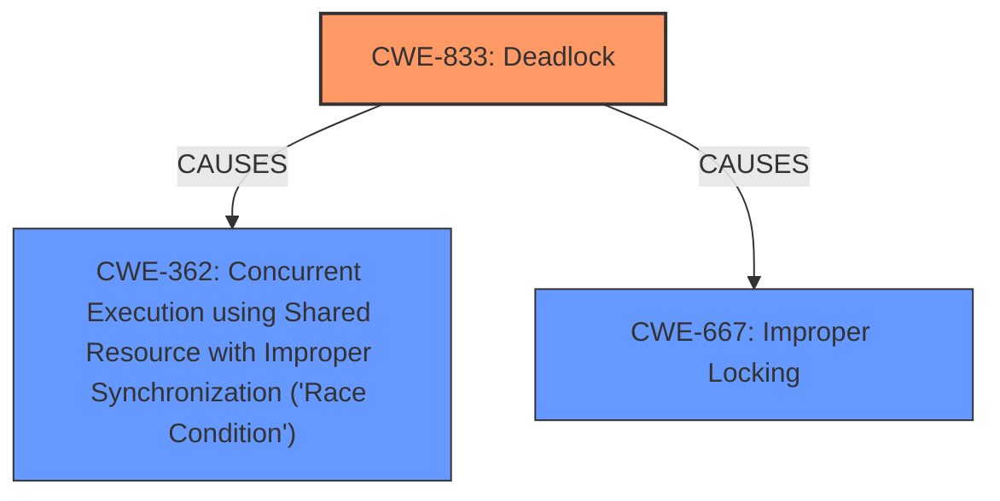

# Analysis Report for CVE-2024-42294

# Vulnerability Analysis Report: CVE-2024-42294

## Description

In the Linux kernel, the following vulnerability has been resolvedblock fix deadlock between sd_remove & sd_releaseOur test report the following hung task[ 2538.459400] INFO task kworker/007 blocked for more than 188 seconds.[ 2538.459427] Call trace[ 2538.459430] __switch_to+0x174/0x338[ 2538.459436] __schedule+0x628/0x9c4[ 2538.459442] schedule+0x7c/0xe8[ 2538.459447] schedule_preempt_disabled+0x24/0x40[ 2538.459453] __mutex_lock+0x3ec/0xf04[ 2538.459456] __mutex_lock_slowpath+0x14/0x24[ 2538.459459] mutex_lock+0x30/0xd8[ 2538.459462] del_gendisk+0xdc/0x350[ 2538.459466] sd_remove+0x30/0x60[ 2538.459470] device_release_driver_internal+0x1c4/0x2c4[ 2538.459474] device_release_driver+0x18/0x28[ 2538.459478] bus_remove_device+0x15c/0x174[ 2538.459483] device_del+0x1d0/0x358[ 2538.459488] __scsi_remove_device+0xa8/0x198[ 2538.459493] scsi_forget_host+0x50/0x70[ 2538.459497] scsi_remove_host+0x80/0x180[ 2538.459502] usb_stor_disconnect+0x68/0xf4[ 2538.459506] usb_unbind_interface+0xd4/0x280[ 2538.459510] device_release_driver_internal+0x1c4/0x2c4[ 2538.459514] device_release_driver+0x18/0x28[ 2538.459518] bus_remove_device+0x15c/0x174[ 2538.459523] device_del+0x1d0/0x358[ 2538.459528] usb_disable_device+0x84/0x194[ 2538.459532] usb_disconnect+0xec/0x300[ 2538.459537] hub_event+0xb80/0x1870[ 2538.459541] process_scheduled_works+0x248/0x4dc[ 2538.459545] worker_thread+0x244/0x334[ 2538.459549] kthread+0x114/0x1bc[ 2538.461001] INFO task fsck.15415 blocked for more than 188 seconds.[ 2538.461014] Call trace[ 2538.461016] __switch_to+0x174/0x338[ 2538.461021] __schedule+0x628/0x9c4[ 2538.461025] schedule+0x7c/0xe8[ 2538.461030] blk_queue_enter+0xc4/0x160[ 2538.461034] blk_mq_alloc_request+0x120/0x1d4[ 2538.461037] scsi_execute_cmd+0x7c/0x23c[ 2538.461040] ioctl_internal_command+0x5c/0x164[ 2538.461046] scsi_set_medium_removal+0x5c/0xb0[ 2538.461051] sd_release+0x50/0x94[ 2538.461054] blkdev_put+0x190/0x28c[ 2538.461058] blkdev_release+0x28/0x40[ 2538.461063] __fput+0xf8/0x2a8[ 2538.461066] __fput_sync+0x28/0x5c[ 2538.461070] __arm64_sys_close+0x84/0xe8[ 2538.461073] invoke_syscall+0x58/0x114[ 2538.461078] el0_svc_common+0xac/0xe0[ 2538.461082] do_el0_svc+0x1c/0x28[ 2538.461087] el0_svc+0x38/0x68[ 2538.461090] el0t_64_sync_handler+0x68/0xbc[ 2538.461093] el0t_64_sync+0x1a8/0x1ac T1 T2 sd_remove del_gendisk __blk_mark_disk_dead blk_freeze_queue_start ++q->mq_freeze_depth bdev_release mutex_lock(&disk->open_mutex) sd_release scsi_execute_cmd blk_queue_enter wait_event(!q->mq_freeze_depth) mutex_lock(&disk->open_mutex)SCSI does not set GD_OWNS_QUEUE, so QUEUE_FLAG_DYING is not set inthis scenario. This is a classic ABBA deadlock. To fix the deadlock,make sure we dont try to acquire disk->open_mutex after freezingthe queue.

## Vulnerability Description Key Phrases

- **Rootcause:** Deadlock between sd_remove and sd_release due to incorrect mutex acquisition order after queue freezing.
- **Weakness:** Incorrect locking order in the SCSI driver, specifically attempting to acquire the disk->open_mutex after the queue has been frozen.
- **Impact:** System hang due to a deadlock, preventing further operation.
- **Vector:** Concurrent execution of sd_remove and sd_release operations on a SCSI device.
- **Product:** Linux Kernel
- **Version:** All versions affected until the fix is applied
- **Component:** SCSI Driver

## Analysis (with Relationship Data)

# Summary
| CWE ID | CWE Name | Confidence | CWE Abstraction Level | CWE Vulnerability Mapping Label | CWE-Vulnerability Mapping Notes |
|---|---|---|---|---|---|
| CWE-833 | Deadlock | 1.0 | Base | Primary | Allowed |
| CWE-362 | Concurrent Execution using Shared Resource with Improper Synchronization ('Race Condition') | 0.8 | Class | Secondary | Allowed-with-Review |
| CWE-667 | Improper Locking | 0.7 | Class | Secondary | Allowed-with-Review |

## Evidence and Confidence

*   **Confidence Score:** 0.9
*   **Evidence Strength:** HIGH

## Relationship Analysis
The primary weakness is CWE-833 Deadlock, which occurs due to the interaction of concurrent operations. The conditions necessary for the deadlock involve a race condition (CWE-362) where timing of the concurrent processes leads to inconsistent lock states, and an improper locking strategy (CWE-667) that allows the circular dependency to form. While CWE-833 is the root cause, CWE-362 and CWE-667 represent contributing factors.



## Vulnerability Chain
The vulnerability chain starts with concurrent execution and improper locking leading to a deadlock and ultimately causing a system hang.

1.  **Concurrent Execution:** `sd_remove` and `sd_release` executing concurrently.
2.  **Improper Locking:** Incorrect mutex acquisition order after queue freezing.
3.  **Deadlock:** Circular dependency between the locks acquired by `sd_remove` and `sd_release`.
4.  **System Hang:** Tasks blocked indefinitely, leading to denial of service.

The **Primary CWE** is CWE-833 because it represents the actual **deadlock** that halts system operations.

## Summary of Analysis
The analysis is primarily based on the provided vulnerability description and the supporting CVE reference content. The key evidence is the description of the **deadlock** between `sd_remove` and `sd_release`, which arises from the **incorrect locking order** and concurrent execution.

The Retriever results and graph relationships support the selection of CWE-833 as the primary cause, with CWE-362 and CWE-667 as contributing factors.

The selected CWEs are at the optimal level of specificity as they directly address the root cause and contributing factors of the vulnerability. CWE-833 is a Base level CWE, offering a clear description of the **deadlock** condition.

Relevant CWE Information:

# Enhanced Context (25 CWEs)
The following CWEs were identified as potentially relevant to this vulnerability:

## CWE-833: Deadlock
**Abstraction Level**: Base
**Similarity Score**: 0.79
**Source**: dense

**Description**:
The product contains multiple threads or executable segments that are waiting for each other to release a necessary lock, resulting in **deadlock**.

**Mapping Guidance**:
- Usage: Allowed
- Rationale: This CWE entry is at the Base level of abstraction, which is a preferred level of abstraction for mapping to the root causes of vulnerabilities.

## CWE-667: Improper Locking
**Abstraction Level**: Class
**Similarity Score**: 0.77
**Source**: dense

**Description**:
The product does not properly acquire or release a lock on a resource, leading to unexpected resource state changes and behaviors.

**Mapping Guidance**:
- Usage: Allowed-with-Review
- Rationale: This CWE entry is a Class and might have Base-level children that would be more appropriate

## CWE-362: Concurrent Execution using Shared Resource with Improper Synchronization ('Race Condition')
**Abstraction Level**: Class
**Similarity Score**: 0.73
**Source**: dense

**Description**:
The product contains a concurrent code sequence that requires temporary, exclusive access to a shared resource, but a timing window exists in which the shared resource can be modified by another code sequence operating concurrently.

**Mapping Guidance**:
- Usage: Allowed-with-Review
- Rationale: This CWE entry is a Class and might have Base-level children that would be more appropriate

### CWE Selection Details:

*   **CWE-833 Deadlock:** The vulnerability description explicitly mentions a **deadlock** between `sd_remove` and `sd_release`. The call trace provided in the vulnerability description clearly shows tasks blocked while waiting for mutexes, which aligns with the definition of a **deadlock**. The "Vulnerability Description Key Phrases" section also explicitly mentions a **deadlock** as a root cause. Confidence: 1.0

*   **CWE-362 Concurrent Execution using Shared Resource with Improper Synchronization ('Race Condition'):** The vulnerability occurs due to the concurrent execution of `sd_remove` and `sd_release`. The timing of these operations leads to the **deadlock** because of **improper synchronization**. The "CVE Reference Links Content Summary" identifies a **race condition** as a contributing factor. Confidence: 0.8

*   **CWE-667 Improper Locking:** The root cause involves **incorrect mutex acquisition order**, which falls under **improper locking**. The "Vulnerability Description Key Phrases" section mentions **incorrect locking order** as a weakness. Confidence: 0.7

### CWEs Considered But Not Used:

*   **CWE-404 Improper Resource Shutdown or Release:** While the vulnerability involves the removal of a device, the core issue is the **deadlock**, not the improper release of resources in general.

*   **CWE-770 Allocation of Resources Without Limits or Throttling:** This CWE is not relevant as the vulnerability does not involve resource allocation issues.

*   **CWE-119 Improper Restriction of Operations within the Bounds of a Memory Buffer:** There is no indication of memory buffer issues.

*   **CWE-367 Time-of-check Time-of-use (TOCTOU) Race Condition:** While there is a race condition involved, it's not specifically a TOCTOU issue.

*   **CWE-789 Memory Allocation with Excessive Size Value:** This is not relevant because the vulnerability is not related to memory allocation sizes.

*   **CWE-908 Use of Uninitialized Resource:** There is no indication of using uninitialized resources in this vulnerability.


## CWE Relationship Analysis

Current CWEs represent these abstraction levels: .


### Vulnerability Chain Analysis

**Chain starting from CWE-770:**
- 770 (Allocation of Resources Without Limits or Throttling) - ROOT


**Chain starting from CWE-404:**
- 404 (Improper Resource Shutdown or Release) - ROOT


### CWE Relationship Diagram

```mermaid
graph TD
    classDef primary fill:#f96,stroke:#333,stroke-width:2px
    classDef secondary fill:#69f,stroke:#333
    classDef tertiary fill:#9e9,stroke:#333
```


*Report generated on 2025-07-13 13:54:15*
