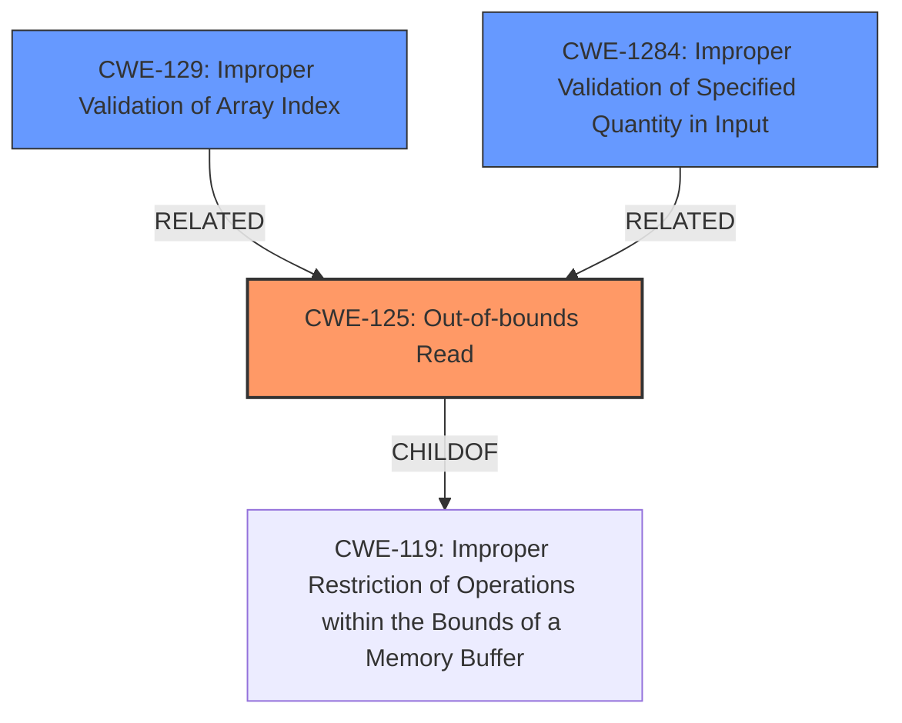

# Analysis Report for CVE-2024-42305

# Vulnerability Analysis Report: CVE-2024-42305

## Description

In the Linux kernel, the following vulnerability has been resolved ext4 check dot and dotdot of dx_root before making dir indexed Syzbot reports a issue as follows ============================================ BUG unable to handle page fault for address ffffed11022e24fe PGD 23ffee067 P4D 23ffee067 PUD 0 Oops Oops 0000 [#1] PREEMPT SMP KASAN PTI CPU 0 PID 5079 Comm syz-executor306 Not tainted 6.10.0-rc5-g55027e689933 #0 Call Trace make_indexed_dir+0xdaf/0x13c0 fs/ext4/namei.c2341 ext4_add_entry+0x222a/0x25d0 fs/ext4/namei.c2451 ext4_rename fs/ext4/namei.c3936 [inline] ext4_rename2+0x26e5/0x4370 fs/ext4/namei.c4214 [...] ============================================ The immediate cause of this problem is that there is only one valid dentry for the block to be split during do_split, so split==0 results in out of bounds accesses to the map triggering the issue. do_split unsigned split dx_make_map count = 1 split = count/2 = 0 continued = hash2 == map[split - 1].hash ---> map[4294967295] The maximum length of a filename is 255 and the minimum block size is 1024, so it is always guaranteed that the number of entries is greater than or equal to 2 when do_split() is called. But syzbots crafted image has no dot and dotdot in dir, and the dentry distribution in dirblock is as follows bus dentry1 hole dentry2 free |xx--|xx-------------|...............|xx-------------|........

## Vulnerability Description Key Phrases

- **Impact:** Oops
- **Product:** Linux kernel

## Analysis (with Relationship Data)

# Summary

| CWE ID  | CWE Name                                                        | Confidence | CWE Abstraction Level | CWE Vulnerability Mapping Label | CWE-Vulnerability Mapping Notes |
| :-------- | :-------------------------------------------------------------- | :--------- | :-------------------- | :------------------------------ | :------------------------------ |
| CWE-125   | Out-of-bounds Read                                              | 0.9        | Base                  | Primary                         | Allowed                         |
| CWE-1284  | Improper Validation of Specified Quantity in Input            | 0.7        | Base                  | Secondary                       | Allowed                         |
| CWE-129   | Improper Validation of Array Index                              | 0.6        | Variant               | Secondary                       | Allowed                         |

## Evidence and Confidence

*   **Confidence Score:** 0.8
*   **Evidence Strength:** HIGH

## Relationship Analysis

The primary CWE is CWE-125 (Out-of-bounds Read), which is directly implicated by the vulnerability description. CWE-1284 (Improper Validation of Specified Quantity in Input) and CWE-129 (Improper Validation of Array Index) are related because the vulnerability arises from **improper validation** of the number of directory entries, leading to an out-of-bounds array access. CWE-125 is a base level CWE and child of CWE-119. CWE-129 is a variant.



## Vulnerability Chain

The vulnerability chain starts with the **incorrect assumption** that a directory always contains "." and ".." entries. This leads to **improper validation** of the number of entries, and ultimately results in an **out-of-bounds read** when accessing the `map` array.
  - Initial Flaw: **Incorrect assumption** about "." and ".." entries in directories.
  - Root Cause: **Improper Validation** of the number of directory entries.
  - Impact: **Out-of-bounds Read**, leading to kernel panic.

## Summary of Analysis

The analysis is based on the provided vulnerability description and CVE reference content summary, which clearly indicates an out-of-bounds read due to **improper validation** of directory entries. The vulnerability occurs because the code assumes the existence of "." and ".." entries and doesn't handle the case where they are missing, leading to an incorrect count of entries and subsequent out-of-bounds access.

The primary CWE is CWE-125 (Out-of-bounds Read) because the immediate consequence of the flaw is reading memory outside the allocated buffer. CWE-1284 (Improper Validation of Specified Quantity in Input) is a contributing factor because the code **fails to properly validate** the number of directory entries, which is the root cause that allows the out-of-bounds read to occur. CWE-129 (Improper Validation of Array Index) is related, but less directly applicable, as the issue is more about the count of entries than the array index itself.

The selected CWEs are at the optimal level of specificity. CWE-125 is a Base CWE, and CWE-1284 is also a Base CWE. Using these CWEs provides a clear and accurate representation of the vulnerability.

Relevant CWE Information:

# Enhanced Context (25 CWEs)

## CWE-667: Improper Locking
**Abstraction Level**: Class
**Similarity Score**: 0.74
**Source**: dense
Not selected because the vulnerability does not involve improper locking.

## CWE-125: Out-of-bounds Read
**Abstraction Level**: Base
**Similarity Score**: 0.74
**Source**: dense
Selected as the primary CWE because the vulnerability leads to reading data outside the bounds of the intended buffer.

## CWE-362: Concurrent Execution using Shared Resource with Improper Synchronization ('Race Condition')
**Abstraction Level**: Class
**Similarity Score**: 0.73
**Source**: dense
Not selected because the vulnerability doesn't appear to be related to race conditions or concurrent execution issues.

## CWE-367: Time-of-check Time-of-use (TOCTOU) Race Condition
**Abstraction Level**: Base
**Similarity Score**: 0.73
**Source**: dense
Not selected because the vulnerability doesn't involve a TOCTOU race condition.

## CWE-129: Improper Validation of Array Index
**Abstraction Level**: Variant
**Similarity Score**: 0.73
**Source**: dense
Selected as a secondary CWE because the root cause is **improper validation**, which leads to out-of-bounds access via an invalid array index.

## CWE-755: Improper Handling of Exceptional Conditions
**Abstraction Level**: Class
**Similarity Score**: 0.73
**Source**: dense
Not selected because it is too general. The vulnerability can be described more precisely by other CWEs.

## CWE-1285: Improper Validation of Specified Index, Position, or Offset in Input
**Abstraction Level**: Base
**Similarity Score**: 0.73
**Source**: dense
Not selected because the issue is primarily related to the quantity of directory entries rather than a specific index or offset.

## CWE-59: Improper Link Resolution Before File Access ('Link Following')
**Abstraction Level**: Base
**Similarity Score**: 0.73
**Source**: dense
Not selected because the vulnerability does not involve symlinks or file access issues.

## CWE-824: Access of Uninitialized Pointer
**Abstraction Level**: Base
**Similarity Score**: 0.72
**Source**: dense
Not selected because the vulnerability doesn't involve accessing an uninitialized pointer.

## CWE-193: Off-by-one Error
**Abstraction Level**: Base
**Similarity Score**: 0.72
**Source**: dense
Not selected because the vulnerability is not specifically an off-by-one error, but rather related to the **incorrect calculation** of the number of directory entries due to **missing validation**.

## CWE-190: Integer Overflow or Wraparound
**Abstraction Level**: Base
**Similarity Score**: 1466.75
**Source**: sparse
Not selected because the vulnerability does not directly involve integer overflow or wraparound.

## CWE-1284: Improper Validation of Specified Quantity in Input
**Abstraction Level**: Base
**Similarity Score**: 1405.72
**Source**: sparse
Selected as a secondary CWE because the code **fails to properly validate** the number of directory entries, which contributes to the out-of-bounds read.

## CWE-191: Integer Underflow (Wrap or Wraparound)
**Abstraction Level**: Base
**Similarity Score**: 1364.94
**Source**: sparse
Not selected because the vulnerability does not involve integer underflow.

## CWE-125: Out-of-bounds Read
**Abstraction Level**: Base
**Similarity Score**: 1356.62
**Source**: sparse
Selected as the primary CWE because the vulnerability leads to reading data outside the bounds of the intended buffer.

## CWE-367: Time-of-check Time-of-use (TOCTOU) Race Condition
**Abstraction Level**: Base
**Similarity Score**: 1351.43
**Source**: sparse
Not selected because the vulnerability doesn't involve a TOCTOU race condition.

## CWE-609: Double-Checked Locking
**Abstraction Level**: base
**Similarity Score**: 4.33
**Source**: graph
Not selected because the vulnerability does not involve double-checked locking.

## CWE-770: Allocation of Resources Without Limits or Throttling
**Abstraction Level**: base
**Similarity Score**: 3.49
**Source**: graph
Not selected because the vulnerability does not involve resource allocation without limits or throttling.

## CWE-190: Integer Overflow or Wraparound
**Abstraction Level**: base
**Similarity Score**: 3.15
**Source**: graph
Not selected because the vulnerability does not directly involve integer overflow or wraparound.

## CWE-1325: Improperly Controlled Sequential Memory Allocation
**Abstraction Level**: base
**Similarity Score**: 2.93
**Source**: graph
Not selected because the vulnerability does not involve memory allocation.

## CWE-367: Time-of-check Time-of-use (TOCTOU) Race Condition
**Abstraction Level**: Base
**Similarity Score**: 2.90
**Source**: graph
Not selected


## CWE Relationship Analysis

Current CWEs represent these abstraction levels: .


### Vulnerability Chain Analysis

**Chain starting from CWE-1284:**
- 1284 (Improper Validation of Specified Quantity in Input) - ROOT


**Chain starting from CWE-609:**
- 609 (Double-Checked Locking) - ROOT


### CWE Relationship Diagram

```mermaid
graph TD
    classDef primary fill:#f96,stroke:#333,stroke-width:2px
    classDef secondary fill:#69f,stroke:#333
    classDef tertiary fill:#9e9,stroke:#333
```


*Report generated on 2025-07-13 13:54:35*
