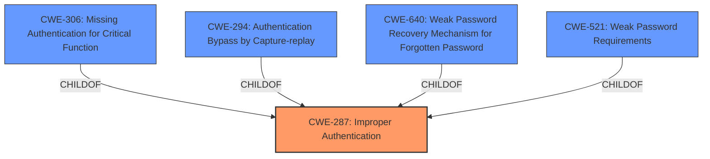

# Analysis for CVE-2024-42336

# Summary
| CWE ID | CWE Name | Confidence | CWE Abstraction Level | CWE Vulnerability Mapping Label | CWE-Vulnerability Mapping Notes |
|---|---|---|---|---|---|
| CWE-287 | Improper Authentication | 1.0 | Class | Primary CWE | Discouraged |

## Evidence and Confidence

*   **Confidence Score:** 1.0
*   **Evidence Strength:** HIGH

## Relationship Analysis
The primary CWE is CWE-287 Improper Authentication which is a Class-level CWE. There are other more specific CWEs that are children of CWE-287 such as CWE-306 Missing Authentication for Critical Function, CWE-294 Authentication Bypass by Capture-replay, CWE-640 Weak Password Recovery Mechanism for Forgotten Password and CWE-521 Weak Password Requirements. The choice of CWE-287 is influenced by the fact that the description mentions **Improper Authentication** as the **rootcause** of the vulnerability.

## Vulnerability Chain
The vulnerability chain starts with **Improper Authentication** (CWE-287), leading to unauthorized access. The chain is:
1.  **Root Cause:** **Improper Authentication** (CWE-287)
2.  **Impact:** Unauthorized Access

## Summary of Analysis
The initial analysis identified CWE-287 **Improper Authentication** as the primary weakness based on the vulnerability description explicitly stating it as the **rootcause**. The vulnerability description key phrases also mention **Improper Authentication** as the **rootcause** and list CWE-287 as the weakness.
The retriever results suggest other CWEs, but the evidence points strongly towards **Improper Authentication**.
The graph relationships helped in understanding that while more specific CWEs exist, the provided information is not detailed enough to warrant a more specific classification.
CWE-287 is selected because the vulnerability description explicitly states "**CWE-287** **Improper Authentication**".

Relevant CWE Information:
- **CWE-287 Improper Authentication**: This CWE is a Class-level weakness describing a situation where the authentication process is flawed, allowing unauthorized access. The vulnerability description states that the **rootcause** is **Improper Authentication**, making this CWE the most appropriate choice. While it is discouraged to use Class-level CWEs when more specific Base-level CWEs exist, there is insufficient information to determine the specific type of **improper authentication**.