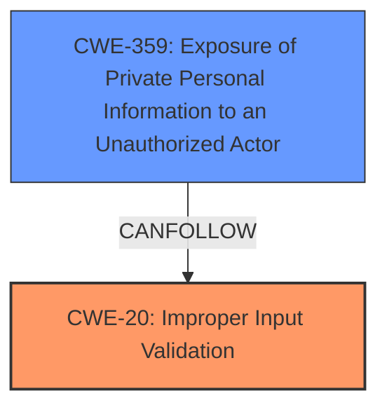

# Analysis for CVE-2024-42347

# Summary
| CWE ID    | CWE Name                                                                                       | Confidence | CWE Abstraction Level | CWE Vulnerability Mapping Label | CWE-Vulnerability Mapping Notes |
| --------- | ---------------------------------------------------------------------------------------------- | ---------- | ----------------------- | ------------------------------- | --------------------------------- |
| CWE-20    | Improper Input Validation                                                                      | 0.7        | Class                   | Primary CWE                   | Allowed-with-Review            |
| CWE-359   | Exposure of Private Personal Information to an Unauthorized Actor                             | 0.6        | Base                    | Secondary Candidate            | Allowed                             |

## Evidence and Confidence

*   **Confidence Score:** 0.65
*   **Evidence Strength:** MEDIUM

## Relationship Analysis
The primary weakness is **Improper Input Validation (CWE-20)**, because the client (matrix-react-sdk) does not properly validate or handle settings related to URL previews received from the homeserver. A related weakness is **Exposure of Private Personal Information to an Unauthorized Actor (CWE-359)** since the manipulation by a malicious homeserver leads to the exposure of URLs from encrypted messages.

## Vulnerability Chain
The vulnerability chain starts with the malicious homeserver manipulating a user's account data. This leads to the client enabling URL previews in end-to-end encrypted rooms due to **improper input validation**. The final impact is the exposure of URLs in encrypted messages to the homeserver.
  - Root Cause: **Improper Input Validation (CWE-20)**
  - Impact: Exposure of Private Personal Information to an Unauthorized Actor **(CWE-359)**

## Summary of Analysis
The initial analysis focused on the ability of a malicious homeserver to manipulate user account data and the resultant exposure of URLs in encrypted messages.

The primary CWE selected is **CWE-20 (Improper Input Validation)** because the client **does not properly validate or handle settings related to URL previews received from the homeserver.** This is the root cause that allows the malicious homeserver to manipulate the client's behavior. The vulnerability description states, "The client (matrix-react-sdk) does not properly validate or handle settings related to URL previews received from the homeserver."

**CWE-359 (Exposure of Private Personal Information to an Unauthorized Actor)** is a secondary candidate because it represents the impact of the vulnerability. The manipulation leads to the exposure of URLs in encrypted messages, which constitutes private personal information.

The retriever results included CWEs like **CWE-290 (Authentication Bypass by Spoofing)**, **CWE-79 (Improper Neutralization of Input During Web Page Generation ('Cross-site Scripting'))**, and **CWE-93 (Improper Neutralization of CRLF Sequences ('CRLF Injection'))**, but these are not directly related to the **root cause** of this vulnerability. The issue is not about spoofing, XSS, or CRLF injection, but about the client **failing to validate the settings** it receives from the homeserver.

**CWE-863 (Incorrect Authorization)** was considered but deemed less appropriate because the issue is not primarily about authorization. While the malicious homeserver effectively gains unauthorized access to URL previews, the core weakness is the **lack of input validation**, not the authorization mechanism itself.

Relevant CWE Information:

# Enhanced Context (25 CWEs)
The following CWEs were identified as potentially relevant to this vulnerability:

## CWE-290: Authentication Bypass by Spoofing
**Abstraction Level**: Base
**Similarity Score**: 0.76
**Source**: dense

**Description**:
This attack-focused weakness is caused by incorrectly implemented authentication schemes that are subject to spoofing attacks.

**Mapping Guidance**:
- Usage: Allowed
- Rationale: This CWE entry is at the Base level of abstraction, which is a preferred level of abstraction for mapping to the root causes of vulnerabilities.

## CWE-346: Origin Validation Error
**Abstraction Level**: Class
**Similarity Score**: 0.74
**Source**: dense

**Description**:
The product does not properly verify that the source of data or communication is valid.

**Mapping Guidance**:
- Usage: Allowed-with-Review
- Rationale: This CWE entry is a Class and might have Base-level children that would be more appropriate

## CWE-941: Incorrectly Specified Destination in a Communication Channel
**Abstraction Level**: Base
**Similarity Score**: 0.74
**Source**: dense

**Description**:
The product creates a communication channel to initiate an outgoing request to an actor, but it does not correctly specify the intended destination for that actor.

**Mapping Guidance**:
- Usage: Allowed
- Rationale: This CWE entry is at the Base level of abstraction, which is a preferred level of abstraction for mapping to the root causes of vulnerabilities.

## CWE-294: Authentication Bypass by Capture-replay
**Abstraction Level**: Base
**Similarity Score**: 0.74
**Source**: dense

**Description**:
A capture-replay flaw exists when the design of the product makes it possible for a malicious user to sniff network traffic and bypass authentication by replaying it to the server in question to the same effect as the original message (or with minor changes).

**Mapping Guidance**:
- Usage: Allowed
- Rationale: This CWE entry is at the Base level of abstraction, which is a preferred level of abstraction for mapping to the root causes of vulnerabilities.

## CWE-918: Server-Side Request Forgery (SSRF)
**Abstraction Level**: Base
**Similarity Score**: 0.73
**Source**: dense

**Description**:
The web server receives a URL or similar request from an upstream component and retrieves the contents of this URL, but it does not sufficiently ensure that the request is being sent to the expected destination.

**Mapping Guidance**:
- Usage: Allowed
- Rationale: This CWE entry is at the Base level of abstraction, which is a preferred level of abstraction for mapping to the root causes of vulnerabilities.

## CWE-303: Incorrect Implementation of Authentication Algorithm
**Abstraction Level**: Base
**Similarity Score**: 0.73
**Source**: dense

**Description**:
The requirements for the product dictate the use of an established authentication algorithm, but the implementation of the algorithm is incorrect.

**Mapping Guidance**:
- Usage: Allowed
- Rationale: This CWE entry is at the Base level of abstraction, which is a preferred level of abstraction for mapping to the root causes of vulnerabilities.

## CWE-93: Improper Neutralization of CRLF Sequences ('CRLF Injection')
**Abstraction Level**: Base
**Similarity Score**: 0.73
**Source**: dense

**Description**:
The product uses CRLF (carriage return line feeds) as a special element, e.g. to separate lines or records, but it does not neutralize or incorrectly neutralizes CRLF sequences from inputs.

**Mapping Guidance**:
- Usage: Allowed
- Rationale: This CWE entry is at the Base level of abstraction, which is a preferred level of abstraction for mapping to the root causes of vulnerabilities.

## CWE-116: Improper Encoding or Escaping of Output
**Abstraction Level**: Class
**Similarity Score**: 0.73
**Source**: dense

**Description**:
The product prepares a structured message for communication with another component, but encoding or escaping of the data is either missing or done incorrectly. As a result, the intended structure of the message is not preserved.

**Mapping Guidance**:
- Usage: Allowed-with-Review
- Rationale: This CWE entry is a Class and might have Base-level children that would be more appropriate

## CWE-923: Improper Restriction of Communication Channel to Intended Endpoints
**Abstraction Level**: Class
**Similarity Score**: 0.73
**Source**: dense

**Description**:
The product establishes a communication channel to (or from) an endpoint for privileged or protected operations, but it does not properly ensure that it is communicating with the correct endpoint.

**Mapping Guidance**:
- Usage: Allowed-with-Review
- Rationale: This CWE entry is a Class and might have Base-level children that would be more appropriate

## CWE-319: Cleartext Transmission of Sensitive Information
**Abstraction Level**: Base
**Similarity Score**: 0.72
**Source**: dense

**Description**:
The product transmits sensitive or security-critical data in cleartext in a communication channel that can be sniffed by unauthorized actors.

**Mapping Guidance**:
- Usage: Allowed
- Rationale: This CWE entry is at the Base level of abstraction, which is a preferred level of abstraction for mapping to the root causes of vulnerabilities.

## CWE-290: Authentication Bypass by Spoofing
**Abstraction Level**: Base
**Similarity Score**: 974.88
**Source**: sparse

**Description**:
This attack-focused weakness is caused by incorrectly implemented authentication schemes that are subject to