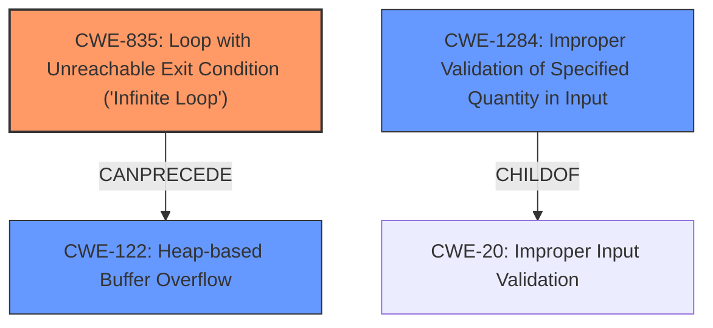

# Enhanced Analysis for CVE-2024-42358

# Summary
| CWE ID | CWE Name | Confidence | CWE Abstraction Level | CWE Vulnerability Mapping Label | CWE-Vulnerability Mapping Notes |
|---|---|---|---|---|---|
| CWE-835 | Loop with Unreachable Exit Condition ('Infinite Loop') | 0.9 | Base | Allowed | Primary CWE. The **infinite loop** is the root cause. |
| CWE-1284 | Improper Validation of Specified Quantity in Input | 0.8 | Base | Allowed | Secondary CWE. The **lack of input validation** on nGroups allows the **infinite loop** to occur. |
| CWE-122 | Heap-based Buffer Overflow | 0.7 | Variant | Allowed | Secondary CWE. A heap overflow condition is a buffer overflow. |

## Evidence and Confidence

*   **Confidence Score:** 0.8
*   **Evidence Strength:** HIGH

## Relationship Analysis
The primary CWE is CWE-835, representing the infinite loop. CWE-1284 is included because the loop occurs due to **improper validation** of the `nGroups` value from the TTF file. CWE-122 is the heap-based buffer overflow.



## Vulnerability Chain
The vulnerability chain starts with **improper validation** of the nGroups value (CWE-1284). This leads to an **infinite loop** (CWE-835) and a **heap-based buffer overflow** (CWE-122).

## Summary of Analysis
The analysis identified CWE-835 as the primary weakness because the core issue is an **infinite loop**. The vulnerability description and CVE details explicitly mention the **infinite loop** in the `read_cmap` function. The `nGroups` value from the TTF file is not properly validated, allowing the **infinite loop** to occur, hence the inclusion of CWE-1284. The heap-buffer-overflow (CWE-122) is a consequence of a large cmap table size, which is also related to the **lack of input validation**. The selected CWEs are at the appropriate level of specificity, with CWE-835 and CWE-1284 being Base level and CWE-122 being a Variant.

CWEs considered but not used:

*   CWE-674: Uncontrolled Recursion - While recursion can cause resource exhaustion, the description specifically mentions a loop, making CWE-835 more appropriate.
*   CWE-190: Integer Overflow or Wraparound - Integer overflow might contribute to the excessive iteration, but the **lack of input validation** leading to the **infinite loop** is the main issue.
*   CWE-789: Memory Allocation with Excessive Size Value - While a large `nGroups` value can cause excessive memory allocation, the core issue is the **infinite loop**, making CWE-835 more appropriate.
*   CWE-131: Incorrect Calculation of Buffer Size - This is related to the heap overflow condition, but CWE-122 is a more direct description of the vulnerability.


## CWE Relationship Analysis

Current CWEs represent these abstraction levels: .


### Vulnerability Chain Analysis

**Chain starting from CWE-1284:**
- 1284 (Improper Validation of Specified Quantity in Input) - ROOT


**Chain starting from CWE-131:**
- 131 (Incorrect Calculation of Buffer Size) - ROOT


### CWE Relationship Diagram

```mermaid
graph TD
    classDef primary fill:#f96,stroke:#333,stroke-width:2px
    classDef secondary fill:#69f,stroke:#333
    classDef tertiary fill:#9e9,stroke:#333
```