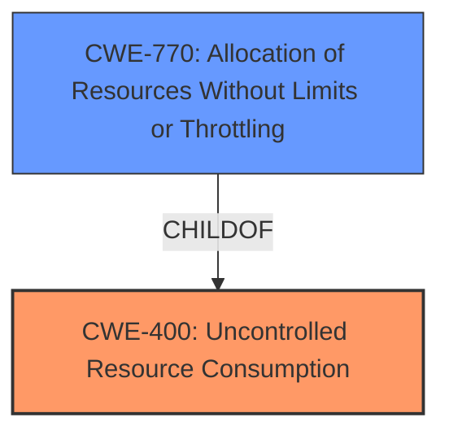

# Analysis Report for CVE-2024-42426

# Vulnerability Analysis Report: CVE-2024-42426

## Description

Dell PowerScale OneFS Versions 9.5.0.x through 9.8.0.x contain an **uncontrolled resource consumption** vulnerability. A low privilege remote attacker could potentially exploit this vulnerability, leading to denial of service.

## Vulnerability Description Key Phrases

- **Weakness:** uncontrolled resource consumption
- **Impact:** ['denial of service', 'resource consumption']
- **Attacker:** low privilege remote attacker
- **Product:** Dell PowerScale OneFS
- **Version:** 9.5.0.x through 9.8.0.x

## Analysis (with Relationship Data)

# Summary
| CWE ID | CWE Name | Confidence | CWE Abstraction Level | CWE Vulnerability Mapping Label | CWE-Vulnerability Mapping Notes |
|---|---|---|---|---|---|
| CWE-400 | Uncontrolled Resource Consumption | 0.9 | Class | Primary | Allowed-with-Review |
| CWE-770 | Allocation of Resources Without Limits or Throttling | 0.7 | Base | Secondary | Allowed |

## Evidence and Confidence

*   **Confidence Score:** 0.8
*   **Evidence Strength:** HIGH

## Relationship Analysis
The primary relationship impacting the decision is that CWE-400 is a Class-level CWE, and it has more specific Base-level children. CWE-770, Allocation of Resources Without Limits or Throttling, is a child of CWE-400, and it is considered a possible candidate. Since the vulnerability is due to the lack of limits on resource allocation, CWE-770 could be considered a contributing factor, but the primary issue is the uncontrolled consumption which is a broader concept.



## Vulnerability Chain
The vulnerability chain starts with an **uncontrolled resource consumption** (CWE-400) due to a lack of proper resource management, leading to a denial-of-service (DoS) condition. A possible factor is the **allocation of resources without limits or throttling** (CWE-770).

## Summary of Analysis
The initial analysis strongly points to CWE-400, "Uncontrolled Resource Consumption," as the primary weakness. The vulnerability description explicitly states "**uncontrolled resource consumption**". The CVE Reference Links Content Summary confirms this, stating the root cause is "**Uncontrolled resource consumption**" and that the vulnerability stems from a **lack of proper resource management**. This aligns perfectly with CWE-400.

The retriever results also list CWE-400 as the top candidate. While CWE-400 is a Class-level CWE, the available information doesn't provide enough detail to pinpoint a more specific Base-level CWE with high confidence. However, CWE-770, "Allocation of Resources Without Limits or Throttling" is a possible contributor because it is a child of CWE-400 and describes a resource allocation issue, but it is still a secondary candidate.

The decision to use CWE-400 is based on the direct evidence of the vulnerability description and CVE summary, which repeatedly emphasize the **uncontrolled resource consumption**. While a more specific CWE could potentially be identified with further investigation, the current evidence supports CWE-400 as the most appropriate classification.

Relevant CWE Information:

# Enhanced Context (25 CWEs)
The following CWEs were identified as potentially relevant to this vulnerability:

## CWE-664: Improper Control of a Resource Through its Lifetime
**Abstraction Level**: Pillar
**Similarity Score**: 0.78
**Source**: dense

**Description**:
The product does not maintain or incorrectly maintains control over a resource throughout its lifetime of creation, use, and release.

**Mapping Guidance**:
- Usage: Discouraged
- Rationale: This CWE entry is high-level when lower-level children are available.

## CWE-400: Uncontrolled Resource Consumption
**Abstraction Level**: class
**Similarity Score**: 2.55
**Source**: graph

**Description**:
CWE-400: Uncontrolled Resource Consumption

**Mapping Guidance**:
- Usage: Discouraged
- Rationale: CWE-400 is intended for incorrect behaviors in which the product is expected to track and restrict how many resources it consumes, but CWE-400 is often misused because it is conflated with the "technical impact" of vulnerabilities in which resource consumption occurs. It is sometimes used for low-information vulnerability reports. It is a level-1 Class (i.e., a child of a Pillar).

**Relationships**:
- PARENTOF -> CWE-920
- PARENTOF -> CWE-779
- PARENTOF -> CWE-771
- PARENTOF -> CWE-770
- CANFOLLOW -> CWE-410

CWE-400 is the primary CWE as the vulnerability description explicitly mentions **uncontrolled resource consumption**. The suggested alternative of child nodes is considered with CWE-770 being a candidate.

## CWE-770: Allocation of Resources Without Limits or Throttling
**Abstraction Level**: Base
**Similarity Score**: 0.187
**Source**: sparse

**Description**:
The product allocates resources for a functionality, but it does not properly limit or throttle the amount of resources that are allocated, which can be exploited to cause a denial of service.

**Mapping Guidance**:
- Usage: Allowed
- Rationale: This CWE entry is at the Base level of abstraction, which is a preferred level of abstraction for mapping to the root causes of vulnerabilities.

CWE-770 is considered as a secondary issue, because **uncontrolled resource consumption** is the primary issue.

CWE-410: Insufficient Resource Pool is not selected because the issue isn't an insufficient pool, but the uncontrolled consumption.
CWE-834: Excessive Iteration is not selected because the description mentions a resource consumption and not iteration.
CWE-772: Missing Release of Resource after Effective Lifetime is not selected because the vulnerability is about resource consumption, not necessarily a missing release.
CWE-674: Uncontrolled Recursion is not selected because the resource consumption does not seem to be caused by recursion.
CWE-789: Memory Allocation with Excessive Size Value is not selected because the resource consumption isn't necessarily memory allocation.
CWE-693: Protection Mechanism Failure is not selected because the root cause is the uncontrolled resource consumption and not a protection mechanism failure.
CWE-911: Improper Update of Reference Count is not selected because the root cause is the uncontrolled resource consumption and not reference counting.


## CWE Relationship Analysis

Current CWEs represent these abstraction levels: .


### Vulnerability Chain Analysis

**Chain starting from CWE-779:**
- 779 (Logging of Excessive Data) - ROOT


**Chain starting from CWE-400:**
- 400 (Uncontrolled Resource Consumption) - ROOT


### CWE Relationship Diagram

```mermaid
graph TD
    classDef primary fill:#f96,stroke:#333,stroke-width:2px
    classDef secondary fill:#69f,stroke:#333
    classDef tertiary fill:#9e9,stroke:#333
```


*Report generated on 2025-07-13 14:03:12*
