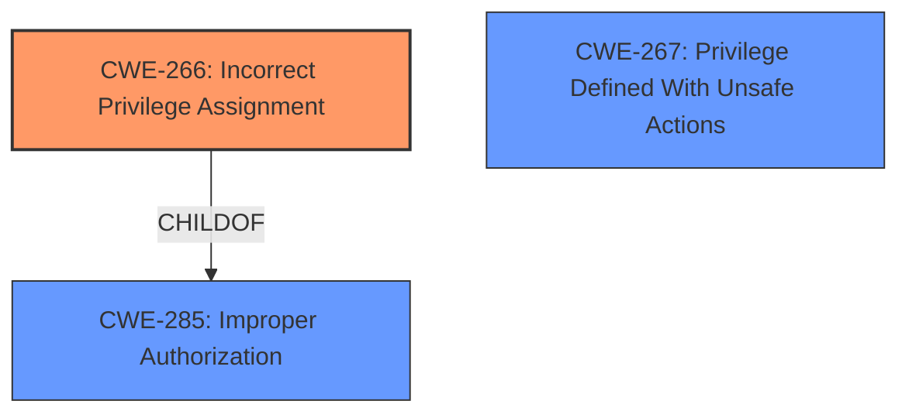

# Analysis for CVE-2024-42440

# Summary
| CWE ID | CWE Name | Confidence | CWE Abstraction Level | CWE Vulnerability Mapping Label | CWE-Vulnerability Mapping Notes |
|---|---|---|---|---|---|
| CWE-266 | Incorrect Privilege Assignment | 0.9 | Base | Primary | Allowed |
| CWE-267 | Privilege Defined With Unsafe Actions | 0.5 | Base | Secondary | Allowed |
| CWE-285 | Improper Authorization | 0.3 | Class | Secondary | Discouraged |

## Evidence and Confidence

*   **Confidence Score:** 0.9
*   **Evidence Strength:** HIGH

## Relationship Analysis
The primary relationship influencing the CWE selection is the parent-child relationship. CWE-266 is chosen as the most specific **rootcause**, while CWE-285, a parent class, is a less specific alternative. The vulnerability description indicates a problem with how privileges are assigned, leading to potential privilege escalation. The guidance on privileges vs permissions helped to refine the choice to CWE-266.

## Vulnerability Chain
The vulnerability chain starts with **improper privilege management** (CWE-266). This leads to a privileged user being able to escalate their privileges. The final impact is privilege escalation, where the attacker gains higher privileges than they should have, allowing them to perform unauthorized actions.

## Summary of Analysis
The analysis is based on the provided evidence, specifically the vulnerability description key phrases and the CVE reference links content summary. The vulnerability description explicitly mentions **"Improper privilege management"** as the root cause. The CVE reference content summary confirms this by stating: "**Root cause of vulnerability:** Improper privilege management within the installer."

CWE-266 (Incorrect Privilege Assignment) is the most appropriate CWE because it directly addresses the **rootcause** of the vulnerability, which is the **incorrect assignment of privileges** during the installation process. This is further supported by the "Privileges vs Permissions Guidance," which states that CWE-266 is applicable when "the system assigns incorrect privileges to a user." The description matches the scenario where the installer incorrectly assigns privileges, allowing a privileged user to escalate their privileges.

CWE-267 (Privilege Defined With Unsafe Actions) was considered as a secondary candidate because it is related to privileges being used for unintended, unsafe actions.

CWE-285 (Improper Authorization) was also considered but ultimately deemed less specific than CWE-266. While privilege management can relate to authorization, the more precise issue is the initial incorrect assignment of those privileges.

The selection of CWE-266 is at the optimal level of specificity, as it is a Base-level CWE that directly corresponds to the identified root cause.
# Enhanced Context (25 CWEs)
The following CWEs were identified as potentially relevant to this vulnerability:

## CWE-266: Incorrect Privilege Assignment
**Abstraction Level**: Base
**Similarity Score**: 0.80
**Source**: dense

**Description**:
A product incorrectly assigns a privilege to a particular actor, creating an unintended sphere of control for that actor.

**Mapping Guidance**:
- Usage: Allowed
- Rationale: This CWE entry is at the Base level of abstraction, which is a preferred level of abstraction for mapping to the root causes of vulnerabilities.
**CWE-266** is the most specific and therefore is the best choice.

## CWE-267: Privilege Defined With Unsafe Actions
**Abstraction Level**: Base
**Similarity Score**: 0.79
**Source**: dense

**Description**:
A particular privilege, role, capability, or right can be used to perform unsafe actions that were not intended, even when it is assigned to the correct entity.

**Mapping Guidance**:
- Usage: Allowed
- Rationale: This CWE entry is at the Base level of abstraction, which is a preferred level of abstraction for mapping to the root causes of vulnerabilities.
**CWE-267** is possible but less specific as the description is about assignment.

## CWE-280: Improper Handling of Insufficient Permissions or Privileges 
**Abstraction Level**: Base
**Similarity Score**: 0.77
**Source**: dense

**Description**:
The product does not handle or incorrectly handles when it has insufficient privileges to access resources or functionality as specified by their permissions. This may cause it to follow unexpected code paths that may leave the product in an invalid state.

**Mapping Guidance**:
- Usage: Allowed
- Rationale: This CWE entry is at the Base level of abstraction, which is a preferred level of abstraction for mapping to the root causes of vulnerabilities.
**CWE-280** is possible but less specific as the description is about assignment.

## CWE-274: Improper Handling of Insufficient Privileges
**Abstraction Level**: Base
**Similarity Score**: 0.77
**Source**: dense

**Description**:
The product does not handle or incorrectly handles when it has insufficient privileges to perform an operation, leading to resultant weaknesses.

**Mapping Guidance**:
- Usage: Discouraged
- Rationale: This CWE entry could be deprecated in a future version of CWE.
**CWE-274** is possible but less specific and discouraged.

## CWE-59: Improper Link Resolution Before File Access ('Link Following')
**Abstraction Level**: Base
**Similarity Score**: 0.77
**Source**: dense

**Description**:
The product attempts to access a file based on the filename, but it does not properly prevent that filename from identifying a link or shortcut that resolves to an unintended resource.

**Mapping Guidance**:
- Usage: Allowed
- Rationale: This CWE entry is at the Base level of abstraction, which is a preferred level of abstraction for mapping to the root causes of vulnerabilities.
**CWE-59** is not relevant to this **improper privilege management** vulnerability.

## CWE-276: Incorrect Default Permissions
**Abstraction Level**: Base
**Similarity Score**: 0.76
**Source**: dense

**Description**:
During installation, installed file permissions are set to allow anyone to modify those files.

**Mapping Guidance**:
- Usage: Allowed
- Rationale: This CWE entry is at the Base level of abstraction, which is a preferred level of abstraction for mapping to the root causes of vulnerabilities.
**CWE-276** is possible but less specific as the description is about assignment.

## CWE-668: Exposure of Resource to Wrong Sphere
**Abstraction Level**: Class
**Similarity Score**: 0.76
**Source**: dense

**Description**:
The product exposes a resource to the wrong control sphere, providing unintended actors with inappropriate access to the resource.

**Mapping Guidance**:
- Usage: Discouraged
- Rationale: CWE-668 is high-level and is often misused as a catch-all when lower-level CWE IDs might be applicable. It is sometimes used for low-information vulnerability reports [REF-1287]. It is a level-1 Class (i.e., a child of a Pillar). It is not useful for trend analysis.
**CWE-668** is too high level and is discouraged.

## CWE-497: Exposure of Sensitive System Information to an Unauthorized Control Sphere
**Abstraction Level**: Base
**Similarity Score**: 0.75
**Source**: dense

**Description**:
The product does not properly prevent sensitive system-level information from being accessed by unauthorized actors who do not have the same level of access to the underlying system as the product does.

**Mapping Guidance**:
- Usage: Allowed
- Rationale: This CWE entry is at the Base level of abstraction, which is a preferred level of abstraction for mapping to the root causes of vulnerabilities.
**CWE-497** is not relevant to this **improper privilege management** vulnerability.

## CWE-667: Improper Locking
**Abstraction Level**: Class
**Similarity Score**: 0.75
**Source**: dense

**Description**:
The product does not properly acquire or release a lock on a resource, leading to unexpected resource state changes and behaviors.

**Mapping Guidance**:
- Usage: Allowed-with-Review
- Rationale: This CWE entry is a Class and might have Base-level children that would be more appropriate
**CWE-667** is not relevant to this **improper privilege management** vulnerability.

## CWE-732: Incorrect Permission Assignment for Critical Resource
**Abstraction Level**: Class
**Similarity Score**: 0.75
**Source**: dense

**Description**:
The product specifies permissions for a security-critical resource in a way that allows that resource to be read or modified by unintended actors.

**Mapping Guidance**:
- Usage: Allowed-with-Review
- Rationale: