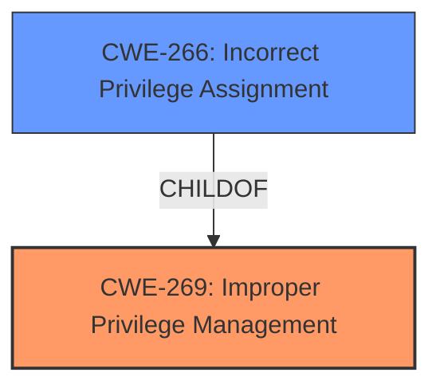

# Analysis for CVE-2024-42441

# Summary
| CWE ID | CWE Name | Confidence | CWE Abstraction Level | CWE Vulnerability Mapping Label | CWE-Vulnerability Mapping Notes |
|---|---|---|---|---|---|
| CWE-269 | Improper Privilege Management | 0.8 | Class | Primary CWE | Discouraged |
| CWE-266 | Incorrect Privilege Assignment | 0.6 | Base | Secondary Candidate | Allowed |

## Evidence and Confidence

*   **Confidence Score:** 0.8
*   **Evidence Strength:** MEDIUM

## Relationship Analysis
The primary CWE selected is CWE-269 (Improper Privilege Management), which is a Class-level CWE. A more specific Base CWE, CWE-266 (Incorrect Privilege Assignment), was also considered because the vulnerability involves assigning incorrect privileges. However, the description uses the broader term "improper privilege management," and without more specific information, CWE-269 is a reasonable choice, though discouraged.

## Vulnerability Chain
The vulnerability chain starts with **improper privilege management** in the installer, leading to a local privilege escalation.

## Summary of Analysis
The analysis is based on the provided vulnerability description, which highlights **improper privilege management** as the root cause. The description states: "**Improper privilege management** in the installer for Zoom Workplace Desktop App for macOS, Zoom Meeting SDK for macOS and Zoom Rooms Client for macOS before 6.1.5 may allow a privileged user to conduct an escalation of privilege via local access."

CWE-269 is chosen as the primary CWE because it directly reflects the described weakness. However, CWE-269 is discouraged, and the analysis considered CWE-266 (Incorrect Privilege Assignment) as a more specific alternative. CWE-266 would be more appropriate if the **improper privilege management** involved incorrect assignment of privileges.

The selection is based on the available evidence and understanding of the vulnerability. Further information about the specific flaw in privilege management would help refine the CWE selection.

Relevant CWE Information:
# Enhanced Context (25 CWEs)
The following CWEs were identified as potentially relevant to this vulnerability:

## CWE-266: Incorrect Privilege Assignment
**Abstraction Level**: Base
**Similarity Score**: 0.80
**Source**: dense

**Description**:
A product incorrectly assigns a privilege to a particular actor, creating an unintended sphere of control for that actor.

**Mapping Guidance**:
- Usage: Allowed
- Rationale: This CWE entry is at the Base level of abstraction, which is a preferred level of abstraction for mapping to the root causes of vulnerabilities.

## CWE-269: Improper Privilege Management
**Abstraction Level**: Class
**Similarity Score**: 1567.35
**Source**: sparse

**Description**:
The product does not properly assign, modify, track, or check privileges for an actor, creating an unintended sphere of control for that actor.

**Mapping Guidance**:
- Usage: Discouraged
- Rationale: CWE-269 is commonly misused. It can be conflated with "privilege escalation," which is a technical impact that is listed in many low-information vulnerability reports [REF-1287]. It is not useful for trend analysis.