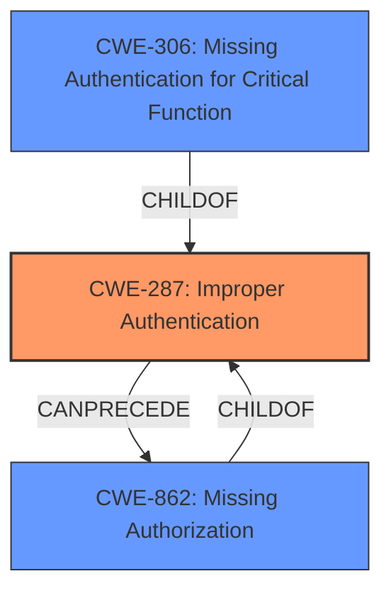

# Analysis Report for CVE-2024-42462

# Vulnerability Analysis Report: CVE-2024-42462

## Description

**Improper Authentication vulnerability** in upKeeper Solutions product upKeeper Manager allows Authentication Bypass.This issue affects upKeeper Manager through 5.1.9.

## Vulnerability Description Key Phrases

- **Rootcause:** Improper Authentication vulnerability
- **Impact:** Authentication Bypass
- **Product:** upKeeper Solutions upKeeper Manager
- **Version:** through 5.1.9

## Analysis (with Relationship Data)

# Summary
| CWE ID | CWE Name | Confidence | CWE Abstraction Level | CWE Vulnerability Mapping Label | CWE-Vulnerability Mapping Notes |
|---|---|---|---|---|---|
| CWE-287 | Improper Authentication | 0.9 | Class | Primary | Discouraged |
| CWE-306 | Missing Authentication for Critical Function | 0.7 | Base | Secondary | Allowed |
| CWE-862 | Missing Authorization | 0.6 | Base | Secondary | Allowed |

## Evidence and Confidence

*   **Confidence Score:** 0.9
*   **Evidence Strength:** MEDIUM

## Relationship Analysis
The primary CWE is CWE-287, Improper Authentication. It is a class-level CWE, and more specific base-level CWEs exist that fall under it. CWE-306, Missing Authentication for Critical Function, is a child of CWE-287 and a strong candidate based on the description. CWE-862 Missing Authorization is another possible child CWE if the Authentication is present, but the authorization is missing. The relationships show that authentication issues can often precede authorization bypass. Choosing the most specific CWE that fits the root cause is essential.



## Vulnerability Chain
The vulnerability chain starts with **Improper Authentication**, potentially leading to Authentication Bypass.

## Summary of Analysis
The initial analysis identified the **root cause** as **Improper Authentication vulnerability**, which leads to the **impact** of Authentication Bypass. The vulnerability description key phrases highlight the **Improper Authentication vulnerability** as the **root cause**.

The guidance provided clarifies the distinction between authentication and authorization. Since the description explicitly mentions **Improper Authentication**, the primary focus is on CWE-287 (Improper Authentication). However, given that authentication bypass is the **impact**, CWE-306 (Missing Authentication for Critical Function) could also be considered if no authentication is present at all, or CWE-862 (Missing Authorization) could be considered if authentication exists but authorization checks are missing.

The evidence for choosing CWE-287 is based on the **Vulnerability Description Key Phrases** which state that the **rootcause** is "**Improper Authentication vulnerability**". This is direct evidence. The retriever results also list CWE-287 as the top match.

CWE-287 is selected as the primary CWE, even though it's discouraged. This is because the provided information is limited. If more information was available, a more specific child CWE of CWE-287 could be chosen. Based on the limited evidence, CWE-287 is chosen with a confidence of 0.9.

CWE-306 is added as a secondary candidate, with a confidence of 0.7, because it is a child of CWE-287 and could be the case if Authentication is completely missing.

CWE-862 is added as a secondary candidate, with a confidence of 0.6, because it is a child of CWE-287 and could be the case if Authentication is present but authorization checks are missing.

Other CWEs considered but not used:

*   CWE-90, CWE-89: These relate to injection vulnerabilities, which are not mentioned in the description.
*   CWE-1390, CWE-522: These relate to weak or insufficiently protected credentials, which are not explicitly mentioned.
*   CWE-305: This is Authentication Bypass by Primary Weakness and is similar to the vulnerability.


## CWE Relationship Analysis

Current CWEs represent these abstraction levels: .


### Vulnerability Chain Analysis

**Chain starting from CWE-90:**
- 90 (Improper Neutralization of Special Elements used in an LDAP Query ('LDAP Injection')) - ROOT


**Chain starting from CWE-89:**
- 89 (Improper Neutralization of Special Elements used in an SQL Command ('SQL Injection')) - ROOT


### CWE Relationship Diagram

```mermaid
graph TD
    classDef primary fill:#f96,stroke:#333,stroke-width:2px
    classDef secondary fill:#69f,stroke:#333
    classDef tertiary fill:#9e9,stroke:#333
```


*Report generated on 2025-07-13 14:06:51*
