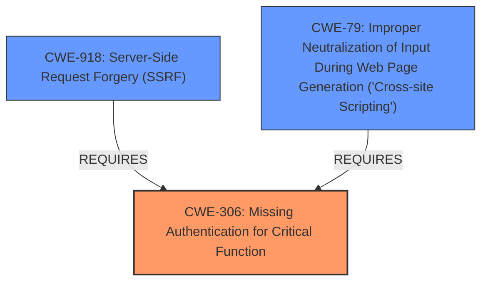

# Analysis Report for CVE-2024-42467

# Vulnerability Analysis Report: CVE-2024-42467

## Description

openHAB, a provider of open-source home automation software, has add-ons including the visualization add-on CometVisu. Prior to version 4.2.1, the proxy endpoint of openHABs CometVisu add-on can be accessed without authentication. This proxy-feature can be exploited as Server-Side Request Forgery (SSRF) to induce GET HTTP requests to internal-only servers, in case openHAB is exposed in a non-private network. Furthermore, this proxy-feature can also be exploited as a Cross-Site Scripting (XSS) vulnerability, as an attacker is able to re-route a request to their server and return a page with malicious JavaScript code. Since the browser receives this data directly from the openHAB CometVisu UI, this JavaScript code will be executed with the origin of the CometVisu UI. This allows an attacker to exploit call endpoints on an openHAB server even if the openHAB server is located in a private network. (e.g. by sending an openHAB admin a link that proxies malicious JavaScript.) This issue may lead up to Remote Code Execution (RCE) when chained with other vulnerabilities. Users should upgrade to version 4.2.1 of the CometVisu add-on of openHAB to receive a patch.

## Vulnerability Description Key Phrases

- **Rootcause:** missing authentication
- **Weakness:** ['server-side request forgery', 'cross-site scripting']
- **Impact:** remote code execution
- **Vector:** malicious JavaScript code
- **Product:** openHAB CometVisu add-on
- **Version:** prior to 4.2.1
- **Component:** proxy endpoint

## Analysis (with Relationship Data)

# Summary
| CWE ID  | CWE Name                                                                    | Confidence | CWE Abstraction Level | CWE Vulnerability Mapping Label | CWE-Vulnerability Mapping Notes |
| :-------- | :-------------------------------------------------------------------------- | :---------- | :---------------------- | :-------------------------------- | :------------------------------ |
| CWE-306 | Missing Authentication for Critical Function                                     | 1.0       | Base                   | Primary                          | Allowed                       |
| CWE-918 | Server-Side Request Forgery (SSRF)                                      | 0.9       | Base                   | Secondary                       | Allowed                       |
| CWE-79  | Improper Neutralization of Input During Web Page Generation ('Cross-site Scripting') | 0.8       | Base                   | Secondary                       | Allowed                       |

## Evidence and Confidence

*   **Confidence Score:** 0.9
*   **Evidence Strength:** HIGH

## Relationship Analysis
The primary weakness is the **missing authentication** on the proxy endpoint, which allows attackers to perform SSRF and XSS attacks. The relationship between CWE-306 and CWE-918 is that the **missing authentication** (CWE-306) is a prerequisite for the SSRF vulnerability (CWE-918). Similarly, the **missing authentication** facilitates the XSS vulnerability (CWE-79), as it allows an attacker to control the response and inject malicious JavaScript. The abstraction levels are appropriate, with CWE-306 and CWE-918 being Base-level CWEs that accurately represent the root cause and the resulting vulnerability. CWE-79 is also a Base-level CWE, describing the XSS issue.



## Vulnerability Chain
1.  **Root Cause:** **Missing authentication** for the proxy endpoint (CWE-306)
2.  **Weakness 1:** Server-Side Request Forgery (SSRF) due to the ability to make requests to internal servers (CWE-918)
3.  **Weakness 2:** Cross-Site Scripting (XSS) due to the ability to re-route requests and inject malicious JavaScript (CWE-79)
4.  **Impact:** Potential Remote Code Execution (RCE) when chained with other vulnerabilities.

## Summary of Analysis
The analysis is heavily based on the provided vulnerability description, particularly the keyphrase analysis. The primary **root cause** is clearly the **missing authentication** (CWE-306) on the proxy endpoint. The SSRF (CWE-918) and XSS (CWE-79) vulnerabilities are consequences of this **missing authentication**. The relationship graph and the vulnerability chain helped to clarify the interaction between these weaknesses. The selected CWEs are at the appropriate level of specificity, providing a clear and accurate representation of the vulnerability. The evidence supporting the primary CWE is the statement "the proxy endpoint of openHABs CometVisu add-on can be accessed without authentication." The evidence for CWE-918 is "This proxy-feature can be exploited as Server-Side Request Forgery (SSRF) to induce GET HTTP requests to internal-only servers". The evidence for CWE-79 is "this proxy-feature can also be exploited as a Cross-Site Scripting (XSS) vulnerability, as an attacker is able to re-route a request to their server and return a page with malicious JavaScript code".

Relevant CWE Information:

# Enhanced Context (25 CWEs)
The following CWEs were identified as potentially relevant to this vulnerability:

## CWE-80: Improper Neutralization of Script-Related HTML Tags in a Web Page (Basic XSS)
**Abstraction Level**: Variant
**Similarity Score**: 0.75
**Source**: dense

**Description**:
The product receives input from an upstream component, but it does not neutralize or incorrectly neutralizes special characters such as "<", ">", and "&" that could be interpreted as web-scripting elements when they are sent to a downstream component that processes web pages.

**Mapping Guidance**:
- Usage: Allowed
- Rationale: This CWE entry is at the Variant level of abstraction, which is a preferred level of abstraction for mapping to the root causes of vulnerabilities.

*This CWE was not selected as CWE-79 is the more general case and seems more appropriate*

## CWE-74: Improper Neutralization of Special Elements in Output Used by a Downstream Component ('Injection')
**Abstraction Level**: Class
**Similarity Score**: 0.74
**Source**: dense

**Description**:
The product constructs all or part of a command, data structure, or record using externally-influenced input from an upstream component, but it does not neutralize or incorrectly neutralizes special elements that could modify how it is parsed or interpreted when it is sent to a downstream component.

**Mapping Guidance**:
- Usage: Discouraged
- Rationale: CWE-74 is high-level and often misused when lower-level weaknesses are more appropriate.

*This CWE was not selected because a more specific CWE ID is a better fit.*

## CWE-303: Incorrect Implementation of Authentication Algorithm
**Abstraction Level**: Base
**Similarity Score**: 0.74
**Source**: dense

**Description**:
The requirements for the product dictate the use of an established authentication algorithm, but the implementation of the algorithm is incorrect.

**Mapping Guidance**:
- Usage: Allowed
- Rationale: This CWE entry is at the Base level of abstraction, which is a preferred level of abstraction for mapping to the root causes of vulnerabilities.

*This CWE was not selected because there is **missing authentication** rather than an incorrect implementation of authentication*

## CWE-138: Improper Neutralization of Special Elements
**Abstraction Level**: Class
**Similarity Score**: 0.73
**Source**: dense

**Description**:
The product receives input from an upstream component, but it does not neutralize or incorrectly neutralizes special elements that could be interpreted as control elements or syntactic markers when they are sent to a downstream component.

**Mapping Guidance**:
- Usage: Discouraged
- Rationale: This CWE entry is a level-1 Class (i.e., a child of a Pillar). It might have lower-level children that would be more appropriate

*This CWE was not selected because it is too general.*

## CWE-668: Exposure of Resource to Wrong Sphere
**Abstraction Level**: Class
**Similarity Score**: 0.73
**Source**: dense

**Description**:
The product exposes a resource to the wrong control sphere, providing unintended actors with inappropriate access to the resource.

**Mapping Guidance**:
- Usage: Discouraged
- Rationale: CWE-668 is high-level and is often misused as a catch-all when lower-level CWE IDs might be applicable. It is sometimes used for low-information vulnerability reports [REF-1287]. It is a level-1 Class (i.e., a child of a Pillar). It is not useful for trend analysis.

*This CWE was not selected because there are lower-level CWEs more applicable.*

## CWE-807: Reliance on Untrusted Inputs in a Security Decision
**Abstraction Level**: Base
**Similarity Score**: 0.73
**Source**: dense

**Description**:
The product uses a protection mechanism that relies on the existence or values of an input, but the input can be modified by an untrusted actor in a way that bypasses the protection mechanism.

**Mapping Guidance**:
- Usage: Allowed
- Rationale: This CWE entry is at the Base level of abstraction, which is a preferred level of abstraction for mapping to the root causes of vulnerabilities.

*This CWE was not selected because the **missing authentication** is a more appropriate rootcause.*

## CWE-425: Direct Request ('Forced Browsing')
**Abstraction Level**: Base
**Similarity Score**: 0.73
**Source**: dense

**Description**:
The web application does not adequately enforce appropriate authorization on all restricted URLs, scripts, or files.

**Mapping Guidance**:
- Usage: Allowed
- Rationale: This CWE entry is at the Base level of abstraction, which is a preferred level of abstraction for mapping to the root causes of vulnerabilities.

*This CWE was not selected because **missing authentication** is more directly related to the vulnerability than authorization.*

## CWE-451: User Interface (UI) Misrepresentation of Critical Information
**Abstraction Level**: Class
**Similarity Score**: 0.73
**Source**: dense

**Description**:
The user interface (UI) does not properly represent critical information to the user, allowing the information - or its source - to be obscured or spoofed. This is often a component in phishing attacks.

**Mapping Guidance**:
-


## CWE Relationship Analysis

Current CWEs represent these abstraction levels: .


### Vulnerability Chain Analysis

**Chain starting from CWE-807:**
- 807 (Reliance on Untrusted Inputs in a Security Decision) - ROOT


**Chain starting from CWE-80:**
- 80 (Improper Neutralization of Script-Related HTML Tags in a Web Page (Basic XSS)) - ROOT


### CWE Relationship Diagram

```mermaid
graph TD
    classDef primary fill:#f96,stroke:#333,stroke-width:2px
    classDef secondary fill:#69f,stroke:#333
    classDef tertiary fill:#9e9,stroke:#333
```


*Report generated on 2025-07-13 14:07:10*
