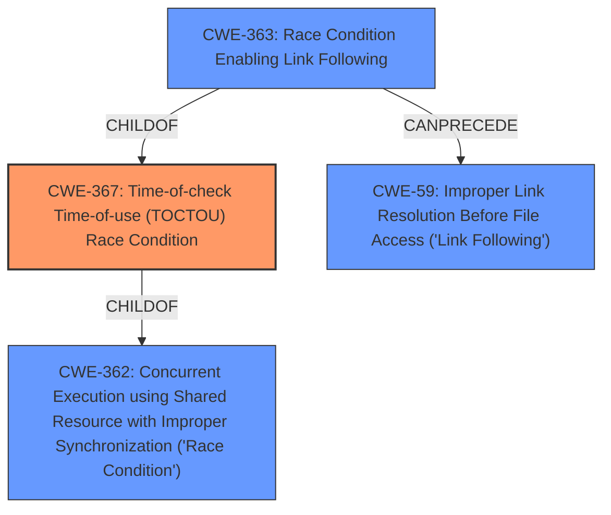

# Enhanced Analysis for CVE-2024-42472

# Summary
| CWE ID    | CWE Name                                                                                                   | Confidence | CWE Abstraction Level | CWE Vulnerability Mapping Label | CWE-Vulnerability Mapping Notes |
| :-------- | :--------------------------------------------------------------------------------------------------------- | :--------- | :---------------------- | :------------------------------ | :-------------------------------- |
| CWE-367   | Time-of-check Time-of-use (TOCTOU) Race Condition                                                          | 0.9        | Base                    | Primary                         | Allowed                           |
| CWE-59    | Improper Link Resolution Before File Access ('Link Following')                                             | 0.8        | Base                    | Secondary                       | Allowed                           |

## Evidence and Confidence

*   **Confidence Score:** 0.85
*   **Evidence Strength:** HIGH

## Relationship Analysis
The primary weakness is a Time-of-check Time-of-use (TOCTOU) Race Condition (CWE-367) that enables the exploitation of Improper Link Resolution (CWE-59). CWE-367 is a child of CWE-362 (Concurrent Execution using Shared Resource with Improper Synchronization), while CWE-59 has various parent CWEs related to path traversal and resource handling. CWE-363 (Race Condition Enabling Link Following) is also relevant.



## Vulnerability Chain
The vulnerability chain starts with a **race condition** (CWE-367), where the state of a directory is checked before use, but changes to a symlink before it is actually used, leading to **improper link resolution** (CWE-59), finally resulting in the application accessing files outside of its intended sandbox.
  - The **Primary CWE** should identify the issue that led to the vulnerability i.e. the first in the "Vulnerability Chain"

## Summary of Analysis
The primary cause of the vulnerability is a **race condition** (CWE-367) that allows a malicious application to replace a directory with a symbolic link after it has been checked but before it is used for a bind mount. This leads to the bind mount following the symlink and granting the application access to unintended files, which can be described as **improper link resolution** (CWE-59).

The **Vulnerability Description Key Phrases** mentions the **rootcause** as a "**race condition**" and a "**weakness**" related to "**symlink following**". The CVE description also mentions both "**Time-of-check/time-of-use race condition**" and "**Improper handling of symbolic links**".

The retriever results indicate that CWE-367 and CWE-59 are good candidates. CWE-362 (Concurrent Execution using Shared Resource with Improper Synchronization) is a parent of CWE-367 and is too high level. CWE-61 (UNIX Symbolic Link (Symlink) Following) is a compound weakness and also a good candidate but less specific than the **race condition** that leads to it.

I am confident in this assessment because it directly addresses the root cause and the mechanism of the vulnerability, and the selected CWEs are at the appropriate level of abstraction.

Relevant CWE Information:

# Enhanced Context (25 CWEs)
The following CWEs were identified as potentially relevant to this vulnerability:

## CWE-362: Concurrent Execution using Shared Resource with Improper Synchronization ('Race Condition')
**Abstraction Level**: Class
**Similarity Score**: 2137.93
**Source**: sparse

**Description**:
The product contains a concurrent code sequence that requires temporary, exclusive access to a shared resource, but a timing window exists in which the shared resource can be modified by another code sequence operating concurrently.

**Mapping Guidance**:
- Usage: Allowed-with-Review
- Rationale: This CWE entry is a Class and might have Base-level children that would be more appropriate

## CWE-61: UNIX Symbolic Link (Symlink) Following
**Abstraction Level**: Compound
**Similarity Score**: 2130.22
**Source**: sparse

**Description**:
The product, when opening a file or directory, does not sufficiently account for when the file is a symbolic link that resolves to a target outside of the intended control sphere. This could allow an attacker to cause the product to operate on unauthorized files.

**Mapping Guidance**:
- Usage: Allowed
- Rationale: This is a well-known Composite of multiple weaknesses that must all occur simultaneously, although it is attack-oriented in nature.

## CWE-367: Time-of-check Time-of-use (TOCTOU) Race Condition
**Abstraction Level**: Base
**Similarity Score**: 2263.71
**Source**: sparse

**Description**:
The product checks the state of a resource before using that resource, but the resource's state can change between the check and the use in a way that invalidates the results of the check. This can cause the product to perform invalid actions when the resource is in an unexpected state.

**Mapping Guidance**:
- Usage: Allowed
- Rationale: This CWE entry is at the Base level of abstraction, which is a preferred level of abstraction for mapping to the root causes of vulnerabilities.

## CWE-59: Improper Link Resolution Before File Access ('Link Following')
**Abstraction Level**: Base
**Similarity Score**: 2271.53
**Source**: sparse

**Description**:
The product attempts to access a file based on the filename, but it does not properly prevent that filename from identifying a link or shortcut that resolves to an unintended resource.

**Mapping Guidance**:
- Usage: Allowed
- Rationale: This CWE entry is at the Base level of abstraction, which is a preferred level of abstraction for mapping to the root causes of vulnerabilities.


## CWE Relationship Analysis

Current CWEs represent these abstraction levels: .


### Vulnerability Chain Analysis

**Chain starting from CWE-59:**
- 59 (Improper Link Resolution Before File Access ('Link Following')) - ROOT


**Chain starting from CWE-363:**
- 363 (Race Condition Enabling Link Following) - ROOT


### CWE Relationship Diagram

```mermaid
graph TD
    classDef primary fill:#f96,stroke:#333,stroke-width:2px
    classDef secondary fill:#69f,stroke:#333
    classDef tertiary fill:#9e9,stroke:#333
```