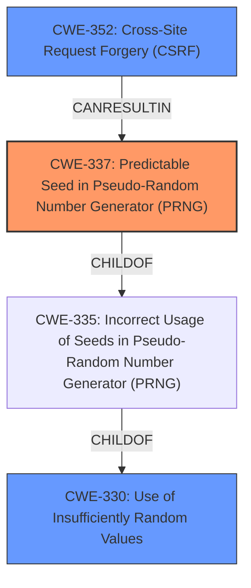

# Analysis for CVE-2024-42475

# Summary
| CWE ID | CWE Name | Confidence | CWE Abstraction Level | CWE Vulnerability Mapping Label | CWE-Vulnerability Mapping Notes |
|---|---|---|---|---|---|
| CWE-337 | Predictable Seed in Pseudo-Random Number Generator (PRNG) | 0.9 | Variant | Allowed | Primary CWE. Matches the vulnerability where the state values are guessable due to predictable seed.|
| CWE-330 | Use of Insufficiently Random Values | 0.7 | Class | Discouraged | Secondary Candidate. The state values generated by the generateState function do not have sufficient entropy and is a parent of CWE-337. |
| CWE-352 | Cross-Site Request Forgery (CSRF) | 0.6 | Base | Allowed | Secondary Candidate. The low entropy of the state value makes it guessable by an attacker which can lead to a CSRF attack. |

## Evidence and Confidence

*   **Confidence Score:** 0.9
*   **Evidence Strength:** HIGH

## Relationship Analysis
The primary CWE is CWE-337, which is a Variant of CWE-335 and a child of CWE-330. CWE-330 is a Class-level CWE that describes the use of insufficiently random values. CWE-352 is a potential impact of the vulnerability, where the lack of entropy in the state values leads to a CSRF attack. The selection of CWE-337 is influenced by its specific description of a predictable seed in a PRNG, aligning directly with the vulnerability's root cause.

## Vulnerability Chain
The vulnerability chain starts with the **root cause** of using a predictable seed in a Pseudo-Random Number Generator (PRNG), represented by CWE-337. This leads to insufficiently random values being generated (CWE-330). The lack of sufficient entropy in the generated state values then allows an attacker to perform a Cross-Site Request Forgery (CSRF) attack (CWE-352).

## Summary of Analysis
The initial analysis identified the **root cause** as the use of a predictable seed in the PRNG, leading to insufficient entropy in the generated state values. The vulnerability description clearly states that "**the state values generated by the generateState function do not have sufficient entropy**". The CVE Reference Links Content Summary further emphasizes this by stating that the state values have low entropy due to the limited range of characters and the short length, making them predictable.

The retriever results suggested CWE-337 (Predictable Seed in Pseudo-Random Number Generator (PRNG)) as a potential candidate. Considering the evidence and the relationship analysis, CWE-337 is selected as the primary CWE because it is a variant-level CWE that specifically addresses the use of a predictable seed, aligning perfectly with the vulnerability's root cause.

CWE-330 (Use of Insufficiently Random Values) is considered as a secondary CWE because it describes the broader issue of using insufficiently random values. While it is relevant, it is a class-level CWE and less specific than CWE-337.

CWE-352 (Cross-Site Request Forgery (CSRF)) is also considered as a secondary CWE because it represents the potential impact of the vulnerability. The low entropy of the state value makes it guessable, which can lead to a CSRF attack.

The selected CWEs are at the optimal level of specificity, with CWE-337 being a variant-level CWE that directly addresses the root cause, CWE-330 being a class-level CWE describing the broader issue, and CWE-352 representing the potential impact.

Relevant CWE Information:

# Enhanced Context (25 CWEs)
The following CWEs were identified as potentially relevant to this vulnerability:

## CWE-335: Incorrect Usage of Seeds in Pseudo-Random Number Generator (PRNG)
**Abstraction Level**: Base
**Similarity Score**: 0.74
**Source**: dense

**Description**:
The product uses a Pseudo-Random Number Generator (PRNG) but does not correctly manage seeds.

**Mapping Guidance**:
- Usage: Allowed
- Rationale: This CWE entry is at the Base level of abstraction, which is a preferred level of abstraction for mapping to the root causes of vulnerabilities.

## CWE-330: Use of Insufficiently Random Values
**Abstraction Level**: Class
**Similarity Score**: 0.72
**Source**: dense

**Description**:
The product uses insufficiently random numbers or values in a security context that depends on unpredictable numbers.

**Mapping Guidance**:
- Usage: Discouraged
- Rationale: This CWE entry is a level-1 Class (i.e., a child of a Pillar). It might have lower-level children that would be more appropriate

## CWE-338: Use of Cryptographically Weak Pseudo-Random Number Generator (PRNG)
**Abstraction Level**: Base
**Similarity Score**: 0.71
**Source**: dense

**Description**:
The product uses a Pseudo-Random Number Generator (PRNG) in a security context, but the PRNG's algorithm is not cryptographically strong.

**Mapping Guidance**:
- Usage: Allowed
- Rationale: This CWE entry is at the Base level of abstraction, which is a preferred level of abstraction for mapping to the root causes of vulnerabilities.

## CWE-1391: Use of Weak Credentials
**Abstraction Level**: Class
**Similarity Score**: 0.70
**Source**: dense

**Description**:
The product uses weak credentials (such as a default key or hard-coded password) that can be calculated, derived, reused, or guessed by an attacker.

**Mapping Guidance**:
- Usage: Allowed-with-Review
- Rationale: This CWE entry is a Class and might have Base-level children that would be more appropriate

## CWE-331: Insufficient Entropy
**Abstraction Level**: Base
**Similarity Score**: 0.69
**Source**: dense

**Description**:
The product uses an algorithm or scheme that produces insufficient entropy, leaving patterns or clusters of values that are more likely to occur than others.

**Mapping Guidance**:
- Usage: Allowed
- Rationale: This CWE entry is at the Base level of abstraction, which is a preferred level of abstraction for mapping to the root causes of vulnerabilities.

## CWE-337: Predictable Seed in Pseudo-Random Number Generator (PRNG)
**Abstraction Level**: Variant
**Similarity Score**: 0.68
**Source**: dense

**Description**:
A Pseudo-Random Number Generator (PRNG) is initialized from a predictable seed, such as the process ID or system time.

**Mapping Guidance**:
- Usage: Allowed
- Rationale: This CWE entry is at the Variant level of abstraction, which is a preferred level of abstraction for mapping to the root causes of vulnerabilities.

## CWE-208: Observable Timing Discrepancy
**Abstraction Level**: Base
**Similarity Score**: 0.67
**Source**: dense

**Description**:
Two separate operations in a product require different amounts of time to complete, in a way that is observable to an actor and reveals security-relevant information about the state of the product, such as whether a particular operation was successful or not.

**Mapping Guidance**:
- Usage: Allowed
- Rationale: This CWE entry is at the Base level of abstraction, which is a preferred level of abstraction for mapping to the root causes of vulnerabilities.

## CWE-334: Small Space of Random Values
**Abstraction Level**: Base
**Similarity Score**: 0.67
**Source**: dense

**Description**:
The number of possible random values is smaller than needed by the product, making it more susceptible to brute force attacks.

**Mapping Guidance**:
- Usage: Allowed
- Rationale: This CWE entry is at the Base level of abstraction, which is a preferred level of abstraction for mapping to the root causes of vulnerabilities.

## CWE-703: Improper Check or Handling of Exceptional Conditions
**Abstraction Level**: Pillar
**Similarity Score**: 0.67
**Source**: dense

**Description**:
The product does not properly anticipate or handle exceptional conditions that rarely occur during normal operation of the product.

**Mapping Guidance**:
- Usage: Discouraged
- Rationale: This CWE entry is extremely high-level, a Pillar.

## CWE-472