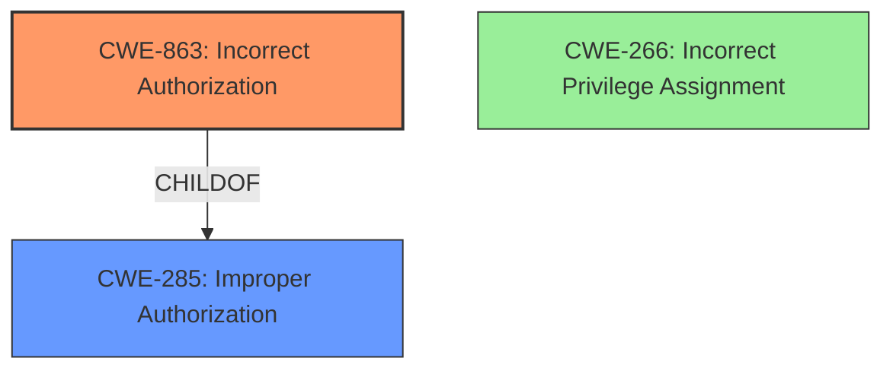

# Analysis for CVE-2024-42497

# Summary

| CWE ID | CWE Name | Confidence | CWE Abstraction Level | CWE Vulnerability Mapping Label | CWE-Vulnerability Mapping Notes |
|---|---|---|---|---|---|
| CWE-863 | Incorrect Authorization | 0.9 | Class | Allowed-with-Review | Primary CWE. The product performs an authorization check, but it does not correctly perform the check. |
| CWE-285 | Improper Authorization | 0.7 | Class | Discouraged | Secondary. The product does not perform or incorrectly performs an authorization check when an actor attempts to access a resource or perform an action. |
| CWE-266 | Incorrect Privilege Assignment | 0.6 | Base | Allowed | Secondary. A product incorrectly assigns a privilege to a particular actor, creating an unintended sphere of control for that actor. |

## Evidence and Confidence

*   **Confidence Score:** 0.8
*   **Evidence Strength:** MEDIUM

## Relationship Analysis

The primary weakness is CWE-863 [Incorrect Authorization], a Class-level CWE. CWE-863 is more specific than its parent CWE-285 [Improper Authorization], which is a Class-level CWE that could also be considered. CWE-266 [Incorrect Privilege Assignment] is a Base-level CWE and is related to privilege management, which could be a contributing factor.

## Vulnerability Chain

The vulnerability chain starts with the **failure to properly enforce permissions**. This leads to a user with read-only access being able to perform write operations.

## Summary of Analysis

The primary CWE is CWE-863 [Incorrect Authorization] because the vulnerability description states that the system **fails to properly enforce permissions**. This means that there is an authorization check, but it is not working correctly. CWE-285 [Improper Authorization] is a more general CWE that could also be used, but CWE-863 [Incorrect Authorization] is more specific and, therefore, a better fit. CWE-266 [Incorrect Privilege Assignment] could also be considered because the vulnerability involves a user with a system manager role with read-only access being able to perform write operations, but it's less direct than CWE-863. The **rootcause** is the **failure to properly enforce permissions**.

The guidance on privileges vs permissions helped guide the selection, but in this case the distinction is blurred as the **failure to properly enforce permissions** encompasses both privileges and permissions.

I am selecting CWE-863 as the primary CWE because it best matches the **rootcause** described in the vulnerability description.