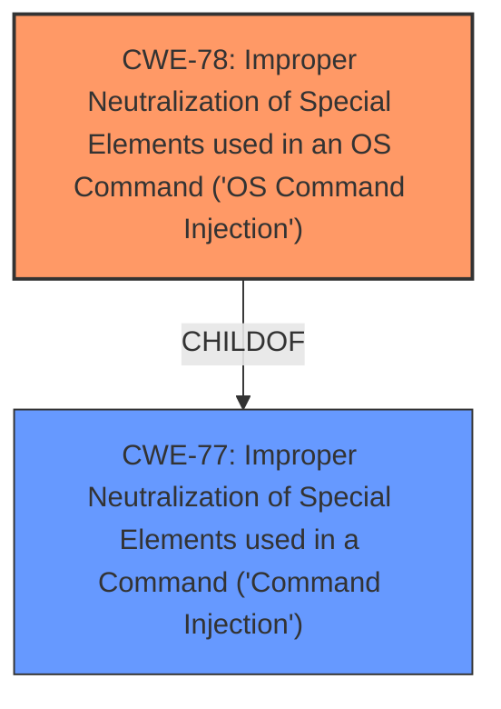

# Raw Analyzer Response for CVE-2024-42509

# Summary
| CWE ID | CWE Name | Confidence | CWE Abstraction Level | CWE Vulnerability Mapping Label | CWE-Vulnerability Mapping Notes |
|---|---|---|---|---|---|
| CWE-78 | Improper Neutralization of Special Elements used in an OS Command ('OS Command Injection') | 1.0 | Base | Allowed | Primary CWE. The vulnerability description explicitly mentions "command injection" in the underlying CLI service. |
| CWE-77 | Improper Neutralization of Special Elements used in a Command ('Command Injection') | 0.7 | Class | Allowed-with-Review | Secondary candidate. CWE-77 is a more general form of command injection. |

## Evidence and Confidence

*   **Confidence Score:** 1.0
*   **Evidence Strength:** HIGH

## Relationship Analysis
The primary relationship that influenced the decision was the parent-child relationship between CWE-77 and CWE-78. CWE-78 is a specific type of CWE-77, focusing on OS commands. Since the vulnerability description mentions the CLI service which executes OS commands, CWE-78 is the more appropriate choice.

## Vulnerability Chain
The vulnerability chain starts with the **improper neutralization of special elements** in commands sent to the CLI service (CWE-78), leading to the ability to execute arbitrary code as a privileged user. The chain is:

1.  **Improper neutralization of special elements in OS command (CWE-78)**
2.  Remote code execution

## Summary of Analysis
The primary weakness is **command injection**, specifically related to OS commands. The vulnerability description explicitly mentions "command injection vulnerability in the underlying CLI service could lead to unauthenticated remote code execution". This clearly indicates CWE-78 as the root cause.

CWE-78 (Improper Neutralization of Special Elements used in an OS Command ('OS Command Injection')) is selected because the vulnerability allows an unauthenticated attacker to send specially crafted packets to the PAPI UDP port (8211), leading to arbitrary code execution as a privileged user on the underlying operating system. The **weakness** here is the **improper neutralization of special elements** within the crafted packets that are then processed as OS commands. This matches the description of CWE-78, which states that the product "does not neutralize or incorrectly neutralizes special elements that could modify the intended OS command when it is sent to a downstream component."

CWE-77 (Improper Neutralization of Special Elements used in a Command ('Command Injection')) was considered as a more general form of command injection, but CWE-78 was preferred because the **command injection** occurs in the underlying CLI service, which executes OS commands.

CWE-20 (Improper Input Validation) was considered but rejected because the root cause is more specific than general input validation. It's the **improper neutralization of special elements** that allows the attacker to inject commands.

CWE-94 (Improper Control of Generation of Code ('Code Injection')) was considered but rejected because it focuses on the generation of code, while the vulnerability is about injecting commands into an existing CLI service.