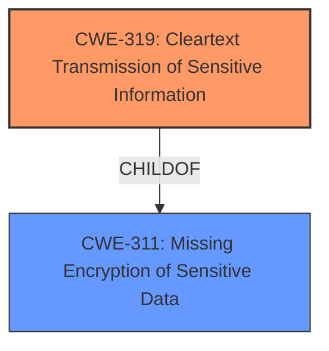

# Enhanced Analysis for CVE-2024-42657

# Summary

| CWE ID  | CWE Name                                            | Confidence | CWE Abstraction Level | CWE Vulnerability Mapping Label | CWE-Vulnerability Mapping Notes |
| :------- | :-------------------------------------------------- | :--------- | :---------------------- | :------------------------------ | :-------------------------------- |
| CWE-319 | Cleartext Transmission of Sensitive Information | 1          | Base                    | Allowed                       | Primary CWE                     |

## Evidence and Confidence

*   **Confidence Score:** 1
*   **Evidence Strength:** HIGH

## Relationship Analysis

The primary relationship is that CWE-319 is a child of CWE-311 (Missing Encryption of Sensitive Data), indicating a more specific instance of the general lack of encryption. While CWE-311 could be considered, CWE-319 directly addresses the **cleartext transmission**, making it a more accurate and specific representation of the vulnerability.



## Vulnerability Chain

The vulnerability chain begins with the **lack of encryption** of the login process, which leads to the transmission of sensitive information in cleartext. This, in turn, allows an attacker to intercept the credentials. The root cause is the **lack of encryption**, and the direct consequence is the cleartext transmission.
  - Root Cause: **Lack of encryption** of the login process
  - Weakness: Cleartext transmission of sensitive information
  - Impact: Interception of credentials, unauthorized access

## Summary of Analysis

The initial analysis and the provided content consistently point towards the **lack of encryption** during the login process as the core issue. The **Vulnerability Description** explicitly mentions the "**lack of encryption**". The **CVE Reference Links Content Summary** confirms that login credentials are transmitted over an unencrypted HTTP connection. This directly aligns with CWE-319, which specifies the "**cleartext transmission**" of sensitive information.

The retriever results also list CWE-319 as a relevant candidate. While other CWEs like CWE-311, CWE-798, and CWE-259 were considered, they represent broader categories or different aspects of the vulnerability. For example, CWE-311 (Missing Encryption of Sensitive Data) is a more general case, while CWE-798 (Use of Hard-coded Credentials) and CWE-259 (Use of Hard-coded Password) are not applicable as the vulnerability is not about hard-coded credentials but about the **lack of encryption** during transmission.

The selection of CWE-319 is based on its direct relevance to the vulnerability description and the evidence presented in the CVE summary. It represents the most specific and accurate classification of the weakness.

Relevant CWE Information:

# Enhanced Context (25 CWEs)

## CWE-1391: Use of Weak Credentials

## CWE-311: Missing Encryption of Sensitive Data

## CWE-319: Cleartext Transmission of Sensitive Information

## CWE-312: Cleartext Storage of Sensitive Information

## CWE-321: Use of Hard-coded Cryptographic Key

## CWE-288: Authentication Bypass Using an Alternate Path or Channel

## CWE-798: Use of Hard-coded Credentials

## CWE-259: Use of Hard-coded Password

## CWE-294: Authentication Bypass by Capture-replay

## CWE-303: Incorrect Implementation of Authentication Algorithm

## CWE-321: Use of Hard-coded Cryptographic Key

## CWE-319: Cleartext Transmission of Sensitive Information

## CWE-259: Use of Hard-coded Password

## CWE-798: Use of Hard-coded Credentials

## CWE-522: Insufficiently Protected Credentials

## CWE-321: Use of Hard-coded Cryptographic Key

## CWE-259: Use of Hard-coded Password

## CWE-472: External Control of Assumed-Immutable Web Parameter

## CWE-1191: On-Chip Debug and Test Interface With Improper Access Control

## CWE-208: Observable Timing Discrepancy

## CWE-257: Storing Passwords in a Recoverable Format

## CWE-523: Unprotected Transport of Credentials

## CWE-327: Use of a Broken or Risky Cryptographic Algorithm

## CWE-798: Use of Hard-coded Credentials

## CWE-319: Cleartext Transmission of Sensitive Information

CWE-319 is at the optimal level of specificity because it directly addresses the **cleartext transmission** aspect of the vulnerability.

*   **CWE-319: Cleartext Transmission of Sensitive Information**
    *   **Technical Explanation:** The vulnerability involves transmitting sensitive data (login credentials) without encryption, allowing attackers to intercept the data in transit.
    *   **Security Implications:** Interception of credentials leads to unauthorized access to the router's management interface, potentially enabling further malicious activities.
    *   **Relationship:** It is a child of CWE-311 (Missing Encryption of Sensitive Data).
    *   **Usage:** The MITRE mapping guidance allows the usage of CWE-319.
    *   **Primary Weakness:** This is the primary weakness.

Other CWEs Considered but Not Used:

*   CWE-311 (Missing Encryption of Sensitive Data): While related, it is a more general case and less specific than CWE-319.
*   CWE-798 (Use of Hard-coded Credentials) and CWE-259 (Use of Hard-coded Password): These are not applicable as the vulnerability is not related to hard-coded credentials.
*   CWE-522 (Insufficiently Protected Credentials): This is a broader category that includes various methods of insecure credential handling, but CWE-319 more precisely describes the issue of **cleartext transmission**.


## CWE Relationship Analysis

Current CWEs represent these abstraction levels: .


### Vulnerability Chain Analysis

**Chain starting from CWE-288:**
- 288 (Authentication Bypass Using an Alternate Path or Channel) - ROOT


**Chain starting from CWE-321:**
- 321 (Use of Hard-coded Cryptographic Key) - ROOT


### CWE Relationship Diagram

```mermaid
graph TD
    classDef primary fill:#f96,stroke:#333,stroke-width:2px
    classDef secondary fill:#69f,stroke:#333
    classDef tertiary fill:#9e9,stroke:#333
```