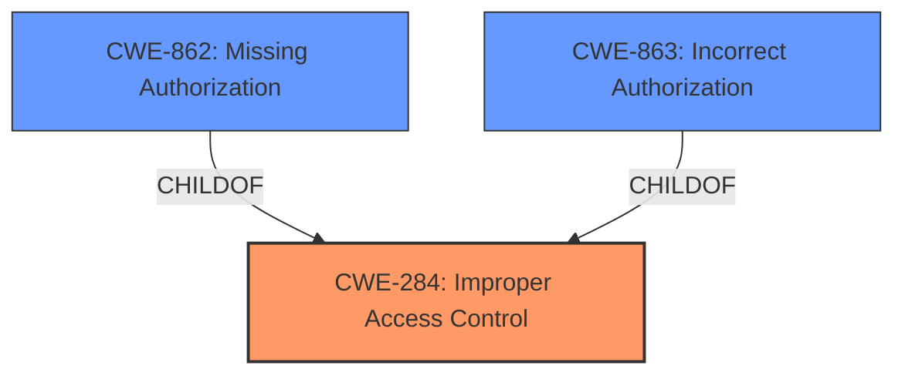

# Analysis for CVE-2024-42766

# Summary
| CWE ID | CWE Name | Confidence | CWE Abstraction Level | CWE Vulnerability Mapping Label | CWE-Vulnerability Mapping Notes |
|---|---|---|---|---|---|
| CWE-284 | Improper Access Control | 0.75 | Pillar | Allowed-with-Review | Primary CWE. Although CWE-284 is a high-level category, the current evidence does not allow for a more specific classification. |

## Evidence and Confidence

*   **Confidence Score:** 0.75
*   **Evidence Strength:** LOW

## Relationship Analysis
The primary CWE, CWE-284, is a high-level category. Ideally, a more specific child CWE would be chosen. However, based on the limited information provided, it's not possible to determine the exact nature of the **incorrect access control**. The relationship analysis indicates that if more information were available, CWE-862 (Missing Authorization) or CWE-863 (Incorrect Authorization) could be considered as child CWEs of CWE-284.

## Vulnerability Chain
The vulnerability chain starts with **incorrect access control** in `/deleteTicket.php`, leading to unauthorized actions. The available information doesn't provide details about authentication or authorization mechanisms, making it difficult to identify specific weaknesses in the chain.

## Summary of Analysis
The initial analysis identified **Incorrect Access Control** as the root cause of the vulnerability in `/deleteTicket.php`. The provided evidence is limited to the vulnerability description. The selection of CWE-284 is based on the **rootcause** phrase "**Incorrect Access Control**" in the vulnerability description and the guidance provided. Without more information, a more specific CWE cannot be determined.

The guidance suggests that CWE-284 is a high-level category and should be avoided if a more specific child CWE is appropriate. However, in this case, the lack of details about the authentication and authorization mechanisms prevents a more granular classification. The retriever results suggest CWE-639, CWE-266, and CWE-425 as potential candidates, but they all require more specific details about the vulnerability than are available. Therefore, CWE-284 is the most appropriate choice based on the limited information provided.

Relevant CWE Information:

*   CWE-284: Improper Access Control - Used because the vulnerability description explicitly mentions **Incorrect Access Control**.

Other CWEs Considered:

*   CWE-639: Authorization Bypass Through User-Controlled Key - Considered but discarded because there is no evidence to suggest that a user-controlled key is involved in the authorization bypass.
*   CWE-266: Incorrect Privilege Assignment - Considered but discarded because there is no information about privilege assignment.
*   CWE-425: Direct Request ('Forced Browsing') - Considered but discarded because there's no evidence of direct request or forced browsing.
*   CWE-287: Improper Authentication - Considered but discarded since the description specifies the issue is with access control, not authentication.
*   CWE-306: Missing Authentication for Critical Function - Considered but discarded since the description specifies the issue is with access control, not authentication.