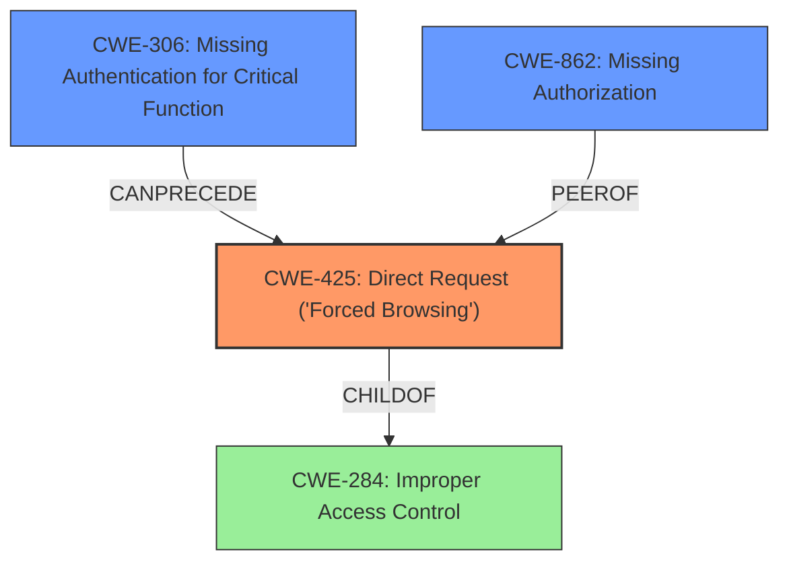

# Analysis Report for CVE-2024-42775

# Vulnerability Analysis Report: CVE-2024-42775

## Description

An Incorrect Access Control vulnerability was found in /admin/add_room_controller.php in Kashipara Hotel Management System v1.0, which allows an unauthenticated attacker to add the valid hotel room entries in the administrator section via the direct URL access.

## Vulnerability Description Key Phrases

- **Rootcause:** incorrect access control
- **Impact:** add hotel room entries
- **Vector:** direct URL access
- **Attacker:** unauthenticated attacker
- **Product:** Kashipara Hotel Management System
- **Version:** v1.0
- **Component:** /admin/add_room_controller.php

## Analysis (with Relationship Data)

# Summary
| CWE ID | CWE Name | Confidence | CWE Abstraction Level | CWE Vulnerability Mapping Label | CWE-Vulnerability Mapping Notes |
|---|---|---|---|---|---|
| CWE-425 | Direct Request ('Forced Browsing') | 0.9 | Base | Allowed | Primary CWE. The application does not adequately enforce authorization on restricted URLs. |
| CWE-306 | Missing Authentication for Critical Function | 0.7 | Base | Allowed | Secondary Candidate. The application does not perform any authentication for functionality that requires a provable user identity. |
| CWE-862 | Missing Authorization | 0.6 | Base | Allowed | Secondary Candidate. The application misses an authorization check to ensure the user has the required permissions. |

## Evidence and Confidence

*   **Confidence Score:** 0.9
*   **Evidence Strength:** MEDIUM

## Relationship Analysis
The primary CWE is CWE-425 (Direct Request), which falls under CWE-424 (Improper Access Control). CWE-306 (Missing Authentication for Critical Function) and CWE-862 (Missing Authorization) are closely related to CWE-425. CWE-306 could be considered a prerequisite, leading to CWE-425, while CWE-862 represents a similar type of weakness. Choosing CWE-425 as primary due to the direct access nature of the vulnerability.



## Vulnerability Chain
The vulnerability chain starts with the **incorrect access control**, which leads to direct URL access and ultimately allows an unauthenticated attacker to add hotel room entries.

1.  **Root Cause:** **Incorrect access control** in `/admin/add_room_controller.php`.
2.  **Weakness:** Missing or insufficient authentication and authorization checks.
3.  **Impact:** Unauthenticated attacker can add valid hotel room entries.

## Summary of Analysis
Based on the provided information, the primary CWE is CWE-425 (Direct Request). The vulnerability description clearly states that an unauthenticated attacker can add hotel room entries via direct URL access due to **incorrect access control**. This aligns with the definition of CWE-425, where the application does not adequately enforce authorization on restricted URLs.

The retriever results also indicate CWE-425 as a strong candidate. The guidance on Authentication vs Authorization vs Access Control further supports this choice. Since the attacker is unauthenticated and can directly access the URL, CWE-425 is more appropriate than CWE-862 (Missing Authorization), which would typically apply after authentication. CWE-306 (Missing Authentication for Critical Function) is also a possible contributing factor, as there's likely no authentication required to access the vulnerable URL.

The selection is based on the evidence of **incorrect access control** and direct URL access. The hierarchical relationships and chain patterns support this decision, making CWE-425 the most specific and relevant CWE for this vulnerability.

Relevant CWE Information:

# Enhanced Context (25 CWEs)
The following CWEs were identified as potentially relevant to this vulnerability:

## CWE-425: Direct Request ('Forced Browsing')
**Abstraction Level**: Base
**Similarity Score**: 0.76
**Source**: dense

**Description**:
The web application does not adequately enforce appropriate authorization on all restricted URLs, scripts, or files.

**Mapping Guidance**:
- Usage: Allowed
- Rationale: This CWE entry is at the Base level of abstraction, which is a preferred level of abstraction for mapping to the root causes of vulnerabilities.


## CWE Relationship Analysis

Current CWEs represent these abstraction levels: .


### Vulnerability Chain Analysis

**Chain starting from CWE-862:**
- 862 (Missing Authorization) - ROOT


**Chain starting from CWE-306:**
- 306 (Missing Authentication for Critical Function) - ROOT


### CWE Relationship Diagram

```mermaid
graph TD
    classDef primary fill:#f96,stroke:#333,stroke-width:2px
    classDef secondary fill:#69f,stroke:#333
    classDef tertiary fill:#9e9,stroke:#333
```


*Report generated on 2025-07-13 14:19:49*
