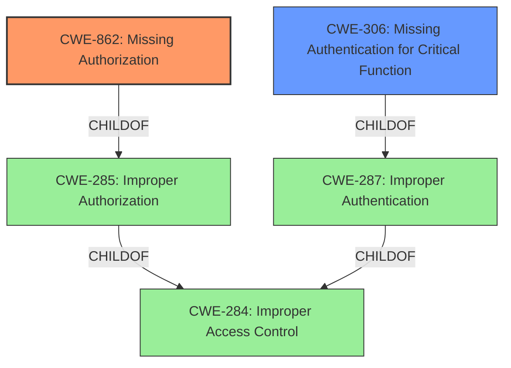

# Raw Analyzer Response for CVE-2024-42796

# Summary
| CWE ID | CWE Name | Confidence | CWE Abstraction Level | CWE Vulnerability Mapping Label | CWE-Vulnerability Mapping Notes |
|---|---|---|---|---|---|
| CWE-862 | Missing Authorization | 1.0 | Class | Primary CWE | Allowed-with-Review |
| CWE-306 | Missing Authentication for Critical Function | 0.7 | Base | Secondary Candidate | Allowed |

## Evidence and Confidence

*   **Confidence Score:** 0.9
*   **Evidence Strength:** HIGH

## Relationship Analysis
The primary relationship influencing the CWE selection is the authentication vs. authorization distinction. CWE-862 (Missing Authorization) and CWE-306 (Missing Authentication for Critical Function) are closely related, but the evidence points more strongly towards a missing authorization check after a potential, but unverified, authentication process. If there was clearly no authentication, then CWE-306 would be more appropriate. Because there is no clear mention of authentication being required or not, I will choose CWE-862, but will note that CWE-306 is a secondary candidate.

## Vulnerability Chain
The vulnerability chain starts with the **incorrect access control**, allowing an unauthenticated attacker to delete music genre entries. This leads to data manipulation and potential system instability.

Root Cause: **Incorrect Access Control** (CWE-862)
Impact: Data Manipulation (Deletion of music genres)

## Summary of Analysis
The initial analysis focused on identifying the root cause of the vulnerability. The description clearly states "**incorrect access control**" as the root cause. The CVE Reference Links Content Summary confirms this, highlighting a "**Broken Access Control** issue" that allows unauthorized users to delete music genres.

Based on the retriever results, the top CWEs were:
- CWE-862: Missing Authorization
- CWE-863: Incorrect Authorization
- CWE-285: Improper Authorization

The Authentication vs Authorization vs Access Control Guidance helped distinguish between these options. Since the vulnerability involves a missing check for authorization, CWE-862 is the most appropriate choice.

The evidence provided strongly supports CWE-862 as the primary CWE. The "**incorrect access control**" and "**Broken Access Control**" phrases directly indicate a missing authorization check. While the vulnerability also mentions an "unauthenticated attacker," the primary issue is the lack of authorization to delete music genres, regardless of authentication status. Therefore, I considered CWE-306 (Missing Authentication for Critical Function) but did not select it as the primary CWE.

CWE-862 is at the Class level of abstraction, while there may be Base-level children that are more appropriate, there isn't enough evidence to support a more specific CWE.

Relevant CWE Information:

**CWE-862: Missing Authorization**
The product does not perform any authorization checks for a function, resource, or data that requires such a check.
# Complete CWE Specifications
CWE-862: Missing Authorization

CWE-863: Incorrect Authorization

CWE-285: Improper Authorization

CWE-284: Improper Access Control

CWE-287: Improper Authentication

CWE-425: Direct Request ('Forced Browsing')

CWE-352: Cross-Site Request Forgery (CSRF)

CWE-306: Missing Authentication for Critical Function

CWE-89: Improper Neutralization of Special Elements used in an SQL Command ('SQL Injection')

CWE-434: Unrestricted Upload of File with Dangerous Type