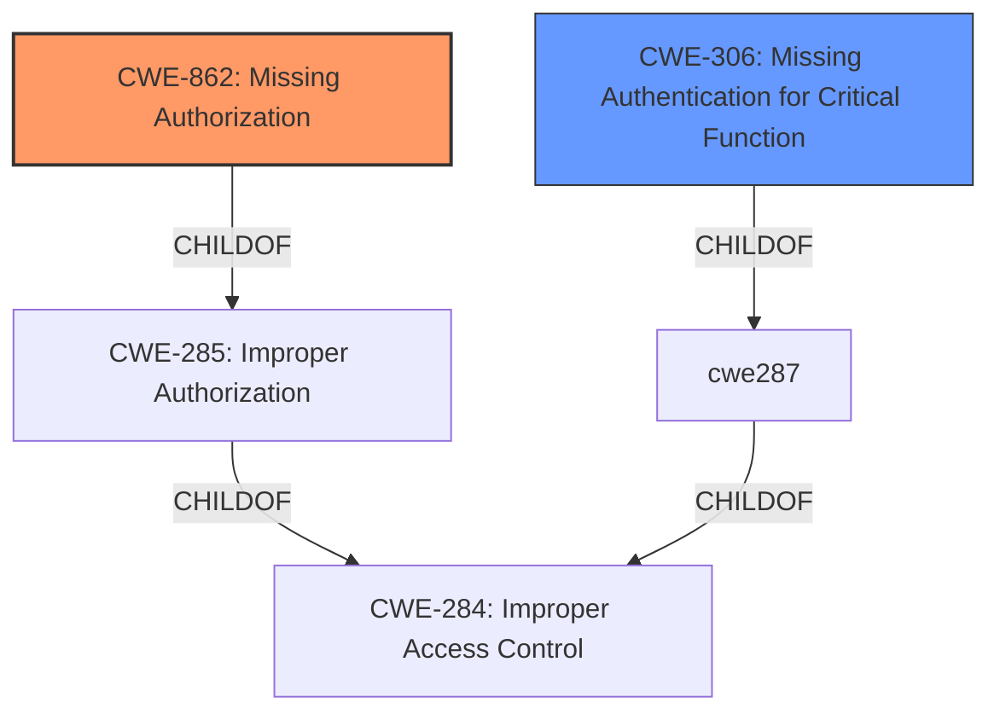

# Raw Analyzer Response for CVE-2024-42797

# Summary
| CWE ID | CWE Name | Confidence | CWE Abstraction Level | CWE Vulnerability Mapping Label | CWE-Vulnerability Mapping Notes |
|---|---|---|---|---|---|
| CWE-862 | Missing Authorization | 1.0 | Class | Allowed-with-Review | The application does not perform any authorization checks for deleting playlist entries. |
| CWE-306 | Missing Authentication for Critical Function | 0.8 | Base | Allowed | The application does not require authentication to access the delete playlist function. |

## Evidence and Confidence

*   **Confidence Score:** 0.9
*   **Evidence Strength:** HIGH

## Relationship Analysis
The primary relationship impacting the decision is the parent-child relationship between CWE-284 (Improper Access Control), CWE-285 (Improper Authorization), CWE-862 (Missing Authorization), and CWE-306 (Missing Authentication). Since the vulnerability description explicitly mentions **incorrect access control** and the attack is performed by an unauthenticated attacker, both authentication and authorization are relevant. CWE-862 and CWE-306 are more specific than CWE-284 and CWE-285, providing a more accurate representation of the vulnerability.

## Vulnerability Chain
The vulnerability chain starts with a **missing authentication** check (CWE-306), leading to a **missing authorization** check (CWE-862), which ultimately allows an unauthenticated attacker to delete valid music playlist entries.

## Summary of Analysis
The initial analysis focused on identifying the root cause of the vulnerability. The description highlights "**Incorrect Access Control**" as the primary weakness. The retriever results also point to various authorization-related CWEs. Based on the vulnerability description, there is no authentication required to delete playlist entries. Therefore, the system **fails to authenticate** the user (CWE-306) and **fails to authorize** the action (CWE-862).

The CWEs selected are at the optimal level of specificity. CWE-862 and CWE-306 are more precise than their parent CWEs (CWE-284 and CWE-285), providing a more accurate representation of the vulnerability. The decision is strongly based on the evidence from the vulnerability description, particularly the phrases "**Incorrect Access Control**" and "unauthenticated attacker".

Relevant CWE Information:

**CWE-862: Missing Authorization**
The product does not perform any authorization checks for users attempting to access a resource.

**CWE-306: Missing Authentication for Critical Function**
The product does not perform any authentication for functionality that requires a provable user identity or consumes a significant amount of resources.

The unauthenticated attacker can directly delete playlist entries because of the **missing authentication** and **missing authorization**.