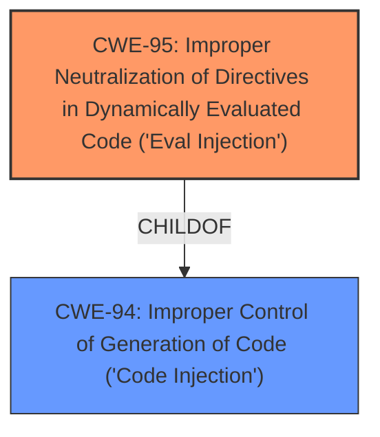

# Raw Analyzer Response for CVE-2024-42845

# Summary
| CWE ID | CWE Name | Confidence | CWE Abstraction Level | CWE Vulnerability Mapping Label | CWE-Vulnerability Mapping Notes |
|---|---|---|---|---|---|
| CWE-95 | Improper Neutralization of Directives in Dynamically Evaluated Code ('Eval Injection') | 1.0 | Variant | Allowed | Primary CWE. The vulnerability stems from the use of the `eval()` function on user-controlled data. |

## Evidence and Confidence

*   **Confidence Score:** 1.0
*   **Evidence Strength:** HIGH

## Relationship Analysis
The primary identified CWE is CWE-95, which is a Variant level weakness. This is a good level of specificity. CWE-95 is a child of CWE-94 (Improper Control of Generation of Code) which is a more general case of code injection. There are no other relationships to consider in this case.

## Vulnerability Chain
The vulnerability chain starts with the **improper use of the `eval()` function (CWE-95)** on user-controlled data, leading to arbitrary code execution.

## Summary of Analysis
The initial analysis correctly identifies **eval Injection** as the root cause, which leads to arbitrary code execution. This is supported by the provided evidence, particularly the "CVE Reference Links Content Summary" section, which states: "The vulnerability stems from the use of the `eval()` function on user-controlled data" and "allows an attacker to inject arbitrary Python code." The technical details section provides the code snippet where `eval()` is used.

The selection of CWE-95 is optimal as it is a Variant-level CWE, providing a specific classification for the vulnerability. The retriever results also list CWE-95 as the top candidate. Other CWEs such as CWE-94, CWE-78, and CWE-89 were considered, but they are not as specific to the **eval injection** vulnerability.

Relevant CWE Information:

# Enhanced Context (25 CWEs)
The following CWEs were identified as potentially relevant to this vulnerability:

## CWE-95: Improper Neutralization of Directives in Dynamically Evaluated Code ('Eval Injection')
**Abstraction Level**: Variant
**Similarity Score**: 0.74
**Source**: dense

**Description**:
The product receives input from an upstream component, but it does not neutralize or incorrectly neutralizes code syntax before using the input in a dynamic evaluation call (e.g. "eval").

**Mapping Guidance**:
- Usage: Allowed
- Rationale: This CWE entry is at the Variant level of abstraction, which is a preferred level of abstraction for mapping to the root causes of vulnerabilities.