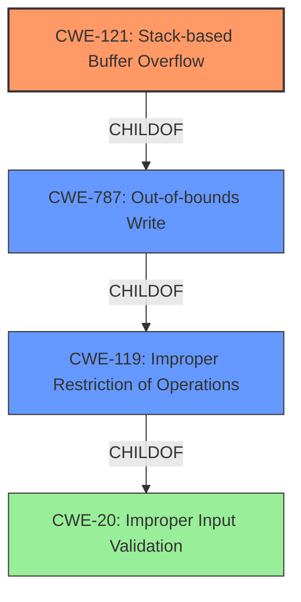

# Raw Analyzer Response for CVE-2024-42950

# Summary

| CWE ID  | CWE Name                                                                  | Confidence | CWE Abstraction Level | CWE Vulnerability Mapping Label | CWE-Vulnerability Mapping Notes |
| :------- | :------------------------------------------------------------------------ | :--------- | :---------------------- | :------------------------------ | :------------------------------ |
| CWE-121  | Stack-based Buffer Overflow                                               | 1.0        | Variant               | Primary                         | Allowed                       |
| CWE-787 | Out-of-bounds Write                                         | 0.8        | Base               | Secondary                       | Allowed                      |
| CWE-119 | Improper Restriction of Operations within the Bounds of a Memory Buffer | 0.6        | Class                 | Secondary                       | Discouraged                     |

## Evidence and Confidence

*   **Confidence Score:** 0.9
*   **Evidence Strength:** HIGH

## Relationship Analysis

The primary CWE is CWE-121 (Stack-based Buffer Overflow), a variant of CWE-119 (Improper Restriction of Operations within the Bounds of a Memory Buffer), which in turn is a child of CWE-20 (Improper Input Validation). CWE-121 is a more specific type of buffer overflow, focusing on overflows occurring on the stack. CWE-787 (Out-of-bounds Write) is a parent of CWE-121 and represents the broader category of writing data beyond the intended buffer boundaries. The relationship helps to narrow down the root cause of the vulnerability.

## Vulnerability Chain

The vulnerability chain starts with the lack of input validation (potentially CWE-20), leading to an out-of-bounds write (CWE-787), which specifically manifests as a stack-based buffer overflow (CWE-121). This overflow then causes a denial of service (DoS).

## Summary of Analysis

The analysis indicates that the vulnerability is a stack-based buffer overflow (CWE-121) caused by **copying a user-supplied parameter "Go" into a fixed-size buffer without proper bounds checking**. The `fromSafeClientFilter` function is **vulnerable** because it uses `strcpy` to copy the `Go` parameter, which can lead to a **buffer overflow** if the parameter exceeds the buffer's size. The evidence from "CVE Reference Links Content Summary" explicitly states the root cause and weakness.

CWE-121 is the most specific and accurate representation of the vulnerability. It aligns with the "Vulnerability Description Key Phrases" that highlight the **stack overflow**. The Retriever Results also list CWE-121 as the top candidate CWE.

CWE-787 (Out-of-bounds Write) is considered a secondary candidate because it is a broader category that encompasses stack-based buffer overflows. While accurate, it is less specific than CWE-121.

CWE-119 (Improper Restriction of Operations within the Bounds of a Memory Buffer) is also considered as a possible CWE, but is discouraged by MITRE when more specific information is available.

The decision to prioritize CWE-121 is based on the specific details of the vulnerability (stack-based), the evidence in the description, and the guidance to choose the most specific CWE.

Relevant CWE Information:

# Enhanced Context (25 CWEs)
The following CWEs were identified as potentially relevant to this vulnerability:

## CWE-121: Stack-based Buffer Overflow
**Abstraction Level**: Variant
**Similarity Score**: 0.73
**Source**: dense

**Description**:
A stack-based buffer overflow condition is a condition where the buffer being overwritten is allocated on the stack (i.e., is a local variable or, rarely, a parameter to a function).

**Mapping Guidance**:
- Usage: Allowed
- Rationale: This CWE entry is at the Variant level of abstraction, which is a preferred level of abstraction for mapping to the root causes of vulnerabilities.

**Explanation:** CWE-121 is a strong candidate since the vulnerability is explicitly described as a "stack overflow." The description aligns perfectly with CWE-121's definition.

## CWE-190: Integer Overflow or Wraparound
**Abstraction Level**: Base
**Similarity Score**: 726.28
**Source**: sparse

**Description**:
The product performs a calculation that can produce an integer overflow or wraparound when the logic assumes that the resulting value will always be larger than the original value. This occurs when an integer value is incremented to a value that is too large to store in the associated representation. When this occurs, the value may become a very small or negative number.

**Mapping Guidance**:
- Usage: Allowed
- Rationale: This CWE entry is at the Base level of abstraction, which is a preferred level of abstraction for mapping to the root causes of vulnerabilities.

**Explanation:** While listed in the retriever results, this CWE doesn't fit the vulnerability description, which clearly points to a buffer overflow, not an integer overflow.

## CWE-1284: Improper Validation of Specified Quantity in Input
**Abstraction Level**: Base
**Similarity Score**: 679.92
**Source**: sparse

**Description**:
The product receives input that is expected to specify a quantity (such as size or length), but it does not validate or incorrectly validates that the quantity has the required properties.

**Mapping Guidance**:
- Usage: Allowed
- Rationale: This CWE entry is at the Base level of abstraction, which is a preferred level of abstraction for mapping to the root causes of vulnerabilities.

**Explanation:** This could be a contributing factor but is not the primary cause. The **improper validation** could lead to the **stack overflow**, but the overflow itself is the more direct weakness.

## CWE-125: Out-of-bounds Read
**Abstraction Level**: Base
**Similarity Score**: 661.67
**Source**: sparse

**Description**:
The product reads data past the end, or before the beginning, of the intended buffer.

**Mapping Guidance**:
- Usage: Allowed
- Rationale: This CWE entry is at the Base level of abstraction, which is a preferred level of abstraction for mapping to the root causes of vulnerabilities.

**Explanation:** This is not related to the vulnerability description which specifies a **stack overflow** via a crafted POST request.

## CWE-120: Buffer Copy without Checking Size of Input ('Classic Buffer Overflow')
**Abstraction Level**: base
**Similarity Score**: 3.80
**Source**: graph

**Description**:
CWE-120: Buffer Copy without Checking Size of Input ('Classic Buffer Overflow')

**Mapping Guidance**:
- Usage: Allowed-with-Review
- Rationale: There are some indications that this CWE ID might be misused and selected simply because it mentions "buffer overflow" - an increasingly vague term. This CWE entry is only appropriate for "Buffer Copy" operations (not buffer reads), in which where there is no "Checking [the] Size of Input", and (by implication of the copy) writing past the end of the buffer.

**Explanation:** This CWE describes a classic buffer overflow due to unchecked copy operations. While it aligns with the general concept, CWE-121 is more specific because it identifies the location of the buffer (stack). Also, CWE-120 is only appropriate for "Buffer Copy" operations, in which there is no "Checking [the] Size of Input", and (by implication of the copy) writing past the end of the buffer.